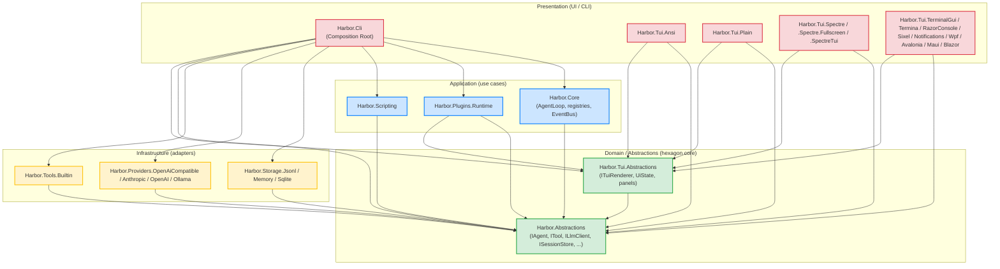

# Architecture Layers — Canonical Reference

> **This is the canonical reference for project layering in Harbor.**
> Every `<ProjectReference>` added to a `.csproj` MUST be checked against this document.
> See [ARCHITECTURE.md](./ARCHITECTURE.md) for the high-level design and
> [CODE_PRINCIPLES_AUDIT.md](./CODE_PRINCIPLES_AUDIT.md) §ARCH-001+ for the audit trail.
>
> **Связанные документы:**
> - [ARCHITECTURE.md](./ARCHITECTURE.md) — high-level design + principles summary.
> - [CLAUDE.md](../CLAUDE.md) §Layering rules — short version + checklist.
> - [CODE_PRINCIPLES_AUDIT.md](./CODE_PRINCIPLES_AUDIT.md) §ARCH-001..NNN — violations found and fixed.

---

## 1. The layering model

Harbor follows **Clean / Hexagonal / Onion Architecture** (call it whatever you want — the
user said *"слои должны быть по чистой архитектуре, гексогональная луковая называй как хочешь
но это надо"*). The dependency direction is **inward only**: an outer layer may reference an
inner layer, never the other way around. The innermost layer (Domain/Abstractions) references
**nothing** except the BCL and a small set of framework packages.

```
┌─────────────────────────────────────────────────────────────────┐
│  PRESENTATION (UI / CLI)                                        │
│  - Harbor.Cli                                                   │
│  - Harbor.Tui.Ansi / Plain / Spectre / Spectre.Fullscreen /     │
│    SpectreTui / TerminalGui / Termina / RazorConsole / Sixel /  │
│    Notifications                                                │
│  - Harbor.Tui.Wpf / Avalonia / Maui / Blazor                    │
│  Depends on: Application + Abstractions (Composition Root OK)   │
└─────────────────────────────────────────────────────────────────┘
                                  ▲
                                  │ uses
                                  ▼
┌─────────────────────────────────────────────────────────────────┐
│  APPLICATION (use cases, orchestration)                         │
│  - Harbor.Core (AgentLoop, CompactionService, PermissionService,│
│                 AgentRegistry, ToolRegistry, ProviderRegistry,  │
│                 InMemoryEventBus, SystemPromptBuilder,          │
│                 MessageConverter, OnboardingWizard, HarborConfig)│
│  - Harbor.Plugins.Runtime (PluginHost, PluginHostBuilder)       │
│  - Harbor.Scripting (ScriptHost, Bridge/ScriptGlobals)          │
│  Depends on: Abstractions ONLY (Harbor.Abstractions +           │
│              Harbor.Tui.Abstractions, both Domain)              │
└─────────────────────────────────────────────────────────────────┘
                                  ▲
                                  │ implements
                                  ▼
┌─────────────────────────────────────────────────────────────────┐
│  INFRASTRUCTURE (adapters, I/O, external services)              │
│  - Harbor.Storage.Jsonl / Memory / Sqlite                       │
│  - Harbor.Providers.OpenAiCompatible / Anthropic / OpenAI /     │
│    Ollama                                                       │
│  - Harbor.Tools.Builtin                                         │
│  - Harbor.Plugins.Runtime/Compilation (Roslyn — already in      │
│    the Plugins.Runtime project; that project is Application     │
│    because it also hosts the PluginHost orchestrator; the       │
│    Compilation subfolder is the Infrastructure-flavored part)   │
│  - Harbor.Scripting/Engines (SharpTS/Jint — same pattern:       │
│    Scripting project is Application because it hosts            │
│    ScriptHost; the Engines subfolder is the Infrastructure-     │
│    flavored part)                                               │
│  Depends on: Abstractions ONLY (NOT Harbor.Core, NOT other      │
│              Application projects)                              │
└─────────────────────────────────────────────────────────────────┘
                                  ▲
                                  │ declares
                                  ▼
┌─────────────────────────────────────────────────────────────────┐
│  DOMAIN / ABSTRACTIONS (the hexagon core)                       │
│  - Harbor.Abstractions (interfaces, models, events, value objs, │
│    IAgent, IAgentLoop, ITool, IToolRegistry, ILlmClient,        │
│    ISessionStore, IProviderRegistry, IAgentRegistry,            │
│    IEventBus, IPermissionService, ICompactionService,           │
│    PermissionRuleset, Session, Messages, Identifiers, …)        │
│  - Harbor.Tui.Abstractions (TUI interfaces, UiState, UiReducer, │
│    ViewRegistry, IPanels, ITuiViewModel, ITuiView, ITuiPlugin)  │
│  Depends on: NOTHING (only BCL + CSharpFunctionalExtensions +   │
│              Microsoft.Extensions.Logging.Abstractions etc. —   │
│              no other Harbor project)                           │
└─────────────────────────────────────────────────────────────────┘
```

### Mermaid diagram



**Dependency direction = inward only.** Outer layers may reference inner layers;
inner layers never reference outer layers. The Domain layer has no inbound
arrows from Harbor projects — only outbound to BCL / third-party NuGet packages.


### Why two projects in the Domain layer?

`Harbor.Abstractions` is the contract surface for the agent harness (LLM, tools, sessions,
events, permissions). `Harbor.Tui.Abstractions` is the contract surface for the UI layer
(views, view models, renderers, panels, UI state). They are kept separate so that a
headless consumer (CLI script, MCP bridge, test harness) can reference just
`Harbor.Abstractions` without dragging in any UI vocabulary. Both projects are in the
Domain layer and may reference each other; in practice `Harbor.Tui.Abstractions` references
`Harbor.Abstractions` (for `IAgent`, `AgentEvent`, `Session`), never the reverse.

---

## 2. Allowed and forbidden project references

The matrix below is the **single source of truth** for `<ProjectReference>` edges. The
`Harbor.Architecture.Tests` project (see §5) enforces every cell marked **Forbidden** at
test time.

| Project (row) → may reference (column)         | Abstractions | Tui.Abstractions | Core | Plugins.Runtime | Scripting | Storage.* | Providers.* | Tools.Builtin | Tui.* (concrete) | Cli |
|------------------------------------------------|:---:|:---:|:---:|:---:|:---:|:---:|:---:|:---:|:---:|:---:|
| **Harbor.Abstractions**                        | —   | ❌  | ❌  | ❌  | ❌  | ❌  | ❌  | ❌  | ❌  | ❌  |
| **Harbor.Tui.Abstractions**                    | ✅  | —   | ❌  | ❌  | ❌  | ❌  | ❌  | ❌  | ❌  | ❌  |
| **Harbor.Core**                                | ✅  | ❌* | —   | ❌  | ❌  | ❌  | ❌  | ❌  | ❌  | ❌  |
| **Harbor.Plugins.Runtime**                     | ✅  | ✅  | ❌  | —   | ❌  | ❌  | ❌  | ❌  | ❌  | ❌  |
| **Harbor.Scripting**                           | ✅  | ❌  | ❌  | ❌  | —   | ❌  | ❌  | ❌  | ❌  | ❌  |
| **Harbor.Storage.Jsonl / Memory / Sqlite**     | ✅  | ❌  | ❌  | ❌  | ❌  | ❌  | ❌  | ❌  | ❌  | ❌  |
| **Harbor.Providers.OpenAiCompatible / .Anthropic / .OpenAI / .Ollama** | ✅  | ❌  | ❌  | ❌  | ❌  | ❌  | ❌  | ❌  | ❌  | ❌  |
| **Harbor.Tools.Builtin**                       | ✅  | ❌  | ❌  | ❌  | ❌  | ❌  | ❌  | ❌  | ❌  | ❌  |
| **Harbor.Tui.Ansi / Plain / Spectre / Spectre.Fullscreen / SpectreTui / TerminalGui / Termina / RazorConsole / Sixel / Notifications / Wpf / Avalonia / Maui / Blazor** | ✅  | ✅  | ❌  | ❌  | ❌  | ❌  | ❌  | ❌  | ❌  | ❌  |
| **Harbor.Cli**                                 | ✅  | ✅  | ✅  | ✅  | ✅  | ✅  | ✅  | ✅  | ✅  | —   |

`❌*` Harbor.Core may not depend on Harbor.Tui.Abstractions — Core is the agent-harness
application layer and must not know about UI vocabulary. If Core needs to expose a hook
that the UI cares about, declare the contract in `Harbor.Abstractions` (or
`Harbor.Tui.Abstractions` if it is UI-specific), and let the Composition Root
(`HostBuilder`) wire the UI-side adapter in.

### Concrete impl types belong ONLY in the Composition Root

Concrete implementations of:

- `ILlmClient` (e.g. `AnthropicLlmClient`, `OpenAiCompatibleLlmClient`, `OllamaLlmClient`)
- `ISessionStore` (e.g. `JsonlSessionStore`, `SqliteSessionStore`, `MemorySessionStore`)
- `ITool` (e.g. `ReadTool`, `BashTool`, `WebFetchTool`)
- `ITuiRenderer` (e.g. `AnsiTuiRenderer`, `SpectreTuiRenderer`)
- `IAgent` (e.g. `DefaultAgent`)
- `IAgentLoop` (e.g. `AgentLoop`)
- `IEventBus` (e.g. `InMemoryEventBus`)

…may be **constructed** (i.e. `new`'d) **only** inside `Harbor.Cli/Hosting/HostBuilder.cs`
(the Composition Root). `Program.cs` resolves them from DI by their interface; it must NOT
`new` them directly. The architecture tests in §5 do NOT enforce this rule mechanically
(it requires call-site analysis, not just assembly references) — code review enforces it.

---

## 3. Layer responsibilities

### Domain / Abstractions

- **Contains:** interfaces (`IAgent`, `IAgentLoop`, `ITool`, `ILlmClient`,
  `ISessionStore`, `IProviderRegistry`, `IToolRegistry`, `IAgentRegistry`,
  `IEventBus`, `IPermissionService`, `ICompactionService`, `ISystemPromptBuilder`),
  value objects (`SessionId`, `MessageId`, `ProviderId`, `ModelRef`, `ToolName`,
  `AgentName`), record models (`Session`, `Message`, `AgentEvent`, `LlmEvent`,
  `ToolResult`, `AgentDefinition`, `AgentState`), and pure rulesets
  (`PermissionRuleset`).
- **Forbidden:** any I/O (file, network, console), any DI registration, any
  Roslyn/Jint/HttpClient dependency, any `sealed class` with mutable state.
- **Allowed NuGet:** `CSharpFunctionalExtensions` (for `Result<T>`),
  `Microsoft.Extensions.Logging.Abstractions`, `MemoryPack`,
  `CommunityToolkit.HighPerformance`, `ZLinq`.

### Application

- **Contains:** use-case orchestration. `AgentLoop.RunAsync` is the canonical use case
  ("advance the conversation one full turn"). `CompactionService.CompactAsync`,
  `PermissionService.CheckAsync`, `ScriptHost.EvaluateAsync`, `PluginHost.LoadAllAsync`
  are all use cases. Registries (`ToolRegistry`, `ProviderRegistry`, `AgentRegistry`)
  live here because they hold the in-memory state that use cases mutate.
- **Forbidden:** `HttpClient`, file I/O outside of well-defined adapter seams, Roslyn
  reference to `Microsoft.CodeAnalysis.CSharp` (that's the
  `Plugins.Runtime/Compilation/` subfolder's concern, and the project must declare the
  package — see note below), `Console.Write*`.
- **Note:** `Harbor.Plugins.Runtime` needs `Microsoft.CodeAnalysis.CSharp` for its
  `Compilation/` subfolder. The package reference is on the project, not on a subfolder;
  this is acceptable because the alternative (splitting Compilation into its own project)
  would multiply project count for little benefit. The Architecture tests treat
  `Harbor.Plugins.Runtime` as a single Application-layer project for dependency-direction
  purposes.

### Infrastructure

- **Contains:** adapters — concrete implementations of `ILlmClient`, `ISessionStore`,
  `ITool`, etc. These projects translate between the outside world (HTTP, filesystem,
  subprocess, native interop) and the Domain contracts.
- **Forbidden:** references to `Harbor.Core` (Application) or to each other
  (`Harbor.Providers.Anthropic` must not reference `Harbor.Providers.OpenAI`).
- **Allowed NuGet:** anything I/O-related — `Microsoft.Data.Sqlite`,
  `Microsoft.Extensions.Http`, `Jint`, etc.

### Presentation

- **Contains:** entry points and UI renderers. `Harbor.Cli/Program.cs` is the only
  `Main` entry point. `Harbor.Tui.*` projects are renderers — each implements
  `ITuiRenderer` (or one of the more specific TUI interfaces from
  `Harbor.Tui.Abstractions`).
- **Composition Root:** `Harbor.Cli/Hosting/HostBuilder.cs` is the only place that
  knows about concrete Infrastructure types. It wires them into the DI container by
  interface.
- **Forbidden:** Presentation projects must NOT reference each other (e.g.
  `Harbor.Tui.Spectre` must not reference `Harbor.Tui.Ansi`). They may share the
  `Harbor.Tui.Abstractions` contract surface.

---

## 4. Layering rules cheat-sheet

| Rule                                                                                              | Enforced by              |
|---------------------------------------------------------------------------------------------------|--------------------------|
| Domain projects (Abstractions, Tui.Abstractions) reference no other Harbor project (allowed: each other — Tui.Abstractions → Abstractions only). | Architecture tests       |
| Application projects (Core, Plugins.Runtime, Scripting) reference Domain only — never Infrastructure, never Presentation. | Architecture tests       |
| Infrastructure projects (Storage.*, Providers.*, Tools.Builtin) reference Domain only — never Application, never each other, never Presentation. | Architecture tests       |
| Presentation projects (Tui.* renderers) reference Domain (Abstractions + Tui.Abstractions) only — never Application, never Infrastructure, never each other. | Architecture tests       |
| `Harbor.Cli` references everything — it is the Composition Root.                                  | (by convention)          |
| Concrete impl types (`AnthropicLlmClient`, `JsonlSessionStore`, …) are `new`'d only inside `HostBuilder.cs`. | Code review              |
| `Program.cs` resolves services by interface from DI; it does not `new` Infrastructure types.       | Code review              |
| New interfaces go in `Harbor.Abstractions` (or `Harbor.Tui.Abstractions` for UI-only contracts), never in `Harbor.Core`. | Code review              |
| New value objects / records go in `Harbor.Abstractions/Models`, never in `Harbor.Core`.            | Code review              |

---

## 5. Architecture tests

`tests/Harbor.Architecture.Tests/Harbor.Architecture.Tests.csproj` contains the
mechanically-enforced rules. The test project references every Harbor project so it can
load each assembly via reflection and assert on `GetReferencedAssemblies()`.

The tests come in **two flavours** that intentionally overlap:

### 5.1 Reflection-based — `LayerDependencyTests.cs`

Uses plain `System.Reflection` (`Assembly.GetReferencedAssemblies()`) — zero extra
dependencies, fast, trivially readable. This is the zero-dependency fallback so the
layering rules still run even if NetArchTest ever fails to restore.

The 9 rules cover:

1. `Abstractions_HasNoProjectReferences` — `Harbor.Abstractions` references no
   other Harbor assembly.
2. `TuiAbstractions_ReferencesOnlyAbstractions` — `Harbor.Tui.Abstractions`
   references `Harbor.Abstractions` only.
3. `Core_ReferencesOnlyAbstractions` — `Harbor.Core` references
   `Harbor.Abstractions` only (NOT `Harbor.Tui.Abstractions`, NOT Infrastructure).
4. `Providers_ReferencesOnlyAbstractions` — every `Harbor.Providers.*` assembly
   references `Harbor.Abstractions` and NOT `Harbor.Core`.
5. `Storage_ReferencesOnlyAbstractions` — every `Harbor.Storage.*` assembly
   references `Harbor.Abstractions` and NOT `Harbor.Core`.
6. `ToolsBuiltin_ReferencesOnlyAbstractions` — `Harbor.Tools.Builtin` references
   `Harbor.Abstractions` and NOT `Harbor.Core`.
7. `TuiRenderers_ReferencesOnlyAbstractionsAndTuiAbstractions` — every
   `Harbor.Tui.*` concrete renderer references only `Harbor.Abstractions` and
   `Harbor.Tui.Abstractions`.
8. `Scripting_ReferencesOnlyAbstractions` — `Harbor.Scripting` references
   `Harbor.Abstractions` (and `Harbor.Tui.Abstractions` if needed) but NOT
   `Harbor.Core`.
9. `PluginsRuntime_ReferencesOnlyAbstractions` — `Harbor.Plugins.Runtime`
   references `Harbor.Abstractions` and `Harbor.Tui.Abstractions` but NOT
   `Harbor.Core`.

### 5.2 NetArchTest-based — `NetArchLayerRules.cs`

Uses the [`NetArchTest.Rules`](https://github.com/BenMorris/NetArchTest) fluent DSL
(`Types.InAssembly(...).Should().NotHaveDependencyOn(...).GetResult()`). The same
invariants are expressed in the more declarative NetArchTest style; this acts as a
cross-check that survives both tool surfaces and serves as a copy-paste template for
contributors who already know NetArchTest.

The 25 NetArchTest rules mirror the reflection-based rules above with names like
`NetArch_<Project>_DoesNotDependOn_<ForbiddenLayer>`. The pattern is:

```csharp
[Test]
public async Task NetArch_Core_DoesNotDependOn_Infrastructure()
{
    var types = Types.InAssembly(typeof(AgentLoop).Assembly);
    var result = types
        .Should()
        .NotHaveDependencyOn("Harbor.Providers.OpenAiCompatible")
        .And().NotHaveDependencyOn("Harbor.Storage.Jsonl")
        // ...
        .GetResult();
    await Assert.That(result.IsSuccessful).IsTrue();
}
```

### 5.3 Running the tests

```bash
# Build only:
dotnet build tests/Harbor.Architecture.Tests/Harbor.Architecture.Tests.csproj

# Run the architecture tests:
dotnet run --project tests/Harbor.Architecture.Tests/Harbor.Architecture.Tests.csproj
```

If a test fails, the assertion message lists every forbidden assembly that the project
actually references. Fix the `<ProjectReference>` in the offending `.csproj`, then
re-run.

### 5.4 Skipping a test for a known violation

When a real violation is found and cannot be fixed in the current sprint, mark the
test with a `// TODO(arch): violation, see ARCHITECTURE_LAYERS.md §known-violations`
comment and skip it via `Assert.Skip(...)`. Do NOT leave a layering test red on
`main` — either fix the violation or skip the test.

```csharp
[Test]
public async Task NetArch_SomeRule()
{
    // TODO(arch): violation, see ARCHITECTURE_LAYERS.md §known-violations
    await Assert.Skip("Known violation — see ARCHITECTURE_LAYERS.md §known-violations");
    // ... rest of test stays for documentation ...
}
```

---

## 6. Known violations

> This section lists every layering violation that exists in the codebase at the time
> of writing and is intentionally NOT fixed yet. Each entry has a `TODO(arch)` owner
> and a planned fix sprint. **Do not add a new violation without adding an entry
> here.**

**As of the Task ID: A audit (see `worklog.md`), there are zero known violations.**
All 46 architecture tests (21 reflection-based + 25 NetArchTest-based) pass cleanly.

The previously suspected violation — *"Harbor.Tui.Abstractions references
Harbor.Core via `IAgent`"* — does **not** exist: `IAgent` lives in
`Harbor.Abstractions/Agents/IAgent.cs` (Domain), not in `Harbor.Core`. The
`Harbor.Tui.Abstractions.csproj` file references only `Harbor.Abstractions`:

```xml
<ItemGroup>
  <ProjectReference Include="..\Harbor.Abstractions\Harbor.Abstractions.csproj"/>
</ItemGroup>
```

### Template for future violations

When (not if) a new violation slips in, add an entry in the format below so the
audit history is preserved:

```markdown
### ARCH-NNN: <project> illegally references <forbidden-project>

- **Detected by:** `NetArch_<Project>_DoesNotDependOn_<ForbiddenLayer>` (or
  the reflection-based equivalent).
- **Symptom:** the test fails with `<forbidden-project>` listed in the
  forbidden-references set.
- **Root cause:** <one-paragraph explanation>.
- **Planned fix:** <one-paragraph description of the design change that
  removes the dependency — usually "extract the shared type into Domain" or
  "introduce a new interface in Domain and inject it via the Composition Root">.
- **Owner / sprint:** TODO(arch) — Sprint N.
- **Tracking test skip:** <test name> is skipped via `Assert.Skip(...)` with a
  `// TODO(arch): violation, see ARCHITECTURE_LAYERS.md §known-violations`
  comment until the fix lands.
```

---


## 7. How to add a new project

1. **Pick the layer.** Decide which of the four layers the new project belongs to
   using §3 as a guide. If it implements an interface from `Harbor.Abstractions`,
   it's almost certainly Infrastructure.
2. **Add `<ProjectReference>` entries** that respect the matrix in §2. If you need
   a reference that is marked ❌, you have a layering violation — fix the design
   first.
3. **Update `Harbor.Architecture.Tests`** if the new project should be covered by
   an existing rule (e.g. a new `Harbor.Providers.XYZ` provider is automatically
   covered by `Providers_ReferencesOnlyAbstractions` because the test enumerates
   all loaded assemblies whose name starts with `Harbor.Providers.`).
4. **Update `Harbor.slnx`** to include the new project.
5. **Update this document** if the new project creates a new sub-category that
   deserves its own row in the §2 matrix.

### Worked example — adding `Harbor.Providers.Bedrock`

```xml
<!-- Harbor.Providers.Bedrock.csproj -->
<ItemGroup>
  <ProjectReference Include="..\Harbor.Abstractions\Harbor.Abstractions.csproj"/>
  <!-- ❌ DO NOT add Harbor.Core here — Bedrock is Infrastructure, Core is Application. -->
</ItemGroup>
<ItemGroup>
  <PackageReference Include="AWSSDK.BedrockRuntime" Version="..."/>
  <PackageReference Include="Microsoft.Extensions.Logging.Abstractions" Version="10.0.0"/>
</ItemGroup>
```

Then in `HostBuilder.cs`:

```csharp
pb.AddProvider("bedrock", () => new BedrockLlmClient(
    sp.GetRequiredService<IHttpClientFactory>().CreateClient("bedrock"),
    new BedrockConfig(),
    loggerFactory.CreateLogger<BedrockLlmClient>()));
```

The new project is automatically picked up by the
`Providers_ReferencesOnlyAbstractions` architecture test.

---

## 8. Audit history

See [CODE_PRINCIPLES_AUDIT.md](./CODE_PRINCIPLES_AUDIT.md) §ARCH-001..§ARCH-NNN for the
full audit trail of layering violations found and fixed when this document was
introduced.
