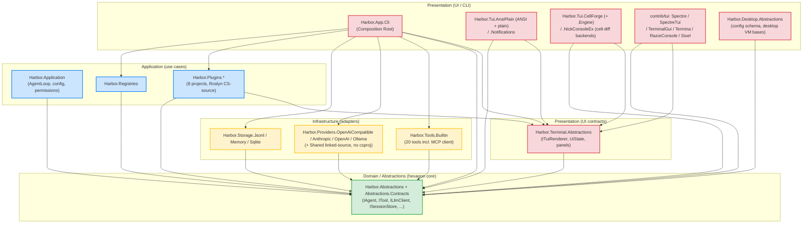

# Architecture Layers — Canonical Reference

> **This is the canonical reference for project layering in Harbor.**
> Every `<ProjectReference>` added to a `.csproj` MUST be checked against this document.
> See [ARCHITECTURE.md](./ARCHITECTURE.md) for the high-level design and
> [CODE_PRINCIPLES_AUDIT.md](./CODE_PRINCIPLES_AUDIT.md) §ARCH-001+ for the audit trail.
>
> **Связанные документы:**
> - [ARCHITECTURE.md](./ARCHITECTURE.md) — high-level design + principles summary.
> - [CLAUDE.md](../CLAUDE.md) §Layering rules — short version + checklist.
> - [CODE_PRINCIPLES_AUDIT.md](./CODE_PRINCIPLES_AUDIT.md) §ARCH-001..NNN — violations found and fixed.

---

## 1. The layering model

Harbor follows **Clean / Hexagonal / Onion Architecture** (call it whatever you want — the
user said *"слои должны быть по чистой архитектуре, гексогональная луковая называй как хочешь
но это надо"*). The dependency direction is **inward only**: an outer layer may reference an
inner layer, never the other way around. The innermost layer (Domain/Abstractions) references
**nothing** except the BCL and a small set of framework packages.

```
┌─────────────────────────────────────────────────────────────────┐
│  PRESENTATION (UI / CLI — composition roots)                    │
│  - apps/Harbor.App.Cli                                          │
│  - apps/Harbor.App.Avalonia (cross-platform desktop GUI)        │
│  - contrib/apps/: Harbor.App.Wpf / App.Maui / App.Blazor        │
│  - In-solution TUI renderers: Tui.AnsiPlain (unified ANSI +     │
│    plain) / Tui.CellForge (+ .Engine) / Tui.NickConsoleEx /     │
│    Tui.Notifications                                            │
│  - Optional contrib/tui renderers: Spectre / .Fullscreen /      │
│    SpectreTui / TerminalGui / Termina / RazorConsole / Sixel    │
│  - Harbor.Desktop.Abstractions (config schema: CommonConfig,    │
│    ICommonConfigStore; desktop VM bases)                        │
│  - Harbor.Terminal.Abstractions (TUI interfaces, ITuiPlugin)    │
│  - Harbor.DesignSystem (HDS v1 token catalog — zero Harbor      │
│    references; RgbColor + the cell-style primitives live here)  │
│  Depends on: Application + Ui.Framework + Abstractions          │
└─────────────────────────────────────────────────────────────────┘
                                  ▲
                                  │ uses
                                  ▼
┌─────────────────────────────────────────────────────────────────┐
│  UI FRAMEWORK (TEA + reusable VMs + components)                 │
│  - Harbor.Ui.Framework (+ split projects Abstractions/, State/, │
│    ViewModels/, Rendering/, Projection/, Services/, Sessions/;  │
│    shell csproj is a meta-package)                              │
│    State/      (UiStore, UiState{Ui,Chat}, AppMsg/ChatAppMsg,   │
│                AppReducer/ChatAppReducer — TEA)                 │
│    ViewModels/ (ChatLineVM, ToolCallVM, TokenUsageVM, ...)      │
│    Rendering/  (ChatMessageRenderer, ChatStreamingPresenter)    │
│    Sessions/   (SessionFactory, SessionSwitcher, SessionContext,│
│                 SessionGitTracker, IChatViewBinder)             │
│    Panels/     (dockable panel system)                          │
│    Services/   (IDispatcherAdapter, IThemeService,              │
│                 IToastService, GitService,                      │
│                 SessionStatusTracker)                           │
│    Configuration/ (ICommonConfigModelRefReader — read-only half │
│                    of the shared-config contract pair)          │
│  Depends on: Abstractions + Desktop.Abstractions                │
│              (circular-dep workaround: #453, ADR-009)           │
└─────────────────────────────────────────────────────────────────┘
                                  ▲
                                  │ uses
                                  ▼
┌─────────────────────────────────────────────────────────────────┐
│  APPLICATION (use cases, orchestration)                         │
│  - Harbor.Application (AgentLoop, Sessions, Agents,             │
│                        Configuration, Permissions, Onboarding)  │
│  - Harbor.Registries                                            │
│  - Harbor.Plugins.Abstractions (the plugin contract surface)    │
│  - contrib/scripting: Harbor.Scripting.* (ScriptHost, Bridge)   │
│  Depends on: Domain ONLY (Harbor.Abstractions +                 │
│              Harbor.Abstractions.Contracts)                     │
└─────────────────────────────────────────────────────────────────┘
                                  ▲
                                  │ implements
                                  ▼
┌─────────────────────────────────────────────────────────────────┐
│  INFRASTRUCTURE (adapters, I/O, external services)              │
│  - Harbor.Storage.Jsonl / Memory / Sqlite                       │
│  - Harbor.Providers.OpenAiCompatible / Anthropic / OpenAI /     │
│    Ollama (+ Shared — linked-source, без .csproj)               │
│  - Harbor.Tools.Builtin — все builtin tools в одном проекте,    │
│    каталог Tools/ (20 tools — см. docs/TOOLS_CATALOG.md;        │
│    MCP-клиент в подкаталоге Mcp/)                               │
│  - Harbor.Ipc.{Client, InProcess, Server} — RPC endpoints       │
│    (MessagePack over named pipes / in-process)                  │
│  - Harbor.Logging (Serilog per-run timestamped files)           │
│  - Harbor.Plugins.{Runtime, Hosting, Registration,              │
│    Instantiation, Compilation, Storage} — plugin machinery      │
│  Depends on: Domain ONLY                                        │
└─────────────────────────────────────────────────────────────────┘
                                  ▲
                                  │ declares
                                  ▼
┌─────────────────────────────────────────────────────────────────┐
│  DOMAIN / ABSTRACTIONS (the hexagon core)                       │
│  - Harbor.Abstractions (interfaces, events, value objs,         │
│    Plugins/IPlugin, PermissionRuleset, Identifiers, …)          │
│  - Harbor.Abstractions.Contracts (Models: Session, ContentPart, │
│    ToolResult, Usage, Pricing etc.; namespace                   │
│    `Harbor.Abstractions.Models`. Бывший `Harbor.Domain.dll` —   │
│    переименован в F1 decoupling (ADR-007, commit fa8d3ae).      │
│  - Harbor.Ipc.Abstractions (IPC contracts)                      │
│  - Harbor.Ui.Framework.Abstractions (the read-only config port) │
│    — the read-only half of the shared-config contract pair)     │
│  - Harbor.Diagnostics.Abstractions, Harbor.Extensions (leaves)  │
│  Depends on: Harbor.Abstractions.Contracts ONLY, plus BCL +     │
│              CSharpFunctionalExtensions +                       │
│              Microsoft.Extensions.Logging.Abstractions — no     │
│              Application / Infrastructure / Presentation.       │
└─────────────────────────────────────────────────────────────────┘
```

> **Two of this box's entries were wrong until #751, and they were wrong from the
> start, not out of date.** `Harbor.Desktop.Abstractions` and
> `Harbor.Terminal.Abstractions` were both listed here as Domain.
> `FullLayerMatrixTests` has carried `new(Layer.Presentation, …)` for both **since the
> matrix row was created** (2026-08-25, `5d2df19f`) — nothing was renamed and nothing
> moved, so this was a description disagreeing with the thing it describes rather than
> text left behind by a change. For `Desktop.Abstractions` the correction is mechanical,
> not editorial: `MatrixTable_RespectsLayerRules` lets a `Domain` row reference Domain
> only, and the project has five live edges into
> `Harbor.Ui.Framework.{ViewModels,State,Services,Sessions,Rendering}` — all
> Presentation — so marking it Domain would fail the architecture tests. §2 and the tests
> were always the truth; this box is only a summary of them.
>
> The `-Abstractions` suffix carries no layer meaning, which is why the name could not
> settle it: Domain holds `Harbor.Abstractions.Contracts`,
> `Harbor.Diagnostics.Abstractions`, `Harbor.Extensions` and
> `Harbor.Ui.Framework.Abstractions`; Presentation holds
> `Harbor.Terminal.Abstractions` and `Harbor.Desktop.Abstractions`. Which name a project
> *should* have is a layering decision (#555), not a docs one.
>
> The `Harbor.Desktop.Abstractions → Harbor.Ui.Framework.*` edges this box used to carry
> as an EXCEPTION are ordinary Presentation-to-Presentation edges the matrix permits; the
> circular-dependency workaround they caused is unchanged and is described in the next
> subsection. The `Harbor.Ui.Framework` *shell* edge that old EXCEPTION named is dead —
> that project has no `.cs` files at all and an empty allowed set (#450).

> **Fourteen more entries in this diagram were wrong until #888, in three boxes, and the
> same way: never right.** `FullLayerMatrixTests.Matrix` is measured from
> `Assembly.GetReferencedAssemblies()`; every list above is hand-typed, and until #888
> nothing compared the two. Measured against the matrix, the APPLICATION box named 16
> assemblies and agreed on 3:
>
> | §1 said | §1 placed | matrix says |
> |---|---|---|
> | `Harbor.Plugins.{Runtime, Hosting, Registration, Instantiation, Compilation, Storage}` | Application | Infrastructure (6 projects) |
> | `Harbor.Ipc.{Client, InProcess, Server}` | Application | Infrastructure |
> | `Harbor.Ipc.Abstractions` | Application | **Domain** — it is in this box's DOMAIN list too, one screen up |
> | `Harbor.Logging` | Application | Infrastructure |
> | `Harbor.Plugins.Host` | Application | **not a layer at all** — `OutOfScopeAssemblies`: "a composition root" |
> | `Harbor.DesignSystem` | Infrastructure | Presentation |
>
> `Harbor.Plugins.Host` is why it is no longer in any layer box. The matrix declines to
> classify it, so a diagram that puts it in a layer is asserting a third answer to a
> question the gate answers with "neither" — it is an `OutputType=Exe` out-of-process MCP
> stdio server, the same kind of thing as `apps/*`.
>
> **Why the diagram was wrong and the gate was not.** The Allowed sets are measurements.
> The plugin classification is then *forced* rather than chosen: the matrix permits
> Infrastructure→Infrastructure only through its `Family()` carve-out, and two
> `SharedSourceFolders` reasons exist precisely because the matrix "forbids
> Infrastructure→Infrastructure project references" — so reading those six rows as
> Application contradicts the same file four times over. The `Layer` enum's own doc comment
> already said it: Infrastructure is "providers, storage, tools, **IPC endpoints**,
> telemetry, plugin machinery" (`FullLayerMatrixTests.cs:37`).
>
> The honest limit, because it decides what may be claimed: for the IPC rows the *edges*
> do not force the class. `Harbor.Ipc.Server`'s Allowed set is two Domain targets and
> `MatrixTable_RespectsLayerRules` would accept that row as Domain, Application or
> Infrastructure alike. The layer there is a judgement, corroborated by what the projects
> contain — MessagePack framing in `Harbor.Ipc.Client`, named pipes and broadcast fanout
> in `Harbor.Ipc.Server`, pure `[Union]` request/response records and no I/O in
> `Harbor.Ipc.Abstractions`. What is measured is the Allowed set, and it is not in dispute.
> No edge is wrong; the prose was.
>
> **Fourteen, not the thirteen the guard's first red run reported — the difference was a
> bug in the guard that found the other thirteen.** `Harbor.Plugins.Instantiation`
> produced no finding, and not because this box was right about it. The extractor read
> each row as `line[1..].Trim()`, which leaves the row's closing `│` in place: it is not
> whitespace, so trimming keeps it. On a brace form wrapped across two lines that bar
> lands *inside* the braces, so the item became `│Instantiation`, the extracted name was
> `Harbor.Plugins.│Instantiation`, and that key is not in the matrix — so the assembly
> was counted as unjudged and produced nothing. Only a name beginning a *wrapped* line is
> affected, which is why five siblings in the same brace list were flagged and the sixth
> was not. `InnerText` strips the trailing bar, and
> `The_Extractor_Reads_Wrapped_And_Repeated_Brace_Forms` plants this exact shape.
>
> Recorded in the document as well as in the guard's history, because the failure mode is
> the dangerous kind: a silently *unchecked* assembly, in a guard whose whole subject is
> unchecked claims. A rule that under-reports is harder to catch than one that
> over-reports, and `13` was wrong for a reason no reader of that run could have derived.
>
> **This is the third time, which is why #888 also added the check.** #879 found three
> false rows in §5.6's capability table; #896 found nine here, two of them false since the
> matrix row was created; #888 found fourteen, one of which (`Harbor.Ipc.Abstractions`
> appearing in two layer boxes at once) is #896's own residue. Three doc edits and the file
> still lied, because `ci.yml` ignores `**.md` and `docs/**` by design (#509) and
> `check-doc-cites.py` proves a cited `file:line` still *exists* — it says itself that this
> is "necessary but NOT sufficient". Layer assignment is prose, so no existing gate saw it
> at all. `LayerDocAgreementRule.cs` in `tests/Harbor.Architecture.Tests/` now compares
> these boxes to the matrix rows, and **§1 is the only section it covers** — the
> abbreviations this diagram still uses (`Harbor.Storage.Jsonl / Memory / Sqlite`) and the
> `UI FRAMEWORK` box, which has no counterpart in the gate's five layers, are declared
> holes in that file's header rather than things it pretends to check.

### Why so many projects in the Domain layer?

| Project | Why it's separate | Why it's in Domain (not Application) |
|---|---|---|
| `Harbor.Abstractions` | Pure contract surface for the agent harness (LLM, tools, sessions, events, permissions, plugins). A headless consumer (CLI script, MCP bridge, test harness) can reference just this. | Contracts only — `Harbor.Abstractions.Contracts` and the BCL, no I/O. |
| `Harbor.Abstractions.Contracts` | Holds the concrete model types (`Session`, `ContentPart`, `ToolResult`, `Usage`, etc.). They declare `namespace Harbor.Abstractions.Models` so consumers don't need a second `using`. Бывший `Harbor.Domain.dll` — переименован в F1 decoupling (ADR-007, commit fa8d3ae, 2026-08-24). | Pure data + formatters — no I/O. |
| `Harbor.Ipc.Abstractions` | IPC contracts for the daemon/remote transport, so a client can be referenced without `Harbor.Ipc.Server` / `Harbor.Ipc.Client`. | Contracts only — `Harbor.Abstractions`, no I/O. |
| `Harbor.Ui.Framework.Abstractions` | Holds `ICommonConfigModelRefReader`, the narrow read-only port `Harbor.Ui.Framework.Sessions` needs for session bootstrap (#453, ADR-009). It is Domain so the port can sit *below* its consumer instead of beside it. | One narrow contract, no I/O. |
| `Harbor.Diagnostics.Abstractions`, `Harbor.Extensions` | Telemetry contracts (`ITracer`, `IMetrics`, `CorrelationContext`) and small cross-cutting helpers. | Zero Harbor references — leaves over BCL. |

Projects named `-Abstractions` that are **not** in this layer: `Harbor.Terminal.Abstractions`
(TUI contracts — Presentation) and `Harbor.Desktop.Abstractions` (config schema + desktop
VM bases — Presentation). Both were rows in this table's Domain column until #751; see the
note above the diagram.

### Circular-dependency workaround: `ICommonConfigModelRefReader`

```
Harbor.Ui.Framework
  ↓ (needs to read config for SessionFactory)
Harbor.Desktop.Abstractions (has ICommonConfigStore + CommonConfig)
  ↓ (direct ProjectReference, plus one to each of
  ↓  Ui.Framework.{ViewModels,State,Services,Sessions,Rendering})
Harbor.Ui.Framework  ← CYCLE!
```

**Fix**: declared `ICommonConfigModelRefReader` in
`Harbor.Ui.Framework.Abstractions/Configuration/` with a narrow contract (just
`ReadModelRefAsync`). Each platform app implements it as an adapter over its own
`ICommonConfigStore` (e.g. `CommonConfigReaderAdapter` in Avalonia).

Earlier revisions of this section named `Terminal.Abstractions` as the edge that
closes the cycle. It is one more edge in the same direction, not the cause: the
`Ui.Framework` edge is a direct `ProjectReference` (#453). The cycle is real
either way, which is why the workaround stands.

**These two contracts are a split of capability, not a duplicate** (#453). The
store is read/write over the whole `CommonConfig` and reports failures as
`Result`; the reader is read-only, hands out the single `ModelRef` session
bootstrap needs, and has no failure channel because "not configured yet" is the
normal pre-onboarding state. They cannot be merged — the cycle above — and
`CommonConfigContractRules` in `tests/Harbor.Architecture.Tests/` fails if the
narrow one grows a write member, a second implementer, or a re-derivation of
"is this reference whole?".

### Presentation → Application is a violation, not a preference: `ISessionForker`

The UI framework forks sessions, and the fork is Application-layer business logic
(`SessionForkService`). `FullLayerMatrixTests.Matrix_AllowedEntries_RespectLayerRules`
draws `Presentation → Application` as a violation, so `Harbor.Ui.Framework.Sessions`
cannot reference `Harbor.Application` — and the single existing exception on that
edge (`Harbor.Desktop.Abstractions` → `ProviderPresets`, #188/#96) is a named debt
with a stated fix, not a precedent to widen.

**What that cost, and the fix (#670).** `SessionFactory.CreateBranchAsync` used to
fork sessions itself, and the copy drifted until a desktop fork set no
`ParentSessionId`, persisted no title, and regenerated every copied message id — a
fork the user could not recognise as a fork. The same answer as the config seam
above applies: declared **`ISessionForker`** in
`Harbor.Ui.Framework.Abstractions/Forking/`, a Domain project the UI framework
already references, and had the composition root adapt it —
`SessionForkerAdapter` in Avalonia forwards to `SessionForkService`, which is
where `Harbor.App.Cli` already called it from. **Zero new `ProjectReference`s**:
the port adds Domain→nothing, the framework edge Presentation→Domain already
existed, and the adapter sits in a `CompositionRoot`, which the matrix permits
unrestricted.

`SessionFactory`'s constructor takes the port as a **required** parameter. That is
the load-bearing part: a required dependency means a host that wants to fork names
the one implementation, and a host that wires nothing gets a compile error instead
of silently falling back to a second, different fork — which is exactly how the
duplicate survived.

### Mermaid diagram


```mermaid
flowchart TB
    subgraph Pres["Presentation (UI / CLI)"]
        Cli["Harbor.App.Cli<br/>(Composition Root)"]
        TuiAnsi["Harbor.Tui.AnsiPlain (ANSI + plain)<br/>/ .Notifications"]
        TuiConsoleEx["Harbor.Tui.CellForge (+ .Engine)<br/>/ .NickConsoleEx (cell-diff backends)"]
        TuiContrib["contrib/tui: Spectre / SpectreTui<br/>/ TerminalGui / Termina / RazorConsole / Sixel"]
        DesktopAbs["Harbor.Desktop.Abstractions<br/>(config schema, desktop VM bases)"]
    end

    subgraph App["Application (use cases)"]
        AppLayer["Harbor.Application<br/>(AgentLoop, config, permissions)"]
        Core["Harbor.Registries"]
        Plugins["Harbor.Plugins.*<br/>(8 projects, Roslyn CS-source)"]
    end

    subgraph Infra["Infrastructure (adapters)"]
        Storage["Harbor.Storage.Jsonl / Memory / Sqlite"]
        Providers["Harbor.Providers.OpenAiCompatible / Anthropic / OpenAI / Ollama<br/>(+ Shared linked-source, no csproj)"]
        Tools["Harbor.Tools.Builtin<br/>(20 tools incl. MCP client)"]
    end

    subgraph Domain["Domain / Abstractions (hexagon core)"]
        Abs["Harbor.Abstractions + Abstractions.Contracts<br/>(IAgent, ITool, ILlmClient, ISessionStore, ...)"]
    end

    subgraph UiPres["Presentation (UI contracts)"]
        TuiAbs["Harbor.Terminal.Abstractions<br/>(ITuiRenderer, UiState, panels)"]
    end

    Cli --> Core
    Cli --> Plugins
    Cli --> Storage
    Cli --> Providers
    Cli --> Tools
    Cli --> Abs
    Cli --> TuiAbs

    DesktopAbs --> Abs

    TuiAnsi --> Abs
    TuiAnsi --> TuiAbs
    TuiConsoleEx --> Abs
    TuiConsoleEx --> TuiAbs
    TuiContrib --> Abs
    TuiContrib --> TuiAbs

    AppLayer --> Abs
    Core --> Abs
    Plugins --> Abs
    Plugins --> TuiAbs

    Storage --> Abs
    Providers --> Abs
    Tools --> Abs

    TuiAbs --> Abs

    classDef domain fill:#d4edda,stroke:#28a745,stroke-width:2px
    classDef app fill:#cce5ff,stroke:#007bff,stroke-width:2px
    classDef infra fill:#fff3cd,stroke:#ffc107,stroke-width:2px
    classDef pres fill:#f8d7da,stroke:#dc3545,stroke-width:2px

    class Abs domain
    class AppLayer,Core,Plugins app
    class Storage,Providers,Tools infra
    class Cli,TuiAnsi,TuiConsoleEx,TuiContrib,DesktopAbs,TuiAbs pres
```

`Harbor.Terminal.Abstractions` sits in a Presentation subgraph rather than the Domain
one: it is an `-Abstractions`-named project that the matrix does not place in Domain.
Corrected in #751 — see the note under the ASCII diagram above.

**Dependency direction = inward only.** Outer layers may reference inner layers;
inner layers never reference outer layers. The Domain layer has no inbound
arrows from outside itself — only outbound to BCL / third-party NuGet packages, plus
Domain-to-Domain edges *within* the layer (`Harbor.Abstractions` →
`Harbor.Abstractions.Contracts`, `Harbor.Ipc.Abstractions` → `Harbor.Abstractions`,
`Harbor.Ui.Framework.Abstractions` → `Harbor.Abstractions.Contracts`).


### Why so many projects in the Domain layer? (the split, not the count)

`Harbor.Abstractions` is the contract surface for the agent harness (LLM, tools, sessions,
events, permissions). `Harbor.Abstractions.Contracts` holds the concrete model types
those contracts speak in, split off in F1 decoupling (ADR-007) so a consumer can take the
contracts without the data. They are kept separate so that a headless consumer
(CLI script, MCP bridge, test harness) can reference just `Harbor.Abstractions` without
dragging in model DTOs. Both are Domain and reference each other in one direction only:
`Harbor.Abstractions` → `Harbor.Abstractions.Contracts`, never the reverse.

> This subsection used to be headed "Why **two** projects in the Domain layer?" and named
> `Harbor.Tui.Abstractions` as the second one. That project does not exist — it was a
> deprecated facade, it has no matrix row, and `src/` has no directory for it any more.
> The Domain layer is six projects deep in the matrix, and §1's diagram lists them. The
> `-Abstractions`-named projects that are **not** Domain are `Harbor.Terminal.Abstractions`
> and `Harbor.Desktop.Abstractions` (both Presentation) — corrected in #751.

---

## 2. Allowed and forbidden project references

> **Единственный механический источник правды** для рёбер `<ProjectReference>` сегодня —
> `tests/Harbor.Architecture.Tests`, в первую очередь `FullLayerMatrixTests` (§5.4):
> data-table на каждый src-assembly главного решения (вне области по документированным
> причинам: CodeGen build-tool, Plugins.Host exe; плюс два csproj-less каталога
> linked-source — `Providers.Shared`, `Storage.Shared`, см. §5.4). Таблица ниже —
> устоявшийся TL;DR, полезный как шпаргалка; при расхождении доверяйте тестам.

The matrix below is a **coarse-grain summary** of allowed `<ProjectReference>` edges.

| Project (row) → may reference (column)         | Domain (Abs. / Contracts / Tui.Abs.) | Application (Application/Core/Registries) | Plugins.* | Storage.* | Providers.* | Tools.Builtin | Tui.* (concrete) | Cli |
|------------------------------------------------|:---:|:---:|:---:|:---:|:---:|:---:|:---:|:---:|
| **Harbor.Abstractions**                        | ❌ (—) | ❌  | ❌  | ❌  | ❌  | ❌  | ❌  | ❌  |
| **Harbor.Application / Core**                  | ✅  | Registries only | ❌  | ❌  | ❌  | ❌  | ❌* | ❌  |
| **Harbor.Plugins.{Runtime, Hosting, …}**       | ✅ (Runtime also Tui.Abstractions) | ❌  | —   | ❌  | ❌  | ❌  | ❌  | ❌  |
| **contrib/scripting Harbor.Scripting***        | ✅  | ❌  | ❌  | ❌  | ❌  | ❌  | ❌  | ❌  |
| **Harbor.Storage.Jsonl / Memory / Sqlite**     | ✅  | ❌  | ❌  | —   | ❌  | ❌  | ❌  | ❌  |
| **Harbor.Providers.OpenAiCompatible / .Anthropic / .OpenAI / .Ollama** | ✅  | ❌  | ❌  | ❌  | —   | ❌  | ❌  | ❌  |
| **Harbor.Tools.Builtin**                       | ✅  | ❌  | ❌  | ❌  | ❌  | —   | ❌  | ❌  |
| **Tui renderers (Ansi / Plain / ConsoleEx / Notifications; contrib Spectre-family и др.)** | ✅  | ❌  | ❌  | ❌  | ❌  | ❌  | ❌ (не друг друга) | ❌  |
| **apps/Harbor.App.Cli**                        | ✅  | ✅  | ✅  | ✅  | ✅  | ✅  | ✅  | —   |

`❌*` Application layer (Core/Application) may not depend on UI vocabulary
(`Harbor.Tui.Abstractions`) — Core is the agent-harness application layer and must not
know about UI vocabulary. If Core needs to expose a hook that the UI cares about,
declare the contract in `Harbor.Abstractions` (or `Harbor.Tui.Abstractions` if it is
UI-specific), and let the Composition Root (`HostBuilder`) wire the UI-side adapter in.
Within the Application layer, Core may reference only its siblings
`Harbor.Application` + `Harbor.Registries` plus Domain
(see rule `Core_ReferencesOnlyApplicationAndRegistriesAndAbstractions`).

`\*` contrib-проекты (`Harbor.Scripting.*`, `contrib/apps/*`) живут вне `Harbor.slnx`
и правятся в `contrib/Contrib.slnx`; правила направления зависимостей те же.

### Concrete impl types belong ONLY in the Composition Root

Concrete implementations of:

- `ILlmClient` (e.g. `AnthropicLlmClient`, `OpenAiCompatibleLlmClient`, `OllamaLlmClient`)
- `ISessionStore` (e.g. `JsonlSessionStore`, `SqliteSessionStore`, `MemorySessionStore`)
- `ITool` (e.g. `ReadTool`, `BashTool`, `WebFetchTool`)
- `ITuiRenderer` (e.g. `AnsiTuiRenderer`, ConsoleEx `ScreenSession`-based renderer)
- `IAgent` (e.g. `DefaultAgent`)
- `IAgentLoop` (e.g. `AgentLoop`)
- `IEventBus` (e.g. `InMemoryEventBus`)

…may be **constructed** (i.e. `new`'d) **only** inside
`apps/Harbor.App.Cli/Hosting/HostBuilder.cs`
(the Composition Root). `Program.cs` resolves them from DI by their interface; it must NOT
`new` them directly. The architecture tests in §5 do NOT enforce this rule mechanically
(it requires call-site analysis, not just assembly references) — code review enforces it.

---

## 3. Layer responsibilities

### Domain / Abstractions

- **Contains:** interfaces (`IAgent`, `IAgentLoop`, `ITool`, `ILlmClient`,
  `ISessionStore`, `IProviderRegistry`, `IToolRegistry`, `IAgentRegistry`,
  `IEventBus`, `IPermissionService`, `ICompactionService`, `ISystemPromptBuilder`),
  value objects (`SessionId`, `MessageId`, `ProviderId`, `ModelRef`, `ToolName`,
  `AgentName`), record models (`Session`, `Message`, `AgentEvent`, `LlmEvent`,
  `ToolResult`, `AgentDefinition`, `AgentState`), and pure rulesets
  (`PermissionRuleset`).
- **Forbidden:** any I/O (file, network, console), any DI registration, any
  Roslyn/Jint/HttpClient dependency, any `sealed class` with mutable state.
- **Allowed NuGet:** `CSharpFunctionalExtensions` (for `Result<T>`),
  `Microsoft.Extensions.Logging.Abstractions`, `MemoryPack`,
  `CommunityToolkit.HighPerformance`, `ZLinq`.

### Application

- **Contains:** use-case orchestration. `AgentLoop.RunAsync` is the canonical use case
  ("advance the conversation one full turn"). `CompactionService.CompactAsync`,
  `PermissionService.CheckAsync`, contrib `ScriptHost.EvaluateAsync`,
  `PluginHost.LoadAllAsync` are all use cases. Registries (`ToolRegistry`,
  `ProviderRegistry`, `AgentRegistry`) live in `Harbor.Registries`/`Harbor.Application`
  because they hold the in-memory state that use cases mutate.
- **Forbidden:** `HttpClient`, file I/O outside of well-defined adapter seams,
  `Console.Write*`.
- **Note:** Roslyn (CS-source plugin compilation) lives in its own project
  `Harbor.Plugins.Compilation` since the plugin-host decomposition — the old
  «Compilation subfolder inside Plugins.Runtime» layout is gone. `Harbor.Plugins.Runtime`
  owns only `CsPluginLoader` + compiled-result types; hosting graph lives in
  `Harbor.Plugins.Hosting`; source sources in `Harbor.Plugins.Storage`;
  instantiation/lifecycle in `Harbor.Plugins.Instantiation`; registration in
  `Harbor.Plugins.Registration`. **The Architecture tests do NOT treat the whole
  `Harbor.Plugins.*` family as Application-layer projects** — §1 listed all eight as
  Application until #888 corrected it. Only `Harbor.Plugins.Abstractions` is Application;
  the other six in-solution projects are classified Infrastructure, and
  `Harbor.Plugins.Host` is not classified at all (`OutOfScopeAssemblies` — an
  `OutputType=Exe` composition root). The reason the six are Infrastructure rather than
  Application is not a preference: they reference each other, and
  `MatrixTable_RespectsLayerRules` forbids Infrastructure→Infrastructure except *within* a
  family, via the `Harbor.Plugins.*` prefix in its `Family()` helper. Application sits a
  layer **above** Infrastructure, so an implementation stack that composes its own
  machinery cannot be an Application project. `Harbor.Plugins.Runtime`'s row says this
  outright: "classified Infrastructure-plugins rather than Application because of those
  intra-family edges".

### Infrastructure

- **Contains:** adapters — concrete implementations of `ILlmClient`, `ISessionStore`,
  `ITool`, etc. These projects translate between the outside world (HTTP, filesystem,
  subprocess, native interop) and the Domain contracts.
- **Forbidden:** references to the Application layer (`Harbor.Application`,
  `Harbor.Registries`) or to each other (`Harbor.Providers.Anthropic` must not
  reference `Harbor.Providers.OpenAI`).
- **Allowed NuGet:** anything I/O-related — `Microsoft.Data.Sqlite`,
  `Microsoft.Extensions.Http`, `Jint`, etc.

### Presentation

- **Contains:** entry points and UI renderers. `apps/Harbor.App.Cli/Program.cs` is the main
  CLI `Main` entry point (`apps/Harbor.App.Avalonia/Program.cs` for the desktop app).
  `Harbor.Tui.*` projects are renderers — each implements
  `ITuiRenderer` (or one of the more specific TUI interfaces from
  `Harbor.Terminal.Abstractions`).
- **Composition Root:** `apps/Harbor.App.Cli/Hosting/HostBuilder.cs` is the only place that
  knows about concrete Infrastructure types. It wires them into the DI container by
  interface.
- **Forbidden (references):** Presentation projects must NOT reference each other (e.g.
  `Harbor.Tui.AnsiPlain` must not reference `Harbor.Tui.CellForge`). They may share the
  `Harbor.Terminal.Abstractions` contract surface.
- **Forbidden (capabilities):** a Presentation assembly must not exercise an I/O
  capability directly. The reference matrix cannot catch this — `System.IO.File`,
  `System.Diagnostics.Process` and `System.Net.Http` are BCL types, visible in no
  `<ProjectReference>`. Enforced mechanically by
  `tests/Harbor.Architecture.Tests/PresentationCapabilityRules.cs` (see §5.6); the
  capability-to-layer assignment comes from the Infrastructure clause at the top of this
  section ("subprocess, filesystem, native interop"):

  | Rule id | Forbids | Layer that owns it |
  |---|---|---|
  | `PRESENTATION-MUST-NOT-SPAWN-SUBPROCESSES` | `System.Diagnostics.Process*` | Infrastructure (`BashTool` / `McpProcessClient` in `Harbor.Tools.Builtin`); UI-chrome spawns go through a Domain contract and live in `Harbor.Application` (`ProcessGitQuery` #537, `ProcessNotificationRunner` #665) |
  | `PRESENTATION-MUST-NOT-TOUCH-THE-FILESYSTEM-FILES` | `System.IO.File*` | Infrastructure (`Harbor.Storage.*`, config stores) |
  | `PRESENTATION-MUST-NOT-TOUCH-THE-FILESYSTEM-DIRECTORIES` | `System.IO.Directory*` | Infrastructure (file-tree / theme scanning) |
  | `PRESENTATION-MUST-NOT-USE-THE-NETWORK` | `System.Net.Http*`, `Sockets`, `WebRequest`, … | Infrastructure (`Harbor.Providers.*`, `Harbor.Transport.Remote`) |
  | `PRESENTATION-MUST-NOT-LOAD-ASSEMBLIES-OR-EMIT-IL` | `System.Reflection.Emit`, `AssemblyLoadContext` | nowhere — banned outright (NativeAOT-readiness) |

  A shell-out from the UI is the sharp edge: because the class is not an `ITool`, the
  call never reaches `PermissionRuleset.Evaluate`, never appears in the tool-call
  transcript, and cannot be cancelled by the agent loop. Route it through an `ITool`.

  **Deliberately not capabilities:** `System.IO.Path` (pure string manipulation —
  Presentation formats paths for display), `Console.*` (the renderer's job), and P/Invoke
  to `kernel32`/`libc` for VT-mode handling (also renderer work, in
  `Harbor.Tui.CellForge.Engine`). `System.Environment.GetEnvironmentVariable` /
  `CurrentDirectory` / `GetFolderPath` are genuine configuration leaks but are used
  pervasively by renderers; they are tracked in #518 rather than baselined here.

---

## 4. Layering rules cheat-sheet

| Rule                                                                                              | Enforced by              |
|---------------------------------------------------------------------------------------------------|--------------------------|
| Domain projects reference no other Harbor project (allowed: Tui.Abstractions → Abstractions only). | Architecture tests       |
| Application projects (Application/Core/Registries/Plugins.*) reference Domain only — never Infrastructure, never Presentation. | Architecture tests       |
| Infrastructure projects (Storage.*, Providers.*, Tools.Builtin) reference Domain only — never Application, never each other, never Presentation. | Architecture tests       |
| Presentation projects (Tui.* renderers) reference Domain only — never Application, never Infrastructure, never each other. | Architecture tests       |
| Presentation projects exercise no I/O capability of their own: no subprocess, no `System.IO.File`/`Directory`, no network, no reflection emit (§3 table, §5.6). | Architecture tests (`PresentationCapabilityRules`) |
| A domain fact decided by the core is decided in ONE place, and the presentation layer reads it: no `SessionStatus`-returning method derives it from the transcript (#687), the `SessionStatus` label/brush table exists once, bar one recorded exception (§5.7) (#663), the core classifies diagnostics (#674), money is priced in the core (#653). | Architecture tests (`SessionStatusSourceRule`, `SessionStatusTableRule`, `DiagnosticsClassificationRule`, `CostPricedInCoreRules`) |
| `apps/Harbor.App.Cli` references everything — it is the Composition Root.                         | (by convention)          |
| Concrete impl types (`AnthropicLlmClient`, `JsonlSessionStore`, …) are `new`'d only inside `HostBuilder.cs`. | Code review              |
| `Program.cs` resolves services by interface from DI; it does not `new` Infrastructure types.       | Code review              |
| New interfaces go in `Harbor.Abstractions` (or `Harbor.Tui.Abstractions` for UI-only contracts), never in the Application layer. | Code review              |
| New value objects / records go in `Harbor.Abstractions.Contracts` (namespace `Harbor.Abstractions.Models`), never in the Application layer.            | Code review              |

---

## 5. Architecture tests

`tests/Harbor.Architecture.Tests/Harbor.Architecture.Tests.csproj` contains the
mechanically-enforced rules. The test project references every Harbor project so it can
load each assembly via reflection and assert on `GetReferencedAssemblies()`.

The tests come in **six files** (`LayerDependencyTests`, `NetArchLayerRules`,
`AbstractionsSplitLayerRules`, `FullLayerMatrixTests`, `CellForgeGraphRules`,
`PresentationCapabilityRules`, `EnforcerIntegrityTests`) — the executed total
exceeds the method count because of parameterised cases:

### 5.1 Reflection-based — `LayerDependencyTests.cs`

Uses plain `System.Reflection` (`Assembly.GetReferencedAssemblies()`) — zero extra
dependencies, fast, trivially readable. This is the zero-dependency fallback so the
layering rules still run even if NetArchTest ever fails to restore.

The 11 rules cover:

1. `Abstractions_HasNoHarborProjectReferences`
2. `TuiAbstractions_ReferencesOnlyAbstractions`
3. `UiFrameworkState_ReferencesOnlyAbstractionsFamily`
4. `Application_ReferencesOnlyAbstractions`
5. `Registries_ReferencesOnlyAbstractions`
6. `PluginsRuntime_ReferencesOnlyAbstractions` (Runtime also allows Tui.Abstractions)
7. `Providers_ReferencesOnlyAbstractions`
8. `Storage_ReferencesOnlyAbstractions`
9. `ToolsBuiltin_ReferencesOnlyAbstractions`
10. `TuiRenderers_ReferencesOnlyAbstractionsAndTuiAbstractions`
11. `AllExpectedHarborAssembliesAreLoaded` (coverage guard — a new src project without a rule fails loudly)

> #451 removed the `Harbor.Core` facade and with it
> `Core_ReferencesOnlyApplicationAndRegistriesAndAbstractions`; the invariant it
> stood for is now enforced against both real owners (`Harbor.Application`,
> `Harbor.Registries`) above and, table-wide, by `FullLayerMatrixTests`.
>
> #450 removed the `Harbor.Scripting` entries from the shared forbidden lists:
> that name is a `contrib/` project *family*, never an assembly, so every
> constraint naming it could never fail. The whole-layer rules above already
> cover those assemblies.

### 5.2 NetArchTest-based — `NetArchLayerRules.cs`

Uses the [`NetArchTest.Rules`](https://github.com/BenMorris/NetArchTest) fluent DSL
(`Types.InAssembly(...).Should().NotHaveDependencyOn(...).GetResult()`). The same
invariants are expressed in the more declarative NetArchTest style; this acts as a
cross-check that survives both tool surfaces and serves as a copy-paste template for
contributors who already know NetArchTest.

The 21 NetArchTest rules mirror the reflection-based rules above with names like
`NetArch_<Project>_DoesNotDependOn_<ForbiddenLayer>`. The pattern is:

```csharp
[Test]
public async Task NetArch_Core_DoesNotDependOn_Infrastructure()
{
    var types = Types.InAssembly(typeof(AgentLoop).Assembly);
    var result = types
        .Should()
        .NotHaveDependencyOn("Harbor.Providers.OpenAiCompatible")
        .And().NotHaveDependencyOn("Harbor.Storage.Jsonl")
        // ...
        .GetResult();
    await Assert.That(result.IsSuccessful).IsTrue();
}
```

Additionally `AbstractionsSplitLayerRules.cs` pins the F1-decoupling invariants
(`Harbor.Abstractions.Contracts` ↔ `Harbor.Abstractions` split — ADR-007).

### 5.3 Running the tests

```bash
# Build only:
dotnet build tests/Harbor.Architecture.Tests/Harbor.Architecture.Tests.csproj

# Run the architecture tests:
dotnet run --project tests/Harbor.Architecture.Tests/Harbor.Architecture.Tests.csproj
```

If a test fails, the assertion message lists every forbidden assembly that the project
actually references. Fix the `<ProjectReference>` in the offending `.csproj`, then
re-run.

### 5.4 Full-project matrix — `FullLayerMatrixTests.cs` (ROP-D)

Before ROP-D only assemblies with a hand-written `typeof()` probe had layer rules
(~18 src projects). `FullLayerMatrixTests.cs` closes the gap with one data
table covering **every main-solution src assembly** (45 rows at the time; grown to
47/50 src dirs as of 2026-08-27 — see §2 banner):

1. *Reference check* — actual `Assembly.GetReferencedAssemblies()` ⊆ the row's
   Allowed set (+ documented exceptions). IL-level: transitive ProjectReferences
   that leak types into a consumer's AssemblyRef are caught too.
2. *Allowed-set liveness* — every entry a row permits must be a reference the
   assembly really has. Without this the Allowed side rots silently: a permitted
   edge nobody uses is a hole waiting for the next contributor.
3. *Table guard* — Allowed sets themselves must respect the layer classes
   (Presentation ↛ Infrastructure/Application, Infrastructure ↛ Presentation,
   Domain ↛ Domain-only), so a violation cannot be pre-declared as "allowed";
   real exceptions live in `DocumentedExceptions`, each with a reason.
4. *Exception liveness* — every documented exception must correspond to a real
   current reference (no rotting into blanket permissions).
5. *Exception scope* — a documented exception names the **individual source
   files** allowed to bind the target assembly, not the whole project. A new
   file reaching into the offending assembly fails, so an exception cannot
   absorb unrelated future violations.
6. *Coverage* — adding a src project without a matrix row (and a ProjectReference
   in the test csproj) fails loudly instead of silently skipping.

Out of scope by design: `Harbor.CodeGen` (source-generator project, consumed via
`OutputItemType=Analyzer`), `Harbor.Plugins.Host` (OutputType=Exe out-of-process
MCP server — an app), and `apps/*` composition roots. Every one of these lives in
`OutOfScopeAssemblies` with a reason, and `EnforcerIntegrityTests.SrcProjects_AreAllClassified`
fails when a new `src/` project is in neither list.

Two further folders are out of scope because they produce no assembly at all:
`Harbor.Providers.Shared` and `Harbor.Storage.Shared`. Their files are
`<Compile Include>`-linked into their consumers (four providers, and the Jsonl +
Sqlite stores) rather than referenced, because the matrix forbids
Infrastructure→Infrastructure project references and these are exactly the cases
that would need one. They live in `SharedSourceFolders` as folder → reason.

**A csproj-less folder is not off the map — it is a separate, checked case (#456).**
`SrcProjects_AreAllClassified` iterates projects that *have* a csproj, so on its own
it cannot see a folder that has none; `Harbor.Storage.Shared` was undeclared there
while the gate was green. `SharedSourceLinkRules` closes that, and closes the half
that mattered more: linked source is compiled *into* the consumer, so the IL matrix
already judges its references, but a rule walking `src/<project>/**` did not see
the file at all — so "which files bind the forbidden target?" answered without it.
`RepoPaths.EnumerateCsFiles` now returns the link items too, which is what makes
`DocumentExceptions_AreScopedToNamedFiles` see shared code.

**The namespace-ownership rule needed its own resolution, and did not get one (#763).**
That sentence used to claim `EnumerateCsFiles` was also "what makes the
namespace-ownership map see shared code". It is not: `AbstractionsNamespaceOwnershipRules`
has its own project map and its own walk-up for an owning `*.csproj`, and never
called the helper #456 had just fixed. A file in a csproj-less folder therefore left
that walk with nothing, and the rule reported green having read none of the six
linked files. `FindAssembliesCompiling` now falls back to the `<Compile Include>`
items — the same `RepoPaths.ReadCompileIncludes` the other rules read — and attributes
a shared file to *every* assembly that compiles it, because the namespace is declared
by all of them and picking one copy would make the verdict depend on which copy the
walk reached. `No_Namespace_Declaration_Is_Left_Without_An_Assembly_To_Judge_It` makes
the leftover case a failure instead of a silent skip.

Converting either folder to a real assembly is *not* a mechanical follow-up: it
would mean an Infrastructure assembly referenced by other Infrastructure
assemblies, i.e. widening the rule the mechanism works around, plus a
public-surface decision for code that is `internal` in every consumer. That is a
layer-model change with its own trade-offs and belongs on its own issue.

### 5.5 Rules about the rules — `EnforcerIntegrityTests.cs` (#450)

The checks above have a failure mode they cannot see themselves: a rule naming
something that does not exist, permitting more than intended, or covering nothing
is green forever. `EnforcerIntegrityTests.cs` closes that class:

| Rule | Guards against |
|---|---|
| `RepositoryInventory_IsDiscoverable` | csproj-walking rules silently passing when the repo root is not found |
| `RuleTargetAssemblyNames_AllExist` | **vacuous targets** — a typo, rename or deleted project left in a forbidden/allowed list |
| `SrcProjects_AreAllClassified` | an assembly in `src/` that is on no list at all (unbounded reach) |
| `Matrix_AllowedEntries_AreLive` | **allowed-set rot** — permitted edges nobody uses |
| `DeclaredProjectReferences_AreJustifiedByTheMatrix` | **csproj-level drift** — a `<ProjectReference>` that binds no type emits no IL, so every AssemblyRef-based rule is blind to it |
| `DeclaredButUnboundProjectReferences_AreReallyUnbound` | a "vestigial" exemption that is actually a live dependency in disguise |
| `DocumentedExceptions_AreScopedToNamedFiles` | **project-granular exceptions** hiding new violations |
| `DocumentedExceptions_AllHaveReasons` | reasonless, accidental exceptions |

The vacuity trap in particular: NetArchTest's `NotHaveDependencyOn("X")` and the
reflection `FindForbiddenReferences(asm, "X")` both treat a **non-existent
assembly name as a satisfied constraint**. `Harbor.Scripting` (a `contrib/`
project *family*, never an assembly) and `Harbor.Domain` (deleted in the F1
split) were named by 15 rule positions and enforced nothing.
`RuleTargetAssemblyNames_AllExist` resolves every name against the real project
tree, so that class of rot now fails.

Adding a `<ProjectReference>` that binds no type therefore needs an explicit
entry in `DeclaredButUnboundProjectReferences` with a reason — a deliberate act
a reviewer can see, instead of an invisible edge.

### 5.6 Skipping a test for a known violation

When a real violation is found and cannot be fixed in the current sprint, mark the
test with a `// TODO(arch): violation, see ARCHITECTURE_LAYERS.md §known-violations`
comment and skip it via `Assert.Skip(...)`. Do NOT leave a layering test red on
`main` — either fix the violation or skip the test.

```csharp
[Test]
public async Task NetArch_SomeRule()
{
    // TODO(arch): violation, see ARCHITECTURE_LAYERS.md §known-violations
    await Assert.Skip("Known violation — see ARCHITECTURE_LAYERS.md §known-violations");
    // ... rest of test stays for documentation ...
}
```

### 5.6 Capability rules — `PresentationCapabilityRules.cs` (#455)

The four files above enforce the **reference** half of the contract: which
`<ProjectReference>` edges may exist. That is not sufficient. `System.IO.File`,
`System.Diagnostics.Process` and `System.Net.Http` are BCL types — they appear in no
ProjectReference, so a perfectly layered assembly can still fork a shell or overwrite
the user's config. `PresentationCapabilityRules.cs` enforces the missing half.

**Mechanism.** Mono.Cecil (the copy `NetArchTest.Rules 1.3.2` already restores — no new
`PackageReference`) reads each Presentation assembly's metadata, walks every method body,
and collects every BCL type referenced from an IL operand or a type/field/method
signature. A rule is a list of type-name prefixes matched with `StartsWith`, so one entry
covers a family (`System.IO.File` also covers `FileStream`, `FileInfo`, `FileAccess`).
Because this is IL-level it catches a `File.ReadAllText` that no assembly-reference check
can see.

**Scope.** The Presentation set is not a second hand-maintained list — it is read from
`FullLayerMatrixTests.Matrix` via `PresentationLayerAssemblies()`, so a new Presentation
src project becomes capability-enforced the moment it gets a matrix row.

**Attribution.** `async` methods and lambdas live in compiler-generated nested types
(`<Foo>d__7`, `<>c__DisplayClass0_0`). The probe collapses those to the nearest type a
human wrote, so baseline keys survive edits and CI failures name a findable type.

**Baseline, not a skip.** Presentation performs I/O today, so the rules land *enforced*
against a `KnownViolations` table keyed by (assembly, rule id, declaring type) — the same
shape as `DocumentedExceptions` in §5.4. A rule holds only if its hits are a subset of the
baseline, so new I/O in any Presentation type is red on the spot. The baseline is
type-granular, not method-granular; see §6 for the inventory and the per-site issues.

**Permanent capabilities, in a second table.** A baseline row is a promise *to fix*: it
names the issue that will delete it, and §6 counts rows deleted. Some capabilities are
real, legitimate and unfixable — the console device a renderer reads stdin from is the
canonical one. Filing those as violations misfiles a permission as debt: it reads as
precedent ("renderers may touch the filesystem"), and it makes the owning issue's
checkbox unreachable, since the row can be neither deleted nor kept in the right place.
Such capabilities go in `PermanentCapabilities`, keyed identically but valued by their
**reason** rather than a tracking issue. The reason is mandatory and the table gets the
baseline's anti-rot liveness test, so it is a decision on the record, not a hole
(#669).

**Non-vacuity.** A rule nobody can fail is a comment, and NetArchTest's
`NotHaveDependencyOn` has a failure mode here: an unmatched name is a satisfied
constraint, so a typo'd or deleted assembly passes forever. Five tests close that door:

1. `NonVacuity_Probe_ReadsRealIlFromThisTestAssembly` — probes this test assembly, whose
   source is in the repo and is known to call `Directory.GetFiles` and `File.Exists`; both
   rules must fire, and the assembly file must exist. "No violations" can never mean "no
   input".
2. `NonVacuity_Probe_CanStillDetectForbiddenCapabilities` — the sensitivity control: the
   same probe, rules and matchers run against a *real* positive control,
   `Harbor.Tools.Builtin` (ReadTool/EditTool/GlobTool touch the filesystem,
   BashTool/McpProcessClient fork processes), and MUST report hits. If the probe ever
   degrades to "nothing anywhere", the Presentation rules go red instead of vacuously
   green.
3. `NonVacuity_GrandfatheredViolations_AreStillReal` — every baseline row must still match
   a real hit, so the list cannot rot into a blanket permission (the
   `DocumentedExceptions_AllCurrentlyRealized` pattern).
4. `PermanentCapabilities_AreAllCurrentlyRealized` — the same guarantee for the
   permanent-capability table, so the second table gets no weaker a deal than the first.
5. `RuleTable_And_Baseline_Are_WellFormed` — rule ids unique and non-blank, every rule
   states what it forbids and why, every baseline row names an existing rule, points at a
   tracking issue, and names an assembly the matrix really classifies as Presentation (a
   typo there would grandf nothing). For the permanent table: same, minus the issue URL,
   plus a mandatory reason and no row may appear in both tables at once.

`PRESENTATION-MUST-NOT-USE-THE-NETWORK` and
`PRESENTATION-MUST-NOT-LOAD-ASSEMBLIES-OR-EMIT-IL` have **empty** baselines: Presentation
is clean on both today, so they run fully armed rather than being deferred with the rest.

### 5.7 Single-source rules — a fact decided once, in the core

The §5.6 rules ask *which capabilities* Presentation may use. These ask a different
question: **is a domain fact decided in one place, or does every consumer reach its
own verdict?** A second verdict is not a style difference — it disagrees with the first,
and nothing in the type system objects.

| Rule | Fact | Issue |
|---|---|---|
| `SessionStatusSourceRule` | a `SessionStatus` is decided on the transition that establishes it (`ChatAppReducer`, from the core's own `AgentErrorEvent` / `AgentEndEvent`), and no method returning one may read the transcript | [#687](https://github.com/refusedguy/Harbor-Harness/issues/687) |
| `SessionStatusTableRule` | the `SessionStatus` → label / brush-key table exists in exactly one file (`StatusMappers`), **with one recorded exception** — see the exception note below | [#663](https://github.com/refusedguy/Harbor-Harness/issues/663) |
| `DiagnosticsClassificationRule` | the detector patterns are declared once, in the core detector, and the LSP counts stay connected to state | [#674](https://github.com/refusedguy/Harbor-Harness/issues/674) |
| `CostPricedInCoreRules` | money is priced by the core from the model that made the call; no renderer recomputes it | [#653](https://github.com/refusedguy/Harbor-Harness/issues/653) |

**Mechanism.** Repository text scans over `src/` + `apps/` (`contrib/` is outside CI and
outside support by owner decision, so it is neither scanned nor expected clean). These
are rules about a table NOT existing in a second file and about a method's body, neither
of which survives into metadata — a compiled check could not be landed before the fix it
guards, and the whole point of writing the guard first is that it is red against the
defect. Comments are stripped first (`SourceCommentStripper`, shared across these rules)
so a file's own doc comment quoting the rule it violates is not graded as code.

**Perimeters are derived, not re-typed.** `SessionStatusSourceRule` reads its Presentation
set from `FullLayerMatrixTests.PresentationLayerAssemblies()` for the same reason §5.6
does, so a new Presentation project is covered the moment it gets a matrix row.

**The recorded exception to "exactly one file" — and why it is not removable here.**
`SessionStatusTableRule` carries the only allowlist in this section:
`SessionStatusTableProbe.KnownDuplicates`, with exactly one entry,
`src/Harbor.Ui.Framework.Projection/Projection/SubagentsModel.cs`. So the honest count is
**two tables in the tree, one of them recorded** — the wording above is the rule's
aspiration, not the whole current tree.

The second table is a real `SessionStatus` → label switch that had already drifted
(`Working` → `"running"`, where `StatusMappers` says `"working"`), so it is not a
harmless copy. It survives for a structural reason, and the reason is still true today:

- The canonical table lives in `Harbor.Ui.Framework.ViewModels`.
- `Harbor.Ui.Framework.Projection` does not reference it, and the matrix in §2 puts both
  in `Layer.Presentation`, so the edge is not available to add.
- Collapsing it means either a cross-project call or relocating the canonical table
  downward — an architecture change, not a doc fix.
- `"running"` is pinned as visible CellForge output by
  `CellForgeSubagentsPanelTests.FormatAge_And_StatusText_CoverVocabulary`, so relabelling
  is a visible-output decision owed its own issue.

Two things keep the record honest rather than an allowlist that rots into a blanket
permission. `RecordedDuplicates_AreStillReal` fails the moment the entry stops being a
real duplicate, so the excuse has to be deleted in the same commit that removes the table;
and the entry is valued by its **reason**, not by a tracking issue, per §5.9. Note that
the entry is graded rather than skipped — the switch in `SubagentsModel` is still scanned
and would still fail the rule if the entry were ever dropped.

This sentence exists because the summary table above used to state "exactly one file" with
no mention of the exception, while the rule file recorded one — the guard and the prose
disagreed, and only the prose was wrong. Related: [#862](https://github.com/refusedguy/Harbor-Harness/issues/862),
[#896](https://github.com/refusedguy/Harbor-Harness/issues/896),
[#902](https://github.com/refusedguy/Harbor-Harness/issues/902).

**Non-vacuity.** Each rule carries a liveness check (the scan really walked a checkout,
the canonical file really exists, the rule table is non-empty) and a positive control that
feeds the probe a synthetic violation and REQUIRES a hit, alongside snippets it must not
report. A probe whose matchers stopped working reports nothing, and the rule goes green
while enforcing nothing — which is the failure mode these rules exist to prevent.

### 5.8 The reflection convention — allowed in tests, banned in product, plugins excepted

> **Reflection is allowed in tests. It is forbidden in shipped product code, except in
> the `src/Harbor.Plugins.*` family, which needs it deliberately.**

Until [#626](https://github.com/refusedguy/Harbor-Harness/issues/626) this existed only as
an emergent property of the `ReflectionAnalyzers` (`REFL*`) diagnostics plus the
zero-warning bar. Nothing in the repo said it was a rule, so a contributor adding
`Assembly.Load` somewhere new had no way to know it was the thing the codebase is built to
avoid. Enforced by `ReflectionConventionRule`.

**What is banned, and where.** The dynamic-code family — `Assembly.Load` / `LoadFrom` /
`LoadFile`, `AssemblyLoadContext`, `Reflection.Emit`, `TypeBuilder`, `DynamicMethod`,
`AppDomain.DefineDynamicAssembly` — may appear only under `src/Harbor.Plugins.`. These are
one capability, not seven: a run-time-loaded or emitted assembly is invisible to NativeAOT,
appears in no `<ProjectReference>`, and is therefore invisible to every reference rule in
§5.1–§5.2. A guard naming only `Assembly.Load(` would be satisfied by switching to
`AssemblyLoadContext`. The scan covers the product trees `src/` and `apps/`.

**What is deliberately NOT banned.** `GetMethod("Name")` / `GetProperty("Name")` /
`GetField("Name")` looks like the same thing and is not. Over `src/` and `apps/` the
overwhelming majority of that shape is `JsonElement.GetProperty` / `TryGetProperty` — a
JSON key, not a CLR member, where the string *is* the call. A blanket ban would fire on
every tool's argument reader and every provider payload builder, and the cheapest way to
green such a ban is to suppress it, at which point it enforces nothing. **The
classification that would be needed before that form can be ruled on is NOT DONE** — do
not add a rule over it on the strength of a count.

Three facts the survey did establish, recorded because they are the non-obvious part:

* The dynamic-load/emit family has **exactly one** real site in `src/`, and it is in the
  allowed family: `CollectiblePluginLoadContext` in
  `src/Harbor.Plugins.Compilation/`, which derives from `AssemblyLoadContext`. Every other
  occurrence of these names in `src/` is inside a `///` comment.
* `apps/` has **zero**.
* One real Type-level reflection outside the plugins is **not** covered by this rule:
  `src/Harbor.Desktop.Shared/Locators/ViewModelLocator.cs` calls
  `typeof(ServiceProviderServiceExtensions).GetMethods()` and `MakeGenericMethod` to build
  a service call. That is member-by-reflection, not assembly loading, so banning it here
  would widen the rule on a guess about intent. Recorded as **out of scope**, not approved.

**Why the plugin exception is the product, not debt.** CS-source plugins are compiled
in-memory with Roslyn and run with full trust; DLL plugins are loaded at run time so a swap
needs no host restart; `Harbor.Plugins.Host` is the separate-process boundary. The
allowance is therefore a permission carrying a **reason**, not a TODO — the point is that
the next contributor reads it as a decision and does not "fix" it like a bug.

**Non-vacuity, in three places.** A guard that names a path nobody occupies is the
NetArchTest trap in a new coat:

1. `The_Plugin_Allowance_Is_Not_A_Dead_Prefix` — the allowance must be **occupied** by a
   real forbidden construct. An unused exemption is a comment with a table around it, and a
   renamed construct leaves the rule green while the thing it describes is gone.
2. `The_Plugin_Allowance_Is_NonEmpty_Scoped_And_Explained` — the prefix must match real
   project directories, must carry a reason, and must not reach past the plugin family. A
   prefix that matches nothing is a satisfied constraint enforcing nothing.
3. `NonVacuity_The_Forbidden_Construct_Matcher_Fires_On_A_Planted_Offender_Only` — the
   matcher is handed ten synthetic snippets and must report six, staying silent on JSON
   property access, on `///` prose that quotes the construct, and on a non-dynamic
   `Assembly` member.

**Why "tests are allowed" is proved rather than asserted.** The convention leans on
`SourceScan`'s `tests/` exclusion, so
`NonVacuity_Discovery_Sees_The_Product_Tree_And_Excludes_Tests_On_Purpose` requires the
excluded tree to really contain what the rule bans: `tests/Harbor.Architecture.Tests/GlobalUsings.cs`
calls `Assembly.Load` in `ArchitectureTestHelpers.LoadHarborAssemblies`. If that stops being
true, the exclusion has become an accident and the scope statement above is a lie.

### 5.9 An exemption row must state a reason

Permission-granting tables in the architecture tests, and the count has grown. The five this
section named — the Presentation capability baseline, the permanent-capability table,
`FullLayerMatrixTests.DocumentedExceptions`, the declared-but-unbound `<ProjectReference>` list,
and the reflection plugin allowance — are now **ten** across the project. Three joined them since:
`FullLayerMatrixTests.SharedSourceFolders` (#456),
`ProviderPayloadSerializationRules.KnownViolations`, and `AotBlockDemotionRules.KnownDemotions`; a
fourth, `CellForgeEngineAtomicityRules`'s reviewed-imports list, is checked under its own label.

Eight of the ten route through `ExemptionReason.RowsWithoutAReason`. The permanent-capability
table carries its own blank-reason check, because it owes two rules the others do not (a row may
not shadow a baseline row, and it has no tracking URL to confuse the reason with).
`SessionStatusTableProbe.KnownDuplicates` — the allowlist in §5.7 — is not checked at all. Before
`#626` each table asked "does this row have a reason?" in its own words, and the one that most
needed the answer — the tracked-violation baseline — did not ask at all: its value was the issue
URL, and the argument for tolerating the violation lived in a `//` comment that no tool can read.

That last gap is the same shape as the defect fixed in §5.7 above, one level down: a
permission that is recorded, justified and kept live, which a document then described as if
it were not there. `SessionStatusTableProbe.KnownDuplicates` grants a real
permission: it excuses `SubagentsModel` from the single-definition rule, and its entry is valued
by its reason rather than by a tracking issue, so the row shape is right. What is missing is the
call. Liveness covers part of it — `RecordedDuplicates_AreStillReal` fails once an entry stops
being a real duplicate — but liveness catches a stale excuse, not a blank or URL-only one, which
is exactly what `RowsWithoutAReason` exists to catch. Routing the table through the shared check
is a small mechanical follow-up; it is left undone here because it changes a guard rather than a
document, and no local build is available to verify a new test compiles.

`ExemptionReason.RowsWithoutAReason` is now the single answer, and a row that fails it does
not pass. Three rules, the third being the one that matters: not blank; not the tracking
issue again (a URL names where the debt is, not why it is tolerated here); and at least 40
characters, so `later` and `TODO` stop counting as reasons. Whether the reason is *true*,
and whether the debt still exists, are separate questions — those are answered by liveness,
since every baseline row is re-probed against reality and fails when the violation it
grandfathers is gone.

---

## 6. Known violations

> This section lists every layering violation that exists in the codebase at the time
> of writing and is intentionally NOT fixed yet. Each entry has a `TODO(arch)` owner
> and a planned fix sprint. **Do not add a new violation without adding an entry
> here.**

**As of 2026-09-29 (issue #455) the REFERENCE matrix has zero known violations** —
`LayerDependencyTests` + `NetArchLayerRules` + `AbstractionsSplitLayerRules` +
`FullLayerMatrixTests` + `CellForgeGraphRules` are all green. The previously cited counts
(46 tests = 21 reflection + 25 NetArchTest, 54 executed cases) are historical.

**The CAPABILITY rules added in #455 have ZERO known violations.** `KnownViolations` is
an empty table, so all five rules are enforced across all 17 Presentation assemblies with
nothing held back. The list used to be the other way round — rows each rule held only
while the violation was still exactly reproduced, each carrying a tracking issue — and
every one of those rows has now been deleted rather than re-baselined. The table below
is the per-rule split; §ARCH-5 is why a row was never the answer.

Rows that no longer count, in five issues. #536: the four
`Harbor.DesignSystem` rows — `ThemeStore` and `ThemeDirectoryWatcher` — are gone, and
the `["Harbor.DesignSystem"]` entry with them, because an entry with no rows is still a
claim that the assembly is dirty. That assembly is the HDS v1 package: `IsPackable`,
`PackageId: Harbor.DesignSystem`, an empty allowed-reference set, no `PackageReference`.
It is the one assembly a consumer can take without pulling Harbor in, and the two types
were the only thing in it that read a disk or the user's home directory. The persistence
half moved to `Harbor.Hosting.Themes`; the `IThemeStore` port and every token stayed in
the leaf, so the contract and the bytes are now in different assemblies on purpose.
`DesignSystemLeafTakesNoIoRules` is the guard, and it covers the two `Environment.Get*`
reads that no capability rule could see. #535: the two `Harbor.Desktop.Shared` rows —
`RecentItemsService` — are gone, and the `["Harbor.Desktop.Shared"]` entry with them,
for a different reason. That type was **constructed nowhere** — not by a product, not
by a test — so the port #535 proposed would have had zero callers, and a seam with no
consumer substitutes nothing. It was deleted rather than relocated, and the same five
sites went with it: three `File.*`, one `Directory.CreateDirectory`, and the
`Environment.GetFolderPath(UserProfile)` that resolved the path in the first place and
that no capability rule could see. That leaves `Harbor.Desktop.Shared` with no I/O at
all and no waiver — and, unlike the other clean Presentation assemblies, with a rule
that says so: `DesktopSharedTakesNoIoRules` rules the whole project directory, because
a per-type "resolved" row was unusable — `ResolvedRows_AreWellFormed` fails on a row
whose type no longer exists. #668: the
terminal `JsonThemeLoader` and `ThemeFileWatcher` were not a filesystem permission but a
second implementation of theme loading beside `ThemeStore`. They read through
`IThemeStore` now, and `ThemeStoreSeamRules` fails if a second implementation of that
port appears. #667: the two `CellForgeFileTreePanel` rows — the file tree, described
below. #666: the last row of all —
`PRESENTATION-MUST-NOT-SPAWN-SUBPROCESSES` / `CellForgeJumpPalettePanel`, which forked
`git worktree list --porcelain` from inside a painted frame; the panel now asks the
Domain `IGitQuery` the branch badge has used since #537, and `ProcessGitQuery` does the
spawning in Application. All five deletions are forced rather than asserted: the
liveness test fails the build on a row that outlived its violation, and — where the type
still exists — the resolved-list test fails it if the capability returns.

A further capability is recorded in `PermanentCapabilities` — not a violation, so not
counted above. See "Permanent capabilities" in §5.6.

> These counts come from `KnownViolations`; the table below is the source of truth for
> the per-rule split. The prose had drifted from it three times — "21 … 14 types across
> 7" when the table held 13 across 6, then "18 … 12 types" when it held 13 across 6
> again, then "13 … 7 types across 4" when the deletions of #537, #665, #667 and #668
> had left it holding 11 across 6, then "5 violations in 3 types across 2 assemblies"
> when #534 had emptied everything but the jump palette — so it now says where the
> numbers come from rather than only what they are. #536 recomputed both halves from the
> table; #666 recomputed them again, and the table is now all zeroes.

| Rule | Violating types | Assemblies | Tracking issues |
|---|---:|---:|---|
| `PRESENTATION-MUST-NOT-SPAWN-SUBPROCESSES` | 0 | 0 | — clean since [#666](https://github.com/refusedguy/Harbor-Harness/issues/666) |
| `PRESENTATION-MUST-NOT-TOUCH-THE-FILESYSTEM-FILES` | 0 | 0 | — clean since #534 |
| `PRESENTATION-MUST-NOT-TOUCH-THE-FILESYSTEM-DIRECTORIES` | 0 | 0 | — clean since #534 |
| `PRESENTATION-MUST-NOT-USE-THE-NETWORK` | 0 | 0 | — clean, never baselined |
| `PRESENTATION-MUST-NOT-LOAD-ASSEMBLIES-OR-EMIT-IL` | 0 | 0 | — clean, never baselined |

| Permanent capability | Assembly | Reason |
|---|---|---|
| `PRESENTATION-MUST-NOT-TOUCH-THE-FILESYSTEM-FILES` / `TerminalInputStream` | `Harbor.Tui.CellForge.Engine` | Console device, not storage: fd 0 is the renderer's input medium (#669) |

### ARCH-5 template — new capability violations

The reference-layer template below applies to the capability rules too, keyed by
(assembly, rule id, declaring type). **Do not delete a baseline row when a rule goes
red** — that is the one move that turns an enforced rule back into a comment. Either fix
the I/O (move it behind a Domain contract + an Infrastructure implementation) or, if it
genuinely must stay, add a row with a real issue URL.

### ARCH-5 completed — the file tree (#667)

`CellForgeFileTreePanel` was the clearest example of why a rule needs a *design* and not
just a moved call. It listed the working directory with `Directory.EnumerateDirectories`
/ `EnumerateFiles` and read `FileAttributes`, from inside `Build` — inside a painted
frame. Deleting those three calls was not possible on its own, because the listing lived
in a private field and **a render-thread cache can only be filled by the render thread**.
Three layers had to land together:

| Layer | Before | After |
|---|---|---|
| State | `_entries` + `_entriesDir` fields, lock-guarded | `UiState.Ui.FileTrees` → `FileTreeSnapshot`, reducer-written |
| Seam | none — the call was inline | Domain `IDirectoryLister`, implemented by `SystemDirectoryLister` (Application) |
| Cancellation | none | `FileTreeLoader` owns a per-panel `CancellationTokenSource` |

The third layer is what makes the second one safe rather than merely relocated: a walk
is bounded (entry cap), cancellable, and superseded — navigating away cancels the walk
in flight, and a result that arrives for a directory the panel has left is dropped by
the reducer rather than painted. The panel now performs **no** `System.IO` at all;
`Path.GetDirectoryName` replaces `Directory.GetParent` for the `h` key, which is pure
string handling and explicitly not forbidden.

Two baseline rows are gone, and both deletions are enforced in both directions:
`NonVacuity_GrandfatheredViolations_AreStillReal` fails the build on a row that outlived
its violation, and `ResolvedViolations_HaveNoHits` fails it if the capability returns.
The second is the one worth copying for the remaining #538 sites — a removed violation
with nothing guarding its removal is indistinguishable from one that was never paid for.

### ARCH-6 completed — the desktop file tree (#492)

`MainViewModel` — the Avalonia shell's view-model — carried its own recursive filesystem
scanner: `Directory.GetDirectories` / `Directory.GetFiles` / `new DirectoryInfo`, a
literal `if (depth > 3) return`, a private ignore list (`bin`/`obj`/`node_modules`/`.git`/
`packages` plus dotfiles) and a private extension→icon `switch`, all inside a `Task.Run`
with no cancellation and no entry budget.

**It was not a second #667, and the difference is worth stating.** #667's panel enumerated
from inside `Build`, i.e. from a painted frame; this one wrapped the walk in `Task.Run`, so
the syscalls ran on the thread pool. What the two had in common was the class of defect —
unbounded, uncancellable, untestable filesystem work owned by a presentation type — not the
thread. The consequences that remain: no `CancellationTokenSource` at all, so a Refresh
during a scan started a second uncancellable walk and the later result won; a depth cap
with no count cap, so a wide shallow tree was unbounded; no seam, so nothing about the
ignore list, the recursion or the icon map could be asserted without a real temp directory;
and `ProjectRootPath` read twice from inside the `Task.Run` while the UI thread could write
it, with no snapshot to tell a late result from a current one.

| Layer | Before | After |
|---|---|---|
| Walk | `Directory.Get*` in a view-model | Domain `IDirectoryLister` — **the #667 port, reused** |
| Policy | two private statics in the view-model | Domain `IFileTreePolicy` + `DefaultFileTreePolicy` (Application) |
| Recursion | private `LoadDirectory`, literal depth cap | `ProjectFileTreeScanner` (app-local), named depth **and node** budgets |
| Cancellation | none | the view-model owns one `CancellationTokenSource` per request and supersedes the previous one |

The walk port was **not** re-invented. `SystemDirectoryLister` already bounds one directory
at 4096 entries, times out at 5s and checks its token between entries; what it does not
have is a bound on the WALK, which is why the node budget is new and why it is the same
number as the port's own entry cap — one idea, one constant.

Policy is a separate contract from the listing on purpose: `IDirectoryLister` answers "what
is on disk", `IFileTreePolicy` answers "what does a tree display", and the dependency runs
one way. A view may list a directory and still hide half of it; the lister must have no
opinion about glyphs.

**Where the rule lives, and why not in `PresentationCapabilityRules`.**
`Harbor.App.Avalonia` is an app. It is absent from `AllSrcAssemblies` (a `src/`-only list),
so the IL probe never opens it, and a `KnownViolations` row naming `MainViewModel` would be
a row against an assembly the enforcer never scans — a lie in the one table whose purpose is
to be checkable. The rule is therefore source-level, like #569's and #672's, in
`tests/Harbor.Architecture.Tests/AvaloniaFileTreeWalkRules.cs`. It forbids the four
spellings of a directory walk and nothing else: `Directory.CreateDirectory` (the app
creating its own `~/.harbor`) and `File.*` (`CodeEditorViewModel` reading the file the user
picked) are different capabilities in different types, tracked as #534/#535, and folding
them in would make the rule permanently red and therefore deletable. Its second test pins
the same decision structurally — the app may consume `IFileTreePolicy` / `IDirectoryLister`
but may not declare an implementer of either — because "policy is not in the view-model"
is not greppable without pinning today's vocabulary.

### Previously suspected (not a violation)

The previously suspected violation — *"Harbor.Tui.Abstractions references the
agent-harness assembly via `IAgent`"* — does **not** exist: `IAgent` lives in
`Harbor.Abstractions/Agents/IAgent.cs` (Domain), not in `Harbor.Application` or
`Harbor.Registries`. The
`Harbor.Tui.Abstractions.csproj` file references only `Harbor.Abstractions`:

```xml
<ItemGroup>
  <ProjectReference Include="..\Harbor.Abstractions\Harbor.Abstractions.csproj"/>
</ItemGroup>
```

### Template for future violations

When (not if) a new violation slips in, add an entry in the format below so the
audit history is preserved:

```markdown
### ARCH-NNN: <project> illegally references <forbidden-project>

- **Detected by:** `NetArch_<Project>_DoesNotDependOn_<ForbiddenLayer>` (or
  the reflection-based equivalent).
- **Symptom:** the test fails with `<forbidden-project>` listed in the
  forbidden-references set.
- **Root cause:** <one-paragraph explanation>.
- **Planned fix:** <one-paragraph description of the design change that
  removes the dependency — usually "extract the shared type into Domain" or
  "introduce a new interface in Domain and inject it via the Composition Root">.
- **Owner / sprint:** TODO(arch) — Sprint N.
- **Tracking test skip:** <test name> is skipped via `Assert.Skip(...)` with a
  `// TODO(arch): violation, see ARCHITECTURE_LAYERS.md §known-violations`
  comment until the fix lands.
```

---


## 7. How to add a new project

1. **Pick the layer.** Decide which of the four layers the new project belongs to
   using §3 as a guide. If it implements an interface from `Harbor.Abstractions`,
   it's almost certainly Infrastructure.
2. **Add `<ProjectReference>` entries** that respect the matrix in §2. If you need
   a reference that is marked ❌, you have a layering violation — fix the design
   first.
3. **Update `Harbor.Architecture.Tests`** if the new project should be covered by
   an existing rule (e.g. a new `Harbor.Providers.XYZ` provider is automatically
   covered by `Providers_ReferencesOnlyAbstractions` because the test enumerates
   all loaded assemblies whose name starts with `Harbor.Providers.`).
4. **Update `Harbor.slnx`** to include the new project.
5. **Update this document** if the new project creates a new sub-category that
   deserves its own row in the §2 matrix.

### Worked example — adding `Harbor.Providers.Bedrock`

```xml
<!-- Harbor.Providers.Bedrock.csproj -->
<ItemGroup>
  <ProjectReference Include="..\Harbor.Abstractions\Harbor.Abstractions.csproj"/>
  <!-- ❌ DO NOT add Harbor.Application / Harbor.Registries here — Bedrock is Infrastructure, they are Application. -->
</ItemGroup>
<ItemGroup>
  <PackageReference Include="AWSSDK.BedrockRuntime" Version="..."/>
  <PackageReference Include="Microsoft.Extensions.Logging.Abstractions" Version="10.0.0"/>
</ItemGroup>
```

Then in `HostBuilder.cs`:

```csharp
pb.AddProvider("bedrock", () => new BedrockLlmClient(
    sp.GetRequiredService<IHttpClientFactory>().CreateClient("bedrock"),
    new BedrockConfig(),
    loggerFactory.CreateLogger<BedrockLlmClient>()));
```

The new project is automatically picked up by the
`Providers_ReferencesOnlyAbstractions` architecture test.

---

## 8. Audit history

See [CODE_PRINCIPLES_AUDIT.md](./CODE_PRINCIPLES_AUDIT.md) §ARCH-001..§ARCH-NNN for the
full audit trail of layering violations found and fixed when this document was
introduced.
