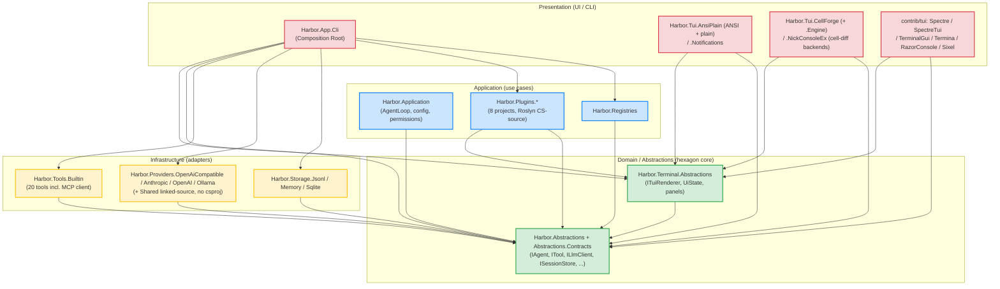

# Architecture Layers — Canonical Reference

> **This is the canonical reference for project layering in Harbor.**
> Every `<ProjectReference>` added to a `.csproj` MUST be checked against this document.
> See [ARCHITECTURE.md](./ARCHITECTURE.md) for the high-level design and
> [CODE_PRINCIPLES_AUDIT.md](./CODE_PRINCIPLES_AUDIT.md) §ARCH-001+ for the audit trail.
>
> **Связанные документы:**
> - [ARCHITECTURE.md](./ARCHITECTURE.md) — high-level design + principles summary.
> - [CLAUDE.md](../CLAUDE.md) §Layering rules — short version + checklist.
> - [CODE_PRINCIPLES_AUDIT.md](./CODE_PRINCIPLES_AUDIT.md) §ARCH-001..NNN — violations found and fixed.

---

## 1. The layering model

Harbor follows **Clean / Hexagonal / Onion Architecture** (call it whatever you want — the
user said *"слои должны быть по чистой архитектуре, гексогональная луковая называй как хочешь
но это надо"*). The dependency direction is **inward only**: an outer layer may reference an
inner layer, never the other way around. The innermost layer (Domain/Abstractions) references
**nothing** except the BCL and a small set of framework packages.

```
┌─────────────────────────────────────────────────────────────────┐
│  PRESENTATION (UI / CLI — composition roots)                    │
│  - apps/Harbor.App.Cli                                          │
│  - apps/Harbor.App.Avalonia (cross-platform desktop GUI)        │
│  - contrib/apps/: Harbor.App.Wpf / App.Maui / App.Blazor        │
│  - In-solution TUI renderers: Tui.AnsiPlain (unified ANSI +     │
│    plain) / Tui.CellForge (+ .Engine) / Tui.NickConsoleEx /    │
│    Tui.Notifications                                            │
│  - Optional contrib/tui renderers: Spectre / .Fullscreen /      │
│    SpectreTui / TerminalGui / Termina / RazorConsole / Sixel    │
│  Depends on: Application + Ui.Framework + Abstractions          │
└─────────────────────────────────────────────────────────────────┘
                                  ▲
                                  │ uses
                                  ▼
┌─────────────────────────────────────────────────────────────────┐
│  UI FRAMEWORK (TEA + reusable VMs + components)                 │
│  - Harbor.Ui.Framework (+ split projects Abstractions/, State/, │
│    Reducers/, ViewModels/, Rendering/, Projection/, Services/,  │
│    Sessions/; shell csproj is a meta-package)                   │
│    State/      (UiStore, UiState{Ui,Chat}, AppMsg/ChatAppMsg,   │
│                AppReducer/ChatAppReducer — TEA)                  │
│    ViewModels/ (ChatLineVM, ToolCallVM, TokenUsageVM, ...)      │
│    Rendering/  (ChatMessageRenderer, ChatStreamingPresenter)    │
│    Sessions/   (SessionFactory, SessionSwitcher, SessionContext,│
│                 SessionGitTracker, IChatViewBinder)             │
│    Panels/     (dockable panel system)                          │
│    Services/   (IDispatcherAdapter, IThemeService, IToastService,│
│                 GitService, SessionStatusTracker)               │
│    Configuration/ (ICommonConfigReader)                         │
│  Depends on: Abstractions + Desktop.Abstractions                │
│              (circular-dep workaround: ICommonConfigReader)     │
└─────────────────────────────────────────────────────────────────┘
                                  ▲
                                  │ uses
                                  ▼
┌─────────────────────────────────────────────────────────────────┐
│  APPLICATION (use cases, orchestration)                         │
│  - Harbor.Application (AgentLoop, Sessions, Agents,             │
│                        Configuration, Permissions, Onboarding)  │
│  - Harbor.Registries                                            │
│  - Harbor.Plugins.{Abstractions, Runtime, Hosting, Registration,│
│    Instantiation, Compilation, Storage, Host} (8 projects)      │
│  - contrib/scripting: Harbor.Scripting.* (ScriptHost, Bridge)   │
│  - Harbor.Ipc.{Abstractions, InProcess, Server, Client}         │
│  - Harbor.Logging (Serilog per-run timestamped files)           │
│  Depends on: Domain ONLY (Harbor.Abstractions +                 │
│              Harbor.Abstractions.Contracts +                    │
│              Harbor.Desktop.Abstractions)                       │
└─────────────────────────────────────────────────────────────────┘
                                  ▲
                                  │ implements
                                  ▼
┌─────────────────────────────────────────────────────────────────┐
│  INFRASTRUCTURE (adapters, I/O, external services)              │
│  - Harbor.Storage.Jsonl / Memory / Sqlite                       │
│  - Harbor.Providers.OpenAiCompatible / Anthropic / OpenAI /     │
│    Ollama (+ Shared — linked-source, без .csproj)               │
│  - Harbor.Tools.Builtin — все builtin tools в одном проекте,    │
│    каталог Tools/ (20 tools — см. docs/TOOLS_CATALOG.md;        │
│    MCP-клиент в подкаталоге Mcp/)                               │
│  - DesignSystem — отдельный проект src/Harbor.DesignSystem/     │
│  Depends on: Domain ONLY                                        │
└─────────────────────────────────────────────────────────────────┘
                                  ▲
                                  │ declares
                                  ▼
┌─────────────────────────────────────────────────────────────────┐
│  DOMAIN / ABSTRACTIONS (the hexagon core)                       │
│  - Harbor.Abstractions (interfaces, events, value objs,         │
│    Plugins/IPlugin, PermissionRuleset, Identifiers, …)          │
│  - Harbor.Abstractions.Contracts (Models: Session, ContentPart, │
│    ToolResult, Usage, Pricing etc.; namespace                   │
│    `Harbor.Abstractions.Models`. Бывший `Harbor.Domain.dll` —   │
│    переименован в F1 decoupling (ADR-007, commit fa8d3ae).      │
│  - Harbor.Desktop.Abstractions (Configuration: CommonConfig,    │
│    ICommonConfigStore; base VMs for cross-platform reuse)       │
│  - Harbor.Terminal.Abstractions (TUI interfaces, ITuiPlugin)    │
│  Depends on: NOTHING (only BCL + CSharpFunctionalExtensions +   │
│              Microsoft.Extensions.Logging.Abstractions etc. —   │
│              no other Harbor project)                           │
│  EXCEPTION: Harbor.Desktop.Abstractions → Harbor.Ui.Framework   │
│             (via Harbor.Terminal.Abstractions). Worked around   │
│             via ICommonConfigReader in Ui.Framework.            │
└─────────────────────────────────────────────────────────────────┘
```

### Why so many projects in the Domain layer?

| Project | Why it's separate | Why it's in Domain (not Application) |
|---|---|---|
| `Harbor.Abstractions` | Pure contract surface for the agent harness (LLM, tools, sessions, events, permissions, plugins). A headless consumer (CLI script, MCP bridge, test harness) can reference just this. | Zero dependencies — only BCL + CSharpFunctionalExtensions. |
| `Harbor.Abstractions.Contracts` | Holds the concrete model types (`Session`, `ContentPart`, `ToolResult`, `Usage`, etc.). They declare `namespace Harbor.Abstractions.Models` so consumers don't need a second `using`. Бывший `Harbor.Domain.dll` — переименован в F1 decoupling (ADR-007, commit fa8d3ae, 2026-08-24). | Pure data + formatters — no I/O. |
| `Harbor.Desktop.Abstractions` | Cross-platform contracts shared by every desktop app (Avalonia / WPF / MAUI / Blazor): `CommonConfig`, `ICommonConfigStore`, base VMs. | Configuration schema + VM contracts are stable across platforms. |
| `Harbor.Terminal.Abstractions` | TUI contracts: `ITuiRenderer`, `ITuiPlugin`, panel system entry points. Kept separate from `Harbor.Ui.Framework` because terminal vocabulary (Spectre, ANSI) is not relevant to desktop GUIs. | Used by both `Harbor.Ui.Framework` (panel system) and concrete TUI renderers. |

### Circular-dependency workaround: `ICommonConfigReader`

```
Harbor.Ui.Framework
  ↓ (needs to read config for SessionFactory)
Harbor.Desktop.Abstractions (has ICommonConfigStore + CommonConfig)
  ↓ (uses Ui.Framework.ViewModels via GlobalUsings)
Harbor.Terminal.Abstractions (references Ui.Framework)
  ↓
Harbor.Ui.Framework  ← CYCLE!
```

**Fix**: declared `ICommonConfigReader` in `Harbor.Ui.Framework/Configuration/` with a narrow
contract (just `TryReadProviderModelAsync`). Each platform app implements it as an adapter
over its own `ICommonConfigStore` (e.g. `CommonConfigReaderAdapter` in Avalonia).

### Mermaid diagram


```mermaid
flowchart TB
    subgraph Pres["Presentation (UI / CLI)"]
        Cli["Harbor.App.Cli<br/>(Composition Root)"]
        TuiAnsi["Harbor.Tui.AnsiPlain (ANSI + plain)<br/>/ .Notifications"]
        TuiConsoleEx["Harbor.Tui.CellForge (+ .Engine)<br/>/ .NickConsoleEx (cell-diff backends)"]
        TuiContrib["contrib/tui: Spectre / SpectreTui<br/>/ TerminalGui / Termina / RazorConsole / Sixel"]
    end

    subgraph App["Application (use cases)"]
        AppLayer["Harbor.Application<br/>(AgentLoop, config, permissions)"]
        Core["Harbor.Registries"]
        Plugins["Harbor.Plugins.*<br/>(8 projects, Roslyn CS-source)"]
    end

    subgraph Infra["Infrastructure (adapters)"]
        Storage["Harbor.Storage.Jsonl / Memory / Sqlite"]
        Providers["Harbor.Providers.OpenAiCompatible / Anthropic / OpenAI / Ollama<br/>(+ Shared linked-source, no csproj)"]
        Tools["Harbor.Tools.Builtin<br/>(20 tools incl. MCP client)"]
    end

    subgraph Domain["Domain / Abstractions (hexagon core)"]
        Abs["Harbor.Abstractions + Abstractions.Contracts<br/>(IAgent, ITool, ILlmClient, ISessionStore, ...)"]
        TuiAbs["Harbor.Terminal.Abstractions<br/>(ITuiRenderer, UiState, panels)"]
    end

    Cli --> Core
    Cli --> Plugins
    Cli --> Storage
    Cli --> Providers
    Cli --> Tools
    Cli --> Abs
    Cli --> TuiAbs

    TuiAnsi --> Abs
    TuiAnsi --> TuiAbs
    TuiConsoleEx --> Abs
    TuiConsoleEx --> TuiAbs
    TuiContrib --> Abs
    TuiContrib --> TuiAbs

    AppLayer --> Abs
    Core --> Abs
    Plugins --> Abs
    Plugins --> TuiAbs

    Storage --> Abs
    Providers --> Abs
    Tools --> Abs

    TuiAbs --> Abs

    classDef domain fill:#d4edda,stroke:#28a745,stroke-width:2px
    classDef app fill:#cce5ff,stroke:#007bff,stroke-width:2px
    classDef infra fill:#fff3cd,stroke:#ffc107,stroke-width:2px
    classDef pres fill:#f8d7da,stroke:#dc3545,stroke-width:2px

    class Abs,TuiAbs domain
    class AppLayer,Core,Plugins app
    class Storage,Providers,Tools infra
    class Cli,TuiAnsi,TuiConsoleEx,TuiContrib pres
```

**Dependency direction = inward only.** Outer layers may reference inner layers;
inner layers never reference outer layers. The Domain layer has no inbound
arrows from Harbor projects — only outbound to BCL / third-party NuGet packages.


### Why two projects in the Domain layer?

`Harbor.Abstractions` is the contract surface for the agent harness (LLM, tools, sessions,
events, permissions). `Harbor.Tui.Abstractions` is the contract surface for the UI layer
(views, view models, renderers, panels, UI state). They are kept separate so that a
headless consumer (CLI script, MCP bridge, test harness) can reference just
`Harbor.Abstractions` without dragging in any UI vocabulary. Both projects are in the
Domain layer and may reference each other; in practice `Harbor.Tui.Abstractions` references
`Harbor.Abstractions` (for `IAgent`, `AgentEvent`, `Session`), never the reverse.

---

## 2. Allowed and forbidden project references

> **Единственный механический источник правды** для рёбер `<ProjectReference>` сегодня —
> `tests/Harbor.Architecture.Tests`, в первую очередь `FullLayerMatrixTests` (§5.4):
> data-table на каждый src-assembly главного решения (47/50 строк; вне области по
> документированным причинам: CodeGen build-tool, Plugins.Host exe, Providers.Shared
> linked-source). Таблица ниже — устоявшийся TL;DR, полезный как шпаргалка; при
> расхождении доверяйте тестам.

The matrix below is a **coarse-grain summary** of allowed `<ProjectReference>` edges.

| Project (row) → may reference (column)         | Domain (Abs. / Contracts / Tui.Abs.) | Application (Application/Core/Registries) | Plugins.* | Storage.* | Providers.* | Tools.Builtin | Tui.* (concrete) | Cli |
|------------------------------------------------|:---:|:---:|:---:|:---:|:---:|:---:|:---:|:---:|
| **Harbor.Abstractions**                        | ❌ (—) | ❌  | ❌  | ❌  | ❌  | ❌  | ❌  | ❌  |
| **Harbor.Application / Core**                  | ✅  | Registries only | ❌  | ❌  | ❌  | ❌  | ❌* | ❌  |
| **Harbor.Plugins.{Runtime, Hosting, …}**       | ✅ (Runtime also Tui.Abstractions) | ❌  | —   | ❌  | ❌  | ❌  | ❌  | ❌  |
| **contrib/scripting Harbor.Scripting***        | ✅  | ❌  | ❌  | ❌  | ❌  | ❌  | ❌  | ❌  |
| **Harbor.Storage.Jsonl / Memory / Sqlite**     | ✅  | ❌  | ❌  | —   | ❌  | ❌  | ❌  | ❌  |
| **Harbor.Providers.OpenAiCompatible / .Anthropic / .OpenAI / .Ollama** | ✅  | ❌  | ❌  | ❌  | —   | ❌  | ❌  | ❌  |
| **Harbor.Tools.Builtin**                       | ✅  | ❌  | ❌  | ❌  | ❌  | —   | ❌  | ❌  |
| **Tui renderers (Ansi / Plain / ConsoleEx / Notifications; contrib Spectre-family и др.)** | ✅  | ❌  | ❌  | ❌  | ❌  | ❌  | ❌ (не друг друга) | ❌  |
| **apps/Harbor.App.Cli**                        | ✅  | ✅  | ✅  | ✅  | ✅  | ✅  | ✅  | —   |

`❌*` Application layer (Core/Application) may not depend on UI vocabulary
(`Harbor.Tui.Abstractions`) — Core is the agent-harness application layer and must not
know about UI vocabulary. If Core needs to expose a hook that the UI cares about,
declare the contract in `Harbor.Abstractions` (or `Harbor.Tui.Abstractions` if it is
UI-specific), and let the Composition Root (`HostBuilder`) wire the UI-side adapter in.
Within the Application layer, Core may reference only its siblings
`Harbor.Application` + `Harbor.Registries` plus Domain
(see rule `Core_ReferencesOnlyApplicationAndRegistriesAndAbstractions`).

`\*` contrib-проекты (`Harbor.Scripting.*`, `contrib/apps/*`) живут вне `Harbor.slnx`
и правятся в `contrib/Contrib.slnx`; правила направления зависимостей те же.

### Concrete impl types belong ONLY in the Composition Root

Concrete implementations of:

- `ILlmClient` (e.g. `AnthropicLlmClient`, `OpenAiCompatibleLlmClient`, `OllamaLlmClient`)
- `ISessionStore` (e.g. `JsonlSessionStore`, `SqliteSessionStore`, `MemorySessionStore`)
- `ITool` (e.g. `ReadTool`, `BashTool`, `WebFetchTool`)
- `ITuiRenderer` (e.g. `AnsiTuiRenderer`, ConsoleEx `ScreenSession`-based renderer)
- `IAgent` (e.g. `DefaultAgent`)
- `IAgentLoop` (e.g. `AgentLoop`)
- `IEventBus` (e.g. `InMemoryEventBus`)

…may be **constructed** (i.e. `new`'d) **only** inside
`apps/Harbor.App.Cli/Hosting/HostBuilder.cs`
(the Composition Root). `Program.cs` resolves them from DI by their interface; it must NOT
`new` them directly. The architecture tests in §5 do NOT enforce this rule mechanically
(it requires call-site analysis, not just assembly references) — code review enforces it.

---

## 3. Layer responsibilities

### Domain / Abstractions

- **Contains:** interfaces (`IAgent`, `IAgentLoop`, `ITool`, `ILlmClient`,
  `ISessionStore`, `IProviderRegistry`, `IToolRegistry`, `IAgentRegistry`,
  `IEventBus`, `IPermissionService`, `ICompactionService`, `ISystemPromptBuilder`),
  value objects (`SessionId`, `MessageId`, `ProviderId`, `ModelRef`, `ToolName`,
  `AgentName`), record models (`Session`, `Message`, `AgentEvent`, `LlmEvent`,
  `ToolResult`, `AgentDefinition`, `AgentState`), and pure rulesets
  (`PermissionRuleset`).
- **Forbidden:** any I/O (file, network, console), any DI registration, any
  Roslyn/Jint/HttpClient dependency, any `sealed class` with mutable state.
- **Allowed NuGet:** `CSharpFunctionalExtensions` (for `Result<T>`),
  `Microsoft.Extensions.Logging.Abstractions`, `MemoryPack`,
  `CommunityToolkit.HighPerformance`, `ZLinq`.

### Application

- **Contains:** use-case orchestration. `AgentLoop.RunAsync` is the canonical use case
  ("advance the conversation one full turn"). `CompactionService.CompactAsync`,
  `PermissionService.CheckAsync`, contrib `ScriptHost.EvaluateAsync`,
  `PluginHost.LoadAllAsync` are all use cases. Registries (`ToolRegistry`,
  `ProviderRegistry`, `AgentRegistry`) live in `Harbor.Registries`/`Harbor.Application`
  because they hold the in-memory state that use cases mutate.
- **Forbidden:** `HttpClient`, file I/O outside of well-defined adapter seams,
  `Console.Write*`.
- **Note:** Roslyn (CS-source plugin compilation) lives in its own project
  `Harbor.Plugins.Compilation` since the plugin-host decomposition — the old
  «Compilation subfolder inside Plugins.Runtime» layout is gone. `Harbor.Plugins.Runtime`
  owns only `CsPluginLoader` + compiled-result types; hosting graph lives in
  `Harbor.Plugins.Hosting`; source sources in `Harbor.Plugins.Storage`;
  instantiation/lifecycle in `Harbor.Plugins.Instantiation`; registration in
  `Harbor.Plugins.Registration`. The Architecture tests treat the whole
  `Harbor.Plugins.*` family as Application-layer projects for dependency-direction
  purposes.

### Infrastructure

- **Contains:** adapters — concrete implementations of `ILlmClient`, `ISessionStore`,
  `ITool`, etc. These projects translate between the outside world (HTTP, filesystem,
  subprocess, native interop) and the Domain contracts.
- **Forbidden:** references to the Application layer (`Harbor.Application`,
  `Harbor.Registries`) or to each other (`Harbor.Providers.Anthropic` must not
  reference `Harbor.Providers.OpenAI`).
- **Allowed NuGet:** anything I/O-related — `Microsoft.Data.Sqlite`,
  `Microsoft.Extensions.Http`, `Jint`, etc.

### Presentation

- **Contains:** entry points and UI renderers. `apps/Harbor.App.Cli/Program.cs` is the main
  CLI `Main` entry point (`apps/Harbor.App.Avalonia/Program.cs` for the desktop app).
  `Harbor.Tui.*` projects are renderers — each implements
  `ITuiRenderer` (or one of the more specific TUI interfaces from
  `Harbor.Terminal.Abstractions`).
- **Composition Root:** `apps/Harbor.App.Cli/Hosting/HostBuilder.cs` is the only place that
  knows about concrete Infrastructure types. It wires them into the DI container by
  interface.
- **Forbidden (references):** Presentation projects must NOT reference each other (e.g.
  `Harbor.Tui.AnsiPlain` must not reference `Harbor.Tui.CellForge`). They may share the
  `Harbor.Terminal.Abstractions` contract surface.
- **Forbidden (capabilities):** a Presentation assembly must not exercise an I/O
  capability directly. The reference matrix cannot catch this — `System.IO.File`,
  `System.Diagnostics.Process` and `System.Net.Http` are BCL types, visible in no
  `<ProjectReference>`. Enforced mechanically by
  `tests/Harbor.Architecture.Tests/PresentationCapabilityRules.cs` (see §5.6); the
  capability-to-layer assignment comes from the Infrastructure clause at the top of this
  section ("subprocess, filesystem, native interop"):

  | Rule id | Forbids | Layer that owns it |
  |---|---|---|
  | `PRESENTATION-MUST-NOT-SPAWN-SUBPROCESSES` | `System.Diagnostics.Process*` | Infrastructure (`BashTool` / `McpProcessClient` in `Harbor.Tools.Builtin`) |
  | `PRESENTATION-MUST-NOT-TOUCH-THE-FILESYSTEM-FILES` | `System.IO.File*` | Infrastructure (`Harbor.Storage.*`, config stores) |
  | `PRESENTATION-MUST-NOT-TOUCH-THE-FILESYSTEM-DIRECTORIES` | `System.IO.Directory*` | Infrastructure (file-tree / theme scanning) |
  | `PRESENTATION-MUST-NOT-USE-THE-NETWORK` | `System.Net.Http*`, `Sockets`, `WebRequest`, … | Infrastructure (`Harbor.Providers.*`, `Harbor.Transport.Remote`) |
  | `PRESENTATION-MUST-NOT-LOAD-ASSEMBLIES-OR-EMIT-IL` | `System.Reflection.Emit`, `AssemblyLoadContext` | nowhere — banned outright (NativeAOT-readiness) |

  A shell-out from the UI is the sharp edge: because the class is not an `ITool`, the
  call never reaches `PermissionRuleset.Evaluate`, never appears in the tool-call
  transcript, and cannot be cancelled by the agent loop. Route it through an `ITool`.

  **Deliberately not capabilities:** `System.IO.Path` (pure string manipulation —
  Presentation formats paths for display), `Console.*` (the renderer's job), and P/Invoke
  to `kernel32`/`libc` for VT-mode handling (also renderer work, in
  `Harbor.Tui.CellForge.Engine`). `System.Environment.GetEnvironmentVariable` /
  `CurrentDirectory` / `GetFolderPath` are genuine configuration leaks but are used
  pervasively by renderers; they are tracked in #518 rather than baselined here.

---

## 4. Layering rules cheat-sheet

| Rule                                                                                              | Enforced by              |
|---------------------------------------------------------------------------------------------------|--------------------------|
| Domain projects reference no other Harbor project (allowed: Tui.Abstractions → Abstractions only). | Architecture tests       |
| Application projects (Application/Core/Registries/Plugins.*) reference Domain only — never Infrastructure, never Presentation. | Architecture tests       |
| Infrastructure projects (Storage.*, Providers.*, Tools.Builtin) reference Domain only — never Application, never each other, never Presentation. | Architecture tests       |
| Presentation projects (Tui.* renderers) reference Domain only — never Application, never Infrastructure, never each other. | Architecture tests       |
| Presentation projects exercise no I/O capability of their own: no subprocess, no `System.IO.File`/`Directory`, no network, no reflection emit (§3 table, §5.6). | Architecture tests (`PresentationCapabilityRules`) |
| `apps/Harbor.App.Cli` references everything — it is the Composition Root.                         | (by convention)          |
| Concrete impl types (`AnthropicLlmClient`, `JsonlSessionStore`, …) are `new`'d only inside `HostBuilder.cs`. | Code review              |
| `Program.cs` resolves services by interface from DI; it does not `new` Infrastructure types.       | Code review              |
| New interfaces go in `Harbor.Abstractions` (or `Harbor.Tui.Abstractions` for UI-only contracts), never in the Application layer. | Code review              |
| New value objects / records go in `Harbor.Abstractions.Contracts` (namespace `Harbor.Abstractions.Models`), never in the Application layer.            | Code review              |

---

## 5. Architecture tests

`tests/Harbor.Architecture.Tests/Harbor.Architecture.Tests.csproj` contains the
mechanically-enforced rules. The test project references every Harbor project so it can
load each assembly via reflection and assert on `GetReferencedAssemblies()`.

The tests come in **six files** (`LayerDependencyTests`, `NetArchLayerRules`,
`AbstractionsSplitLayerRules`, `FullLayerMatrixTests`, `CellForgeGraphRules`,
`PresentationCapabilityRules`; counts as of 2026-08-27 predate the last two — the
executed total may exceed the method count due to parameterised cases):

### 5.1 Reflection-based — `LayerDependencyTests.cs`

Uses plain `System.Reflection` (`Assembly.GetReferencedAssemblies()`) — zero extra
dependencies, fast, trivially readable. This is the zero-dependency fallback so the
layering rules still run even if NetArchTest ever fails to restore.

The 12 rules cover:

1. `Abstractions_HasNoHarborProjectReferences`
2. `TuiAbstractions_ReferencesOnlyAbstractions`
3. `UiFrameworkState_ReferencesOnlyAbstractionsFamily`
4. `Application_ReferencesOnlyAbstractions`
5. `Registries_ReferencesOnlyAbstractions`
6. `Core_ReferencesOnlyApplicationAndRegistriesAndAbstractions`
7. `PluginsRuntime_ReferencesOnlyAbstractions` (Runtime also allows Tui.Abstractions)
8. `Providers_ReferencesOnlyAbstractions`
9. `Storage_ReferencesOnlyAbstractions`
10. `ToolsBuiltin_ReferencesOnlyAbstractions`
11. `TuiRenderers_ReferencesOnlyAbstractionsAndTuiAbstractions`
12. `AllExpectedHarborAssembliesAreLoaded` (coverage guard — a new src project without a rule fails loudly)

### 5.2 NetArchTest-based — `NetArchLayerRules.cs`

Uses the [`NetArchTest.Rules`](https://github.com/BenMorris/NetArchTest) fluent DSL
(`Types.InAssembly(...).Should().NotHaveDependencyOn(...).GetResult()`). The same
invariants are expressed in the more declarative NetArchTest style; this acts as a
cross-check that survives both tool surfaces and serves as a copy-paste template for
contributors who already know NetArchTest.

The 21 NetArchTest rules mirror the reflection-based rules above with names like
`NetArch_<Project>_DoesNotDependOn_<ForbiddenLayer>`. The pattern is:

```csharp
[Test]
public async Task NetArch_Core_DoesNotDependOn_Infrastructure()
{
    var types = Types.InAssembly(typeof(AgentLoop).Assembly);
    var result = types
        .Should()
        .NotHaveDependencyOn("Harbor.Providers.OpenAiCompatible")
        .And().NotHaveDependencyOn("Harbor.Storage.Jsonl")
        // ...
        .GetResult();
    await Assert.That(result.IsSuccessful).IsTrue();
}
```

Additionally `AbstractionsSplitLayerRules.cs` pins the F1-decoupling invariants
(`Harbor.Abstractions.Contracts` ↔ `Harbor.Abstractions` split — ADR-007).

### 5.3 Running the tests

```bash
# Build only:
dotnet build tests/Harbor.Architecture.Tests/Harbor.Architecture.Tests.csproj

# Run the architecture tests:
dotnet run --project tests/Harbor.Architecture.Tests/Harbor.Architecture.Tests.csproj
```

If a test fails, the assertion message lists every forbidden assembly that the project
actually references. Fix the `<ProjectReference>` in the offending `.csproj`, then
re-run.

### 5.4 Full-project matrix — `FullLayerMatrixTests.cs` (ROP-D)

Before ROP-D only assemblies with a hand-written `typeof()` probe had layer rules
(~18 src projects). `FullLayerMatrixTests.cs` closes the gap with one data
table covering **every main-solution src assembly** (45 rows at the time; grown to
47/50 src dirs as of 2026-08-27 — see §2 banner):

1. *Reference check* — actual `Assembly.GetReferencedAssemblies()` ⊆ the row's
   Allowed set (+ documented exceptions). IL-level: transitive ProjectReferences
   that leak types into a consumer's AssemblyRef are caught too.
2. *Table guard* — Allowed sets themselves must respect the layer classes
   (Presentation ↛ Infrastructure/Application, Infrastructure ↛ Presentation,
   Domain ↛ Domain-only), so a violation cannot be pre-declared as "allowed";
   real exceptions live in `DocumentedExceptions`, each with a reason.
3. *Exception liveness* — every documented exception must correspond to a real
   current reference (no rotting into blanket permissions).
4. *Coverage* — adding a src project without a matrix row (and a ProjectReference
   in the test csproj) fails loudly instead of silently skipping.

Out of scope by design: `Harbor.CodeGen` (build tool, outside Harbor.slnx),
`Harbor.Plugins.Host` (OutputType=Exe out-of-process MCP server — an app), and
`apps/*` composition roots.

### 5.5 Skipping a test for a known violation

When a real violation is found and cannot be fixed in the current sprint, mark the
test with a `// TODO(arch): violation, see ARCHITECTURE_LAYERS.md §known-violations`
comment and skip it via `Assert.Skip(...)`. Do NOT leave a layering test red on
`main` — either fix the violation or skip the test.

```csharp
[Test]
public async Task NetArch_SomeRule()
{
    // TODO(arch): violation, see ARCHITECTURE_LAYERS.md §known-violations
    await Assert.Skip("Known violation — see ARCHITECTURE_LAYERS.md §known-violations");
    // ... rest of test stays for documentation ...
}
```

### 5.6 Capability rules — `PresentationCapabilityRules.cs` (#455)

The four files above enforce the **reference** half of the contract: which
`<ProjectReference>` edges may exist. That is not sufficient. `System.IO.File`,
`System.Diagnostics.Process` and `System.Net.Http` are BCL types — they appear in no
ProjectReference, so a perfectly layered assembly can still fork a shell or overwrite
the user's config. `PresentationCapabilityRules.cs` enforces the missing half.

**Mechanism.** Mono.Cecil (the copy `NetArchTest.Rules 1.3.2` already restores — no new
`PackageReference`) reads each Presentation assembly's metadata, walks every method body,
and collects every BCL type referenced from an IL operand or a type/field/method
signature. A rule is a list of type-name prefixes matched with `StartsWith`, so one entry
covers a family (`System.IO.File` also covers `FileStream`, `FileInfo`, `FileAccess`).
Because this is IL-level it catches a `File.ReadAllText` that no assembly-reference check
can see.

**Scope.** The Presentation set is not a second hand-maintained list — it is read from
`FullLayerMatrixTests.Matrix` via `PresentationLayerAssemblies()`, so a new Presentation
src project becomes capability-enforced the moment it gets a matrix row.

**Attribution.** `async` methods and lambdas live in compiler-generated nested types
(`<Foo>d__7`, `<>c__DisplayClass0_0`). The probe collapses those to the nearest type a
human wrote, so baseline keys survive edits and CI failures name a findable type.

**Baseline, not a skip.** Presentation performs I/O today, so the rules land *enforced*
against a `KnownViolations` table keyed by (assembly, rule id, declaring type) — the same
shape as `DocumentedExceptions` in §5.4. A rule holds only if its hits are a subset of the
baseline, so new I/O in any Presentation type is red on the spot. The baseline is
type-granular, not method-granular; see §6 for the inventory and the per-site issues.

**Non-vacuity.** A rule nobody can fail is a comment, and NetArchTest's
`NotHaveDependencyOn` has a failure mode here: an unmatched name is a satisfied
constraint, so a typo'd or deleted assembly passes forever. Four tests close that door:

1. `NonVacuity_Probe_ReadsRealIlFromThisTestAssembly` — probes this test assembly, whose
   source is in the repo and is known to call `Directory.GetFiles` and `File.Exists`; both
   rules must fire, and the assembly file must exist. "No violations" can never mean "no
   input".
2. `NonVacuity_Probe_CanStillDetectForbiddenCapabilities` — the sensitivity control: the
   same probe, rules and matchers run against a *real* positive control,
   `Harbor.Tools.Builtin` (ReadTool/EditTool/GlobTool touch the filesystem,
   BashTool/McpProcessClient fork processes), and MUST report hits. If the probe ever
   degrades to "nothing anywhere", the Presentation rules go red instead of vacuously
   green.
3. `NonVacuity_GrandfatheredViolations_AreStillReal` — every baseline row must still match
   a real hit, so the list cannot rot into a blanket permission (the
   `DocumentedExceptions_AllCurrentlyRealized` pattern).
4. `RuleTable_And_Baseline_Are_WellFormed` — rule ids unique and non-blank, every rule
   states what it forbids and why, every baseline row names an existing rule, points at a
   tracking issue, and names an assembly the matrix really classifies as Presentation (a
   typo there would grandf nothing).

`PRESENTATION-MUST-NOT-USE-THE-NETWORK` and
`PRESENTATION-MUST-NOT-LOAD-ASSEMBLIES-OR-EMIT-IL` have **empty** baselines: Presentation
is clean on both today, so they run fully armed rather than being deferred with the rest.

---

## 6. Known violations

> This section lists every layering violation that exists in the codebase at the time
> of writing and is intentionally NOT fixed yet. Each entry has a `TODO(arch)` owner
> and a planned fix sprint. **Do not add a new violation without adding an entry
> here.**

**As of 2026-09-29 (issue #455) the REFERENCE matrix has zero known violations** —
`LayerDependencyTests` + `NetArchLayerRules` + `AbstractionsSplitLayerRules` +
`FullLayerMatrixTests` + `CellForgeGraphRules` are all green. The previously cited counts
(46 tests = 21 reflection + 25 NetArchTest, 54 executed cases) are historical.

**The CAPABILITY rules added in #455 have 21 known violations, in 14 types across 7 of
the 17 Presentation assemblies.** They are not skipped: each is a row in
`PresentationCapabilityRules.KnownViolations` that a rule holds only while it is still
exactly reproduced, and each carries a tracking issue. Ten Presentation assemblies are
clean and fully enforced.

| Rule | Violating types | Assemblies | Tracking issues |
|---|---:|---:|---|
| `PRESENTATION-MUST-NOT-SPAWN-SUBPROCESSES` | 5 | 3 | [#537](https://github.com/refusedguy/Harbor-Harness/issues/537) (GitService), [#538](https://github.com/refusedguy/Harbor-Harness/issues/538) (3 notification backends, jump palette) |
| `PRESENTATION-MUST-NOT-TOUCH-THE-FILESYSTEM-FILES` | 9 | 5 | [#534](https://github.com/refusedguy/Harbor-Harness/issues/534) (config stores), [#535](https://github.com/refusedguy/Harbor-Harness/issues/535) (recent items), [#536](https://github.com/refusedguy/Harbor-Harness/issues/536) (theme store/watcher), [#538](https://github.com/refusedguy/Harbor-Harness/issues/538) (theme loader/watcher, file tree, terminal stdin) |
| `PRESENTATION-MUST-NOT-TOUCH-THE-FILESYSTEM-DIRECTORIES` | 7 | 6 | [#534](https://github.com/refusedguy/Harbor-Harness/issues/534), [#535](https://github.com/refusedguy/Harbor-Harness/issues/535), [#536](https://github.com/refusedguy/Harbor-Harness/issues/536), [#537](https://github.com/refusedguy/Harbor-Harness/issues/537), [#538](https://github.com/refusedguy/Harbor-Harness/issues/538) (file tree) |
| `PRESENTATION-MUST-NOT-USE-THE-NETWORK` | 0 | 0 | — clean, unbaselined |
| `PRESENTATION-MUST-NOT-LOAD-ASSEMBLIES-OR-EMIT-IL` | 0 | 0 | — clean, unbaselined |

### ARCH-5 template — new capability violations

The reference-layer template below applies to the capability rules too, keyed by
(assembly, rule id, declaring type). **Do not delete a baseline row when a rule goes
red** — that is the one move that turns an enforced rule back into a comment. Either fix
the I/O (move it behind a Domain contract + an Infrastructure implementation) or, if it
genuinely must stay, add a row with a real issue URL.

### Previously suspected (not a violation)

The previously suspected violation — *"Harbor.Tui.Abstractions references the
agent-harness assembly via `IAgent`"* — does **not** exist: `IAgent` lives in
`Harbor.Abstractions/Agents/IAgent.cs` (Domain), not in `Harbor.Application` or
`Harbor.Registries`. The
`Harbor.Tui.Abstractions.csproj` file references only `Harbor.Abstractions`:

```xml
<ItemGroup>
  <ProjectReference Include="..\Harbor.Abstractions\Harbor.Abstractions.csproj"/>
</ItemGroup>
```

### Template for future violations

When (not if) a new violation slips in, add an entry in the format below so the
audit history is preserved:

```markdown
### ARCH-NNN: <project> illegally references <forbidden-project>

- **Detected by:** `NetArch_<Project>_DoesNotDependOn_<ForbiddenLayer>` (or
  the reflection-based equivalent).
- **Symptom:** the test fails with `<forbidden-project>` listed in the
  forbidden-references set.
- **Root cause:** <one-paragraph explanation>.
- **Planned fix:** <one-paragraph description of the design change that
  removes the dependency — usually "extract the shared type into Domain" or
  "introduce a new interface in Domain and inject it via the Composition Root">.
- **Owner / sprint:** TODO(arch) — Sprint N.
- **Tracking test skip:** <test name> is skipped via `Assert.Skip(...)` with a
  `// TODO(arch): violation, see ARCHITECTURE_LAYERS.md §known-violations`
  comment until the fix lands.
```

---


## 7. How to add a new project

1. **Pick the layer.** Decide which of the four layers the new project belongs to
   using §3 as a guide. If it implements an interface from `Harbor.Abstractions`,
   it's almost certainly Infrastructure.
2. **Add `<ProjectReference>` entries** that respect the matrix in §2. If you need
   a reference that is marked ❌, you have a layering violation — fix the design
   first.
3. **Update `Harbor.Architecture.Tests`** if the new project should be covered by
   an existing rule (e.g. a new `Harbor.Providers.XYZ` provider is automatically
   covered by `Providers_ReferencesOnlyAbstractions` because the test enumerates
   all loaded assemblies whose name starts with `Harbor.Providers.`).
4. **Update `Harbor.slnx`** to include the new project.
5. **Update this document** if the new project creates a new sub-category that
   deserves its own row in the §2 matrix.

### Worked example — adding `Harbor.Providers.Bedrock`

```xml
<!-- Harbor.Providers.Bedrock.csproj -->
<ItemGroup>
  <ProjectReference Include="..\Harbor.Abstractions\Harbor.Abstractions.csproj"/>
  <!-- ❌ DO NOT add Harbor.Application / Harbor.Registries here — Bedrock is Infrastructure, they are Application. -->
</ItemGroup>
<ItemGroup>
  <PackageReference Include="AWSSDK.BedrockRuntime" Version="..."/>
  <PackageReference Include="Microsoft.Extensions.Logging.Abstractions" Version="10.0.0"/>
</ItemGroup>
```

Then in `HostBuilder.cs`:

```csharp
pb.AddProvider("bedrock", () => new BedrockLlmClient(
    sp.GetRequiredService<IHttpClientFactory>().CreateClient("bedrock"),
    new BedrockConfig(),
    loggerFactory.CreateLogger<BedrockLlmClient>()));
```

The new project is automatically picked up by the
`Providers_ReferencesOnlyAbstractions` architecture test.

---

## 8. Audit history

See [CODE_PRINCIPLES_AUDIT.md](./CODE_PRINCIPLES_AUDIT.md) §ARCH-001..§ARCH-NNN for the
full audit trail of layering violations found and fixed when this document was
introduced.
