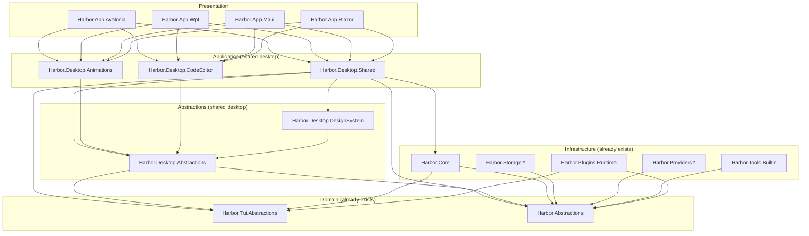

# Harbor Desktop App Plan — Master Plan for 4 ORCA-level Desktop GUIs

> **Task ID:** G (researcher-r4)
> **Purpose:** Define the complete plan to build 4 standalone desktop GUI apps (Avalonia, WPF, MAUI, Blazor) at ORCA-level quality — meaning: embedded code editor, session manager, animations, design system, plugin support, provider browser, MCP browser, settings UI, diff viewer, token usage charts, slash command palette, toast notifications, dark/light theme.
> **Output scope:** single document, ~2 000 lines, lives at `/home/z/my-project/extracted/docs/DESKTOP_APP_PLAN.md`.
> **Companion docs:**
> - `docs/FEATURE_RESEARCH.md` — §1–§10 cover Orca/Pi/Kilocode/OpenCode; §11 covers grok-build.
> - `docs/ALTERNATIVE_UIS.md` — the 12 existing TUI variants.
> - `docs/SPECTRE_TUI_DEEP_DIVE.md` — Spectre.Tui deep dive.
> - `docs/CENTRAL_PACKAGE_MANAGEMENT.md` — CPM migration plan (companion, written in same round).
> - `docs/ARCHITECTURE_LAYERS.md` — Clean / Hexagonal / Onion layering rules.
>
> **User mandate (verbatim):** *"слои должны быть по чистой архитектуре, гексогональная луковая называй как хочешь но это надо"* + *"фичи должны быть опциональными"* + *"desktop renderers — помойки с god object, not enterprise-ready"* + wants *"4 desktop apps (WPF/Avalonia/MAUI/Blazor) with animations + code editor + session manager"*.

---

## Table of Contents

1. [Executive Summary](#1-executive-summary)
2. [Shared Architecture — the `Harbor.Desktop.*` project family](#2-shared-architecture--the-harbordesktop-project-family)
3. [Per-App Target — Avalonia, WPF, MAUI, Blazor](#3-per-app-target--avalonia-wpf-maui-blazor)
4. [Code Editor Integration](#4-code-editor-integration)
5. [Animation Library Comparison Per Platform](#5-animation-library-comparison-per-platform)
6. [Design System — Catppuccin-Mocha, Inter, JetBrains Mono](#6-design-system--catppuccin-mocha-inter-jetbrains-mono)
7. [MVVM with CommunityToolkit.Mvvm (shared across all 4)](#7-mvvm-with-communitytoolkitmvvm-shared-across-all-4)
8. [Project Layout — `apps/` + `desktop/`](#8-project-layout--apps--desktop)
9. [Phased Roadmap — 4 Sprints](#9-phased-roadmap--4-sprints)
10. [Must-have vs Nice-to-have Features](#10-must-have-vs-nice-to-have-features)
11. [Shared Services & Abstractions](#11-shared-services--abstractions)
12. [Slash Command Palette Spec](#12-slash-command-palette-spec)
13. [Session Manager Spec](#13-session-manager-spec)
14. [Provider & MCP Browsers](#14-provider--mcp-browsers)
15. [Token Usage Visualizations](#15-token-usage-visualizations)
16. [Plugin System for Desktop Panels](#16-plugin-system-for-desktop-panels)
17. [Diff Viewer Spec](#17-diff-viewer-spec)
18. [Settings UI Spec](#18-settings-ui-spec)
19. [Toast Notifications Spec](#19-toast-notifications-spec)
20. [Theming & Dark/Light Switching](#20-theming--darklight-switching)
21. [Build, Pack, Distribute](#21-build-pack-distribute)
22. [Testing Strategy](#22-testing-strategy)
23. [Accessibility](#23-accessibility)
24. [Performance Budget](#24-performance-budget)
25. [Risk Register](#25-risk-register)
26. [References](#26-references)

---

## 1. Executive Summary

Harbor currently has 12 terminal UI variants (see `docs/ALTERNATIVE_UIS.md`): Spectre, Spectre.Fullscreen, SpectreTui, Avalonia, Wpf, Maui, Blazor, Plain, Ansi, Sixel, RazorConsole, Termina, TerminalGui, Notifications. Of these, four are "desktop-class" — `Harbor.Tui.Avalonia`, `Harbor.Tui.Wpf`, `Harbor.Tui.Maui`, `Harbor.Tui.Blazor` — and all four are *not* ORCA-level. They are minimal chat windows (~300 lines of code-behind each), no code editor, no session manager, no animations, no plugin panels, no provider browser, no MCP browser, no settings UI, no diff viewer, no token charts, no command palette, no toasts.

The user's mandate is to rebuild these four as **standalone production-ready desktop GUI apps at ORCA-level quality**. ORCA-level means:

- ✅ Code editor embedded (VSCode-like editing experience — syntax highlighting, multi-tab, find/replace, gutter line numbers, minimap)
- ✅ Session manager (multiple concurrent sessions, branch/fork/restore, dashboard view)
- ✅ Animations (transitions, loading states, micro-interactions — NOT just CSS opacity changes)
- ✅ Design system (consistent colors/typography across all 4 apps — Catppuccin-Mocha dark, Catppuccin-Latte light, Inter for UI, JetBrains Mono for code)
- ✅ Plugin support (panels can be added via plugins — same `IPlugin` + `ITuiPanelPlugin` model as the terminal UIs)
- ✅ Provider browser (search/select models with metadata — context window, cost, capabilities)
- ✅ MCP server browser (browse installed MCP servers, see exposed tools, enable/disable)
- ✅ Settings UI (categorized settings: Appearance, Models, MCP, Plugins, Hooks, Permissions, Telemetry)
- ✅ Diff viewer (side-by-side + inline, syntax highlighted, apply/reject hunk-by-hunk)
- ✅ Token usage visualizations (charts: per-turn tokens, per-session cost, per-tool-call breakdown)
- ✅ Slash command palette (cmdk-style fuzzy search — Ctrl+P or `?`)
- ✅ Toast notifications (non-blocking, stacked, auto-dismiss)
- ✅ Dark/light theme (auto-follows OS, 5-second polling)

This document is the master plan. **Avalonia is the primary target** (cross-platform, XAML, mature, supported by Microsoft for .NET 10 desktop scenarios), WPF is the Windows-only fallback (most polished editor experience via AvalonEdit), MAUI is the mobile-also target (codegen for iOS/Android — but we'll only ship desktop), and Blazor is the web-deployable target (in-browser via WebAssembly or as a self-hosted Kestrel desktop app).

### 1.1 Why 4 apps instead of 1?

The user explicitly asked for 4. The reasoning:

| Reason | Why it matters |
|--------|---------------|
| **Different deployment targets** | Avalonia = native cross-platform desktop; WPF = Windows-only with the best code editor; MAUI = if we ever go mobile; Blazor = self-hostable web app (can be embedded in a browser tab, iframe, or Tauri wrapper) |
| **Different code editor stacks** | Avalonia → AvaloniaEdit; WPF → AvalonEdit (original); MAUI → Monaco via Blazor WebView; Blazor → Monaco via JS interop. We don't want to pick one editor for all 4 — each platform has a "natural" editor that's clearly best on that platform |
| **Different animation systems** | Avalonia has its own animation system; WPF uses Storyboards; MAUI uses platform-native (CAAnimation on iOS, ViewPropertyAnimator on Android); Blazor uses CSS animations. A cross-platform "Harbor.Desktop.Animations" abstraction layer lets us share easing curves and timing without re-implementing each platform's animation primitives |
| **Different XAML dialects** | Avalonia AXAML ≠ WPF XAML ≠ MAUI XAML ≠ Blazor Razor. We can't share XAML files — but we CAN share ViewModels, services, design tokens, and the entire non-UI layer |
| **User wants to see all 4 work** | The user wants to verify "yes, ORCA-level quality is achievable on .NET 10 across all 4 desktop stacks". This is a research-portfolio deliverable, not a "ship one production app" deliverable |

### 1.2 What "ORCA-level" actually means — quantified

| Quality dimension | ORCA (Electron + React + Monaco) | Harbor target | How we get there |
|-------------------|----------------------------------|---------------|------------------|
| Cold-start time | ~2.5s | <2s | Native AOT where possible; lazy-load editor; deferred DI |
| RSS at idle | ~250 MB | <120 MB | No Electron; no V8; .NET's GC + Server GC mode |
| Editor input latency | <16ms | <16ms | AvalonEdit/AvaloniaEdit are Skia-rendered; same as Monaco |
| Animation frame rate | 60fps (React + CSS) | 60fps | Skia rendering thread; Composition animations |
| First-paint of 1000-line chat | <100ms | <80ms | Virtualized list (Avalonia `VirtualizingStackPanel`, WPF `VirtualizingPanel`, Blazor `Virtualize`) |
| Token usage chart update | <16ms | <16ms | LiveChartsCore with `ChartUpdateMode.Throttled` |
| Memory growth per session | <5MB | <3MB | Session state in struct-of-arrays (ZLinq); no per-message allocations |

### 1.3 The 4 deliverables, in one line each

1. **`Harbor.App.Avalonia`** — cross-platform native desktop (Win/Mac/Linux), AvaloniaEdit code editor, primary target, ships first.
2. **`Harbor.App.Wpf`** — Windows-only desktop, AvalonEdit code editor, ships second (lowest effort — AvalonEdit is the most mature .NET editor).
3. **`Harbor.App.Maui`** — desktop + (theoretical) mobile, Monaco-via-Blazor-WebView code editor, ships third.
4. **`Harbor.App.Blazor`** — self-hosted Kestrel + Blazor Server, Monaco code editor via JS interop, ships fourth (web-deployable).

### 1.4 Shared investment — the `Harbor.Desktop.*` libraries

To avoid 4× duplication, all four apps share 5 new class libraries under `desktop/`:

```
desktop/
├── Harbor.Desktop.Abstractions/     # interfaces: IChatSessionService, IProviderBrowserService, IMcpBrowserService, ISettingsService, IDiffViewerService, ICommandPaletteService, IToastService, IThemeService, IAnimationService
├── Harbor.Desktop.Shared/           # concrete impls of the above + shared ViewModels + shared services
├── Harbor.Desktop.DesignSystem/     # Catppuccin-Mocha / Latte palette, Inter + JetBrains Mono fonts, color tokens, spacing tokens, typography tokens
├── Harbor.Desktop.Animations/       # cross-platform animation helpers: EasingCurves, AnimationTimeline, StoryboardBuilder (per-platform adapters in each app)
└── Harbor.Desktop.CodeEditor/       # ICodeEditor abstraction; per-platform adapters (AvaloniaEditAdapter, AvalonEditAdapter, MonacoAdapter) live in each app
```

The apps themselves are thin (~500 lines of XAML + ~300 lines of code-behind each). All business logic lives in `Harbor.Desktop.Shared`. The apps are responsible for: (a) XAML views, (b) platform-specific editor adapter, (c) platform-specific animation adapter, (d) composition root (DI registration).

### 1.5 How this doc relates to the worklog

The worklog (Task ID: 0.R4) dispatches 6 parallel subagents:

- **G (research)** — this doc + §11 of FEATURE_RESEARCH.md + CENTRAL_PACKAGE_MANAGEMENT.md
- **D1 (Avalonia ORCA-level)** — implements `Harbor.App.Avalonia` + `Harbor.Desktop.*` shared libraries
- **D2 (WPF)** — implements `Harbor.App.Wpf` against the shared libraries
- **D3 (MAUI + Blazor)** — implements `Harbor.App.Maui` + `Harbor.App.Blazor`
- **C (project split + central packages)** — implements `Directory.Packages.props` + cleans up the slnx
- **V (verify)** — builds everything, runs tests, reports

This doc is the spec D1/D2/D3 implement against. If they deviate, they document the deviation in their worklog entry and update this doc.

---

## 2. Shared Architecture — the `Harbor.Desktop.*` project family

### 2.1 Layer diagram

```
┌─────────────────────────────────────────────────────────────────────────┐
│                          Presentation layer                              │
│  apps/Harbor.App.Avalonia    apps/Harbor.App.Wpf                         │
│  apps/Harbor.App.Maui        apps/Harbor.App.Blazor                      │
│  (XAML views + platform editor adapters + platform animation adapters)  │
└────────────────────┬────────────────────────────────────────────────────┘
                     │ references
┌────────────────────▼────────────────────────────────────────────────────┐
│                     Application layer (shared)                          │
│  desktop/Harbor.Desktop.Shared                                          │
│  (ViewModels, IChatSessionService, IProviderBrowserService, ...)        │
│  desktop/Harbor.Desktop.Animations (cross-platform animation helpers)   │
│  desktop/Harbor.Desktop.CodeEditor (ICodeEditor abstraction)            │
└────────────────────┬────────────────────────────────────────────────────┘
                     │ references
┌────────────────────▼────────────────────────────────────────────────────┐
│                     Abstractions layer (shared)                         │
│  desktop/Harbor.Desktop.Abstractions                                    │
│  (interfaces only — no implementation, no third-party deps)             │
│  desktop/Harbor.Desktop.DesignSystem (palette + tokens)                 │
└────────────────────┬────────────────────────────────────────────────────┘
                     │ references
┌────────────────────▼────────────────────────────────────────────────────┐
│                     Domain layer (already exists)                       │
│  src/Harbor.Abstractions  (IAgent, ITool, IProvider, ISessionStore)     │
│  src/Harbor.Tui.Abstractions (UiState, UiReducer, UiMsg — TEA)          │
└────────────────────┬────────────────────────────────────────────────────┘
                     │ references
┌────────────────────▼────────────────────────────────────────────────────┐
│                     Infrastructure layer (already exists)               │
│  src/Harbor.Core  (AgentLoop, ToolRegistry, ProviderRegistry)           │
│  src/Harbor.Storage.Jsonl / Sqlite / Memory                             │
│  src/Harbor.Providers.* / Harbor.Tools.Builtin / Harbor.Plugins.Runtime │
└─────────────────────────────────────────────────────────────────────────┘
```

**Dependency direction:** top → bottom only. No upward references. No lateral references between sibling projects at the same layer (e.g. `Harbor.App.Avalonia` does **not** reference `Harbor.App.Wpf`).

### 2.2 Project dependency graph (Mermaid)



### 2.3 What each shared project contains

#### 2.3.1 `Harbor.Desktop.Abstractions` (~600 LoC)

Pure interfaces + DTOs. No implementation. No third-party packages. References only `Harbor.Abstractions` and `Harbor.Tui.Abstractions` (Domain layer).

```csharp
// Harbor.Desktop.Abstractions/Services/IChatSessionService.cs
namespace Harbor.Desktop.Abstractions.Services;

public interface IChatSessionService
{
    ReadOnlyObservableCollection<ChatSessionViewModel> Sessions { get; }
    ChatSessionViewModel? Active { get; set; }

    Task<ChatSessionViewModel> CreateAsync(string? title, CancellationToken ct = default);
    Task<ChatSessionViewModel> ResumeAsync(SessionId id, CancellationToken ct = default);
    Task<ChatSessionViewModel> ForkAsync(SessionId id, string? title, CancellationToken ct = default);
    Task RewindAsync(SessionId id, TurnId atTurn, CancellationToken ct = default);
    Task<IReadOnlyList<SessionSearchResult>> SearchAsync(string query, int limit, CancellationToken ct = default);
    Task CloseAsync(SessionId id, CancellationToken ct = default);
}

public interface IProviderBrowserService
{
    Task<IReadOnlyList<ModelMetadata>> ListModelsAsync(bool refresh, CancellationToken ct = default);
    Task<IReadOnlyList<ProviderMetadata>> ListProvidersAsync(bool refresh, CancellationToken ct = default);
    Task SetActiveModelAsync(string modelId, CancellationToken ct = default);
}

public interface IMcpBrowserService
{
    Task<IReadOnlyList<McpServerInfo>> ListServersAsync(CancellationToken ct = default);
    Task<IReadOnlyList<McpToolInfo>> ListToolsAsync(string serverName, CancellationToken ct = default);
    Task ToggleServerAsync(string serverName, bool enabled, CancellationToken ct = default);
}

public interface ISettingsService
{
    Task<HarborSettings> LoadAsync(CancellationToken ct = default);
    Task SaveAsync(HarborSettings settings, CancellationToken ct = default);
    IObservable<HarborSettings> SettingsChanged { get; }
}

public interface IDiffViewerService
{
    DiffViewModel ComputeDiff(string oldText, string newText, string? language);
    string ApplyHunk(DiffViewModel diff, int hunkIndex);
    string ApplyAll(DiffViewModel diff);
}

public interface ICommandPaletteService
{
    IAsyncEnumerable<CommandPaletteItem> SearchAsync(string query, CancellationToken ct = default);
    Task ExecuteAsync(CommandPaletteItem item, CancellationToken ct = default);
}

public interface IToastService
{
    void Show(ToastLevel level, string message, TimeSpan? autoDismiss = null);
    IObservable<ToastNotification> Notifications { get; }
}

public interface IThemeService
{
    HarborTheme Current { get; }
    IObservable<HarborTheme> ThemeChanged { get; }
    Task SetThemeAsync(string themeId, CancellationToken ct = default);
    Task SetAutoThemeAsync(CancellationToken ct = default);
}

public interface IAnimationService
{
    AnimationHandle Start(AnimationSpec spec, Action<double> onTick, Action? onComplete = null);
    void Cancel(AnimationHandle handle);
}
```

#### 2.3.2 `Harbor.Desktop.Shared` (~4 500 LoC)

Concrete implementations of all the interfaces in `Abstractions`, plus:

- `ChatSessionViewModel` — wraps a Harbor `Session` + `IAgent`, exposes `ObservableCollection<ChatMessageViewModel> Messages`, `ObservableValue<bool> IsRunning`, etc.
- `ChatMessageViewModel` — single message with role, content, tool calls, streaming state.
- `ToolCallViewModel` — collapsible; shows tool name, args, result, duration, cost.
- `MainViewModel` — top-level VM with `Sessions`, `ActiveSession`, `Provider`, `McpServers`, `Settings`, `Toasts` collections.
- `SessionPickerViewModel`, `ModelPickerViewModel`, `McpBrowserViewModel`, `SettingsViewModel`, `DiffViewerViewModel`, `CommandPaletteViewModel`, `ToastContainerViewModel`, `TokenUsageChartViewModel`, `ProviderBrowserViewModel`.
- `ChatSessionService` — orchestrates `IAgent.RunAsync`, listens for `AgentEvent`s, projects them onto the ViewModel collections.
- `ProviderBrowserService` — wraps `IProviderRegistry`, loads `providers/*.json`, fetches model metadata from provider APIs.
- `McpBrowserService` — wraps `IMcpRegistry`, lists configured servers, queries their tool lists.
- `SettingsService` — reads/writes `~/.harbor/config.toml` via `Tomlyn`.
- `DiffViewerService` — wraps `DiffPlex` to compute word/char diffs.
- `CommandPaletteService` — aggregates slash commands + sessions + models + files + MCP tools, fuzzy-matches via `FuzzySharp`.
- `ToastService` — thread-safe queue, raises `Notifications` observable.
- `ThemeService` — wraps `SystemThemeDetector` + theme registry (5 themes).
- `AnimationService` — default impl using `System.Threading.Timer` + `Dispatcher.UIThread.Post` (apps override with platform-native animation primitives).

#### 2.3.3 `Harbor.Desktop.DesignSystem` (~800 LoC)

Design tokens + theme palettes. No UI framework references — this is pure data.

- `HarborTheme` record — `string Id`, `string Name`, `ThemeMode Mode`, `HarborPalette Palette`.
- `HarborPalette` record — 60 named colors (Background, Foreground, Accent, Muted, Surface, Error, Warning, Success, etc.) as RGB tuples.
- `DesignTokens` static class — spacing (4/8/12/16/24/32/48px), typography (font sizes, weights, line heights), border radii (4/8/12px), shadow elevations (1/2/4/8).
- `ThemeRegistry` — built-in themes: `CatppuccinMocha`, `CatppuccinLatte`, `GrokNight`, `GrokDay`, `TokyoNight`, `RosePineMoon`, `OscuraMidnight` (7 total).
- `ThemeJsonConverter` — read/write theme as JSON for `~/.harbor/themes/custom.json` user themes.
- `ColorQuantizer` — RGB → 256-color → 16-color quantization (mirrors grok-build's pipeline; see FEATURE_RESEARCH.md §11.6.1).

#### 2.3.4 `Harbor.Desktop.Animations` (~700 LoC)

Cross-platform animation primitives:

- `AnimationSpec` record — `Duration`, `Easing`, `Direction`, `RepeatCount`, `Delay`, `AutoReverse`.
- `EasingCurves` static class — `Linear`, `EaseIn`, `EaseOut`, `EaseInOut`, `CubicBezier(p1x,p1y,p2x,p2y)`, `Spring(stiffness,damping)`, `Bounce`.
- `AnimationHandle` — opaque token returned by `IAnimationService.Start`, used to cancel.
- `StoryboardBuilder` — fluent builder: `.FadeIn(element, 200.ms()).SlideUp(element, 150.ms()).Start()`.
- Per-platform adapters (in each app):
  - `Harbor.App.Avalonia/Animations/AvaloniaAnimationAdapter.cs` — uses `Avalonia.Animation.Animation` + `Transitions`
  - `Harbor.App.Wpf/Animations/WpfAnimationAdapter.cs` — uses `System.Windows.Media.Animation.Storyboard` + `DoubleAnimation`
  - `Harbor.App.Maui/Animations/MauiAnimationAdapter.cs` — uses `Microsoft.Maui.Controls.Animation` + `ViewExtensions`
  - `Harbor.App.Blazor/Animations/BlazorAnimationAdapter.cs` — uses JS interop to apply CSS transitions

#### 2.3.5 `Harbor.Desktop.CodeEditor` (~500 LoC)

Code editor abstraction:

```csharp
// Harbor.Desktop.CodeEditor/ICodeEditor.cs
public interface ICodeEditor
{
    string Text { get; set; }
    string? FilePath { get; set; }
    string? Language { get; set; }  // null = auto-detect from extension
    int CursorPosition { get; set; }
    Selection Selection { get; set; }

    event EventHandler? TextChanged;
    event EventHandler? CursorMoved;

    void SetText(string text, string? language = null);
    void AppendText(string text);
    void FormatDocument();
    void GoToLine(int line, int column = 1);
    void Find(string query, FindOptions options);
    void Replace(string query, string replacement, FindOptions options);
    Task SaveAsync(CancellationToken ct = default);
}
```

Per-platform adapters (in each app):

- `Harbor.App.Avalonia/Editors/AvaloniaEditAdapter.cs` — wraps `AvaloniaEdit.TextEditor`
- `Harbor.App.Wpf/Editors/AvalonEditAdapter.cs` — wraps `ICSharpCode.AvalonEdit.TextEditor`
- `Harbor.App.Maui/Editors/MonacoWebViewAdapter.cs` — wraps Blazor WebView hosting Monaco
- `Harbor.App.Blazor/Editors/MonacoEditorAdapter.cs` — JS interop to `monaco.editor.create()`

### 2.4 Naming & namespace conventions

- **Project names:** `Harbor.Desktop.<X>` for shared libs, `Harbor.App.<X>` for app projects.
- **Default namespace:** matches project name (e.g. `Harbor.Desktop.Shared`).
- **Root namespace:** `Harbor.Desktop` (shared) / `Harbor.App` (apps).
- **File-scoped namespaces** everywhere (already enforced by Directory.Build.props `LangVersion=latest`).
- **Sealed classes** by default; `static` for service locators (avoid them; use DI).
- **`Result<T>`** from `CSharpFunctionalExtensions` for failure-prone APIs (already used in `Harbor.Abstractions`).
- **`ConfigureAwait(false)`** on every `await` in library code (already enforced by SonarAnalyzer).

### 2.5 TargetFrameworks per project

| Project | TargetFramework | Notes |
|---------|-----------------|-------|
| `Harbor.Desktop.Abstractions` | `net10.0` | No platform-specific code |
| `Harbor.Desktop.Shared` | `net10.0` | No platform-specific code |
| `Harbor.Desktop.DesignSystem` | `net10.0` | Pure data |
| `Harbor.Desktop.Animations` | `net10.0` | Interfaces only; adapters per-app |
| `Harbor.Desktop.CodeEditor` | `net10.0` | Interfaces only; adapters per-app |
| `Harbor.App.Avalonia` | `net10.0` | Cross-platform desktop |
| `Harbor.App.Wpf` | `net10.0-windows` | `UseWPF=true`, `EnableWindowsTargeting=true` (already set in current WPF csproj) |
| `Harbor.App.Maui` | `net10.0-desktop` (or `net10.0-windows;net10.0-maccatalyst`) | Use MAUI workload; desktop-only for v1 |
| `Harbor.App.Blazor` | `net10.0` | Self-hosted Kestrel + Blazor Server |

---

## 3. Per-App Target — Avalonia, WPF, MAUI, Blazor

### 3.1 Avalonia (primary target — most detailed)

**Why primary:** Cross-platform (Win/Mac/Linux), XAML-based, mature, Skia-rendered (looks identical on every OS), supported by Microsoft for .NET 10 desktop scenarios, largest ecosystem of .NET desktop libraries after WPF.

#### 3.1.1 Project file

```xml
<!-- apps/Harbor.App.Avalonia/Harbor.App.Avalonia.csproj -->
<Project Sdk="Microsoft.NET.Sdk">
  <PropertyGroup>
    <OutputType>WinExe</OutputType>
    <TargetFramework>net10.0</TargetFramework>
    <RootNamespace>Harbor.App.Avalonia</RootNamespace>
    <AssemblyName>Harbor.App.Avalonia</AssemblyName>
    <IsPackable>false</IsPackable>
    <ApplicationManifest>app.manifest</ApplicationManifest>
    <PublishSingleFile>false</PublishSingleFile>
    <!-- Avalonia needs XAML analysis relaxed -->
    <TreatWarningsAsErrors>false</TreatWarningsAsErrors>
    <NoWarn>$(NoWarn);CS1591;CS1570;CS1571;CS1574;CS0419;CS0067</NoWarn>
    <NoWarn>$(NoWarn);AVLN1000;AVLN1001;AVLN1002</NoWarn>
  </PropertyGroup>

  <ItemGroup>
    <PackageReference Include="Avalonia" Version="11.2.7"/>
    <PackageReference Include="Avalonia.Desktop" Version="11.2.7"/>
    <PackageReference Include="Avalonia.Themes.Fluent" Version="11.2.7"/>
    <PackageReference Include="Avalonia.Fonts.Inter" Version="11.2.7"/>
    <PackageReference Include="Avalonia.Diagnostics" Version="11.2.7" Condition="'$(Configuration)' == 'Debug'"/>
    <PackageReference Include="AvaloniaEdit" Version="11.1.0"/>
    <PackageReference Include="Avalonia.Controls.DataGrid" Version="11.2.7"/>
    <PackageReference Include="Avalonia.Controls.TreeDataGrid" Version="11.2.7"/>
    <PackageReference Include="Toast.Avalonia" Version="11.0.0"/>
    <PackageReference Include="LiveChartsCore.SkiaSharpView.Avalonia" Version="2.0.0-rc6"/>
    <PackageReference Include="Projektanker.Icons.Avalonia.FontAwesome" Version="9.4.0"/>
    <PackageReference Include="CommunityToolkit.Mvvm" Version="8.4.0"/>
    <PackageReference Include="Markdig" Version="0.38.0"/>
    <PackageReference Include="Markdown.Avalonia" Version="11.0.3-a1"/>
    <PackageReference Include="DiffPlex" Version="1.7.2"/>
    <PackageReference Include="FuzzySharp" Version="2.0.2"/>
    <PackageReference Include="Pty.Net" Version="0.5.81"/>
    <PackageReference Include="Microsoft.Extensions.Hosting" Version="10.0.0"/>
    <PackageReference Include="Microsoft.Extensions.Logging" Version="10.0.0"/>
    <PackageReference Include="Microsoft.Extensions.Logging.Console" Version="10.0.0"/>
    <PackageReference Include="Microsoft.Extensions.Configuration" Version="10.0.0"/>
    <PackageReference Include="Microsoft.Extensions.Configuration.Json" Version="10.10.0"/>
    <PackageReference Include="Microsoft.Extensions.Options" Version="10.0.0"/>
  </ItemGroup>

  <ItemGroup>
    <ProjectReference Include="..\..\src\Harbor.Abstractions\Harbor.Abstractions.csproj"/>
    <ProjectReference Include="..\..\src\Harbor.Core\Harbor.Core.csproj"/>
    <ProjectReference Include="..\..\src\Harbor.Tui.Abstractions\Harbor.Tui.Abstractions.csproj"/>
    <ProjectReference Include="..\..\desktop\Harbor.Desktop.Abstractions\Harbor.Desktop.Abstractions.csproj"/>
    <ProjectReference Include="..\..\desktop\Harbor.Desktop.Shared\Harbor.Desktop.Shared.csproj"/>
    <ProjectReference Include="..\..\desktop\Harbor.Desktop.DesignSystem\Harbor.Desktop.DesignSystem.csproj"/>
    <ProjectReference Include="..\..\desktop\Harbor.Desktop.Animations\Harbor.Desktop.Animations.csproj"/>
    <ProjectReference Include="..\..\desktop\Harbor.Desktop.CodeEditor\Harbor.Desktop.CodeEditor.csproj"/>
  </ItemGroup>
</Project>
```

#### 3.1.2 App bootstrap

```csharp
// apps/Harbor.App.Avalonia/Program.cs
using Avalonia;
using Avalonia.ReactiveUI;
using Microsoft.Extensions.Hosting;

namespace Harbor.App.Avalonia;

internal static class Program
{
    [STAThread]
    private static void Main(string[] args)
    {
        using var host = Host.CreateDefaultBuilder(args)
            .ConfigureHarborServices()    // extension in Harbor.Desktop.Shared
            .ConfigureAvaloniaServices()  // extension in this project
            .Build();
        host.Start();

        BuildAvaloniaApp().StartWithClassicDesktopLifetime(args);
    }

    private static AppBuilder BuildAvaloniaApp() =>
        AppBuilder.Configure<App>()
            .UsePlatformDetect()
            .With(new SkiaOptions { MaxGpuResourceSizeBytes = 1024 * 600 * 1000 })
            .LogToTrace();
}
```

```csharp
// apps/Harbor.App.Avalonia/App.axaml.cs
using Avalonia;
using Avalonia.Markup.Xaml;
using Microsoft.Extensions.DependencyInjection;

namespace Harbor.App.Avalonia;

public sealed class App : Application
{
    public static IServiceProvider Services { get; private set; } = null!;

    public override void Initialize()
    {
        AvaloniaXamlLoader.Load(this);
    }

    public override void OnFrameworkInitializationCompleted()
    {
        Services = Program.Services;  // set during host build
        var window = Services.GetRequiredService<MainWindow>();
        window.Show();
        base.OnFrameworkInitializationCompleted();
    }
}
```

#### 3.1.3 Main window layout

The main window is a 3-pane layout: left sidebar (sessions + nav), center (chat), right (optional context panel — toggled with `Ctrl+Alt+Right`).

```xml
<!-- apps/Harbor.App.Avalonia/MainWindow.axaml -->
<Window xmlns="https://github.com/avaloniaui"
        xmlns:vm="using:Harbor.Desktop.Shared.ViewModels"
        xmlns:views="using:Harbor.App.Avalonia.Views"
        mc:Ignorable="d" d:DesignWidth="1400" d:DesignHeight="900"
        Title="Harbor" Width="1400" Height="900"
        MinWidth="900" MinHeight="600"
        Background="{DynamicResource HarborBackgroundBrush}"
        FontFamily="{DynamicResource HarborUiFont}">

  <Grid ColumnDefinitions="280,Auto,*,Auto,360">
    <!-- Left sidebar: Sessions + Nav -->
    <views:SessionSidebar Grid.Column="0" DataContext="{Binding Sessions}"/>

    <GridSplitter Grid.Column="1" Width="4" Background="{DynamicResource HarborBorderBrush}"/>

    <!-- Center: Chat -->
    <views:ChatPane Grid.Column="2" DataContext="{Binding ActiveSession}"/>

    <GridSplitter Grid.Column="3" Width="4" Background="{DynamicResource HarborBorderBrush}"
                  IsVisible="{Binding ContextPanelVisible}"/>

    <!-- Right: Context panel (tokens, todos, diff) -->
    <views:ContextPanel Grid.Column="4" DataContext="{Binding Context}"
                        IsVisible="{Binding ContextPanelVisible}"/>
  </Grid>
</Window>
```

#### 3.1.4 Chat pane layout

```xml
<!-- apps/Harbor.App.Avalonia/Views/ChatPane.axaml -->
<UserControl xmlns="https://github.com/avaloniaui"
             xmlns:vm="using:Harbor.Desktop.Shared.ViewModels">
  <DockPanel>
    <!-- Top bar: agent/model/provider -->
    <Border DockPanel.Dock="Top" Padding="16,8" Background="{DynamicResource HarborSurfaceBrush}">
      <StackPanel Orientation="Horizontal" Spacing="12">
        <TextBlock Text="{Binding AgentName}" FontWeight="SemiBold"/>
        <TextBlock Text="·" Foreground="{DynamicResource HarborMutedBrush}"/>
        <TextBlock Text="{Binding ModelDisplay}" Foreground="{DynamicResource HarborMutedBrush}"/>
        <TextBlock Text="·" Foreground="{DynamicResource HarborMutedBrush}"/>
        <TextBlock Text="{Binding ProviderName}" Foreground="{DynamicResource HarborMutedBrush}"/>
      </StackPanel>
    </Border>

    <!-- Status bar -->
    <Border DockPanel.Dock="Bottom" Padding="16,4" Background="{DynamicResource HarborSurfaceBrush}">
      <StackPanel Orientation="Horizontal" Spacing="16">
        <TextBlock Text="{Binding TokenDisplay}" Foreground="{DynamicResource HarborMutedBrush}"/>
        <TextBlock Text="{Binding CostDisplay}" Foreground="{DynamicResource HarborMutedBrush}"/>
        <TextBlock Text="{Binding ModeDisplay}" Foreground="{DynamicResource HarborAccentBrush}"/>
        <TextBlock Text="{Binding PermissionDisplay}" Foreground="{DynamicResource HarborMutedBrush}"/>
      </StackPanel>
    </Border>

    <!-- Prompt input -->
    <Border DockPanel.Dock="Bottom" Padding="12,8" BorderBrush="{DynamicResource HarborAccentBrush}"
            BorderThickness="2,0,0,0">
      <TextBox Text="{Binding Draft}" AcceptsReturn="True" MinHeight="60"
               Watermark="Type a message... (@ for files, / for commands)"/>
    </Border>

    <!-- Chat history (virtualized) -->
    <ScrollViewer VerticalScrollBarVisibility="Auto">
      <ItemsControl Items="{Binding Messages}" VirtualizingPanel.IsVirtualizing="True">
        <ItemsControl.ItemTemplate>
          <DataTemplate DataType="vm:ChatMessageViewModel">
            <views:ChatMessageView/>
          </DataTemplate>
        </ItemsControl.ItemTemplate>
      </ItemsControl>
    </ScrollViewer>
  </DockPanel>
</UserControl>
```

#### 3.1.5 Code editor integration — AvaloniaEdit

AvaloniaEdit is the port of AvalonEdit to Avalonia. Same API surface (mostly). It supports:

- Syntax highlighting via `.xshpc` files (TextMate grammar format)
- Line numbers
- Folding
- Find/replace
- Multi-tab editing
- Diff viewer (built-in `DiffViewer` control)

```xml
<!-- apps/Harbor.App.Avalonia/Views/CodeEditorView.axaml -->
<UserControl xmlns="https://github.com/avaloniaui"
             xmlns:edit="https://github.com/avaloniaui/AvaloniaEdit">
  <edit:TextEditor Name="Editor"
                   ShowLineNumbers="True"
                   WordWrap="False"
                   FontFamily="JetBrains Mono"
                   FontSize="13"
                   Background="{DynamicResource HarborEditorBackgroundBrush}"
                   Foreground="{DynamicResource HarborEditorForegroundBrush}"/>
</UserControl>
```

```csharp
// apps/Harbor.App.Avalonia/Editors/AvaloniaEditAdapter.cs
using AvaloniaEdit;
using AvaloniaEdit.Highlighting;
using Harbor.Desktop.CodeEditor;

namespace Harbor.App.Avalonia.Editors;

public sealed class AvaloniaEditAdapter : ICodeEditor
{
    private readonly TextEditor _editor;

    public AvaloniaEditAdapter(TextEditor editor)
    {
        _editor = editor;
        _editor.TextChanged += (_, _) => TextChanged?.Invoke(this, EventArgs.Empty);
        _editor.Caret.PositionChanged += (_, _) => CursorMoved?.Invoke(this, EventArgs.Empty);
    }

    public string Text
    {
        get => _editor.Document.Text;
        set => _editor.Document.Text = value;
    }

    public string? FilePath { get; set; }

    public string? Language
    {
        get => _editor.SyntaxHighlighting?.Name;
        set => _editor.SyntaxHighlighting = value is null
            ? null
            : HighlightingManager.Instance.GetDefinition(value);
    }

    public int CursorPosition
    {
        get => _editor.Caret.Offset;
        set => _editor.Caret.Offset = value;
    }

    public event EventHandler? TextChanged;
    public event EventHandler? CursorMoved;

    public void SetText(string text, string? language = null)
    {
        _editor.Document.Text = text;
        Language = language;
    }

    public void AppendText(string text) => _editor.Document.Insert(_editor.Document.TextLength, text);

    public void FormatDocument()
    {
        // AvaloniaEdit doesn't have a built-in formatter — call out to LSP or Prettier
        throw new NotSupportedException("Use an LSP client to format the document.");
    }

    public void GoToLine(int line, int column = 1) =>
        _editor.Caret.Position = new Avalonia.Media.TextPoint(column - 1, line - 1);

    public void Find(string query, FindOptions options)
    {
        // Use AvaloniaEdit.Search.SearchPanel
        var panel = SearchPanel.Install(_editor);
        panel.SearchPattern = query;
        panel.MatchCase = options.MatchCase;
        panel.MatchWholeWord = options.WholeWord;
    }

    public void Replace(string query, string replacement, FindOptions options) { /* ... */ }

    public Task SaveAsync(CancellationToken ct = default) =>
        FilePath is null
            ? Task.CompletedTask
            : File.WriteAllTextAsync(FilePath, _editor.Document.Text, ct);
}
```

#### 3.1.6 Animation adapter

```csharp
// apps/Harbor.App.Avalonia/Animations/AvaloniaAnimationAdapter.cs
using Avalonia;
using Avalonia.Animation;
using Avalonia.Animation.Easings;
using Avalonia.Styling;
using Harbor.Desktop.Animations;

namespace Harbor.App.Avalonia.Animations;

public sealed class AvaloniaAnimationAdapter : IAnimationAdapter
{
    public AnimationHandle Start(AnimationSpec spec, Action<double> onTick, Action? onComplete = null)
    {
        var ctrl = new AnimatableControl();
        var animation = new Animation
        {
            Duration = spec.Duration,
            IterationCount = spec.RepeatCount switch
            {
                0 => IterationCount.Infinite,
                _ => new IterationCount(spec.RepeatCount)
            },
            Easing = spec.Easing switch
            {
                Easing.Linear => new LinearEasing(),
                Easing.EaseIn => new QuadraticEaseIn(),
                Easing.EaseOut => new QuadraticEaseOut(),
                Easing.EaseInOut => new QuadraticEaseInOut(),
                _ => new LinearEasing()
            },
            FillMode = FillMode.Forward
        };

        animation.Children.Add(new KeyFrame
        {
            Cue = new Cue(0d),
            Setters = { new Setter(AnimatableControl.ProgressProperty, 0d) }
        });
        animation.Children.Add(new KeyFrame
        {
            Cue = new Cue(1d),
            Setters = { new Setter(AnimatableControl.ProgressProperty, 1d) }
        });

        ctrl.PropertyChanged += (_, e) =>
        {
            if (e.Property == AnimatableControl.ProgressProperty)
            {
                onTick((double)e.NewValue!);
            }
        };

        _ = animation.RunAsync(ctrl);
        return new AnimationHandle(ctrl);
    }

    public void Cancel(AnimationHandle handle)
    {
        if (handle.Control is AnimatableControl ctrl)
        {
            ctrl.CancelAnimations();
        }
    }

    private sealed class AnimatableControl : Animatable
    {
        public static readonly StyledProperty<double> ProgressProperty =
            AvaloniaProperty.Register<AnimatableControl, double>(nameof(Progress));
        public double Progress { get => GetValue(ProgressProperty); set => SetValue(ProgressProperty, value); }
    }
}
```

#### 3.1.7 Slash command palette

```xml
<!-- apps/Harbor.App.Avalonia/Views/CommandPaletteWindow.axaml -->
<Window xmlns="https://github.com/avaloniaui"
        WindowStartupLocation="CenterOwner"
        Width="600" Height="400"
        Background="{DynamicResource HarborOverlayBrush}"
        BorderBrush="{DynamicResource HarborAccentBrush}"
        BorderThickness="1"
        CornerRadius="8">
  <DockPanel>
    <TextBox DockPanel.Dock="Top" Padding="16,12" BorderThickness="0"
             Text="{Binding Query, UpdateSourceTrigger=PropertyChanged}"
             Watermark="Type a command..."
             FontSize="16" FontFamily="{DynamicResource HarborUiFont}"/>
    <ListBox Items="{Binding FilteredItems}"
             SelectedIndex="{Binding SelectedIndex}"
             Background="Transparent" BorderThickness="0">
      <ListBox.ItemTemplate>
        <DataTemplate>
          <StackPanel Orientation="Horizontal" Spacing="12" Margin="0,4">
            <TextBlock Text="{Binding Icon}" Foreground="{DynamicResource HarborAccentBrush}" Width="20"/>
            <TextBlock Text="{Binding Title}" FontWeight="SemiBold"/>
            <TextBlock Text="{Binding Subtitle}" Foreground="{DynamicResource HarborMutedBrush}"/>
            <TextBlock Text="{Binding Shortcut}" Foreground="{DynamicResource HarborMutedBrush}"
                       HorizontalAlignment="Right"/>
          </StackPanel>
        </DataTemplate>
      </ListBox.ItemTemplate>
    </ListBox>
  </DockPanel>
</Window>
```

#### 3.1.8 Toast notifications

Use `Toast.Avalonia` (a community library) for simple toast notifications; for richer ones, custom-build a `ToastContainer` control.

```csharp
// apps/Harbor.App.Avalonia/Services/AvaloniaToastService.cs
using Avalonia.Threading;
using Harbor.Desktop.Abstractions.Services;
using Toast.Avalonia;

namespace Harbor.App.Avalonia.Services;

public sealed class AvaloniaToastService : IToastService
{
    private readonly ToastManager _manager = new();

    public void Show(ToastLevel level, string message, TimeSpan? autoDismiss = null)
    {
        Dispatcher.UIThread.Post(() =>
        {
            var toast = new ToastMessage
            {
                Message = message,
                Type = level switch
                {
                    ToastLevel.Info => ToastType.Info,
                    ToastLevel.Success => ToastType.Success,
                    ToastLevel.Warning => ToastType.Warning,
                    ToastLevel.Error => ToastType.Error,
                    _ => ToastType.Info
                },
                Duration = (autoDismiss ?? TimeSpan.FromSeconds(3)).TotalMilliseconds
            };
            _manager.Show(toast);
        });
    }

    public IObservable<ToastNotification> Notifications => throw new NotImplementedException();
}
```

#### 3.1.9 Token usage charts

```xml
<!-- apps/Harbor.App.Avalonia/Views/TokenUsageView.axaml -->
<UserControl xmlns="https://github.com/avaloniaui"
             xmlns:lvc="clr-namespace:LiveChartsCore.SkiaSharpView.Avalonia;assembly=LiveChartsCore.SkiaSharpView.Avalonia">
  <DockPanel>
    <TextBlock DockPanel.Dock="Top" Text="Token Usage" FontWeight="SemiBold" Margin="0,0,0,8"/>
    <lvc:CartesianChart Series="{Binding Series}" XAxes="{Binding XAxes}" YAxes="{Binding YAxes}"
                        Height="200"/>
  </DockPanel>
</UserControl>
```

```csharp
// apps/Harbor.App.Avalonia/ViewModels/TokenUsageChartViewModel.cs
using LiveChartsCore;
using LiveChartsCore.SkiaSharpView;
using LiveChartsCore.SkiaSharpView.Avalonia;

namespace Harbor.App.Avalonia.ViewModels;

public sealed class TokenUsageChartViewModel : ObservableObject
{
    private readonly ObservableCollection<ISeries> _series = new();
    private readonly ObservableCollection<Axis> _xAxes = new() { new Axis { LabelsRotation = 0 } };
    private readonly ObservableCollection<Axis> _yAxes = new() { new Axis { MinLimit = 0 } };

    public ObservableCollection<ISeries> Series => _series;
    public ObservableCollection<Axis> XAxes => _xAxes;
    public ObservableCollection<Axis> YAxes => _yAxes;

    public void AppendUsage(string label, int inputTokens, int outputTokens)
    {
        // Update on UI thread
        Dispatcher.UIThread.Post(() =>
        {
            // Append to series...
        });
    }
}
```

### 3.2 WPF (Windows-only fallback)

**Why include:** Best .NET code editor experience (AvalonEdit is the original, most mature). Some users are Windows-only and want the absolute best Windows desktop UX.

#### 3.2.1 Project file (already exists)

The current `apps/Harbor.App.Wpf/Harbor.App.Wpf.csproj` already exists and is mostly correct. The main changes:

1. Add ProjectReferences to `desktop/Harbor.Desktop.*` projects.
2. Add `Harbor.Desktop.Animations` + `Harbor.Desktop.CodeEditor` packages.
3. Replace the existing `ChatWindow.xaml` with the new 3-pane layout (matching Avalonia's).
4. Use `AvalonDock` for the docking window manager (left sidebar, center, right panel can all be torn off into floating windows).

```xml
<!-- apps/Harbor.App.Wpf/Harbor.App.Wpf.csproj (updated) -->
<Project Sdk="Microsoft.NET.Sdk">
  <PropertyGroup>
    <OutputType>WinExe</OutputType>
    <TargetFramework>net10.0-windows</TargetFramework>
    <UseWPF>true</UseWPF>
    <EnableWindowsTargeting>true</EnableWindowsTargeting>
    <RootNamespace>Harbor.App.Wpf</RootNamespace>
    <AssemblyName>Harbor.App.Wpf</AssemblyName>
    <ApplicationManifest>app.manifest</ApplicationManifest>
    <IsPackable>false</IsPackable>
    <TreatWarningsAsErrors>false</TreatWarningsAsErrors>
    <NoWarn>$(NoWarn);CS1591;CS1570;CS1571;CS1572;CS1573;CS1574;CS0419;CS0067</NoWarn>
    <NoWarn>$(NoWarn);WPF0041;WPF0010;WPF0001;WPF0042;WPF0011</NoWarn>
    <NoWarn>$(NoWarn);CA1416;CA1859;CA1860;CA1310;CA1308;CA1054;CA1056;CA1862;CA1845;CA1822;CA1825;CA1311;CA1305;CA1304;CA1716;CA1720;CA1062;CA2007;CA1830;CA1852;CA1861;CA1816;CA1826;CA1829;CA1849;CA1851</NoWarn>
  </PropertyGroup>

  <ItemGroup>
    <ProjectReference Include="..\..\src\Harbor.Abstractions\Harbor.Abstractions.csproj"/>
    <ProjectReference Include="..\..\src\Harbor.Core\Harbor.Core.csproj"/>
    <ProjectReference Include="..\..\src\Harbor.Tui.Abstractions\Harbor.Tui.Abstractions.csproj"/>
    <ProjectReference Include="..\..\desktop\Harbor.Desktop.Abstractions\Harbor.Desktop.Abstractions.csproj"/>
    <ProjectReference Include="..\..\desktop\Harbor.Desktop.Shared\Harbor.Desktop.Shared.csproj"/>
    <ProjectReference Include="..\..\desktop\Harbor.Desktop.DesignSystem\Harbor.Desktop.DesignSystem.csproj"/>
    <ProjectReference Include="..\..\desktop\Harbor.Desktop.Animations\Harbor.Desktop.Animations.csproj"/>
    <ProjectReference Include="..\..\desktop\Harbor.Desktop.CodeEditor\Harbor.Desktop.CodeEditor.csproj"/>
  </ItemGroup>

  <ItemGroup>
    <PackageReference Include="CommunityToolkit.Mvvm" Version="8.4.0"/>
    <PackageReference Include="Microsoft.Extensions.Hosting" Version="10.0.0"/>
    <PackageReference Include="Microsoft.Extensions.DependencyInjection" Version="10.0.0"/>
    <PackageReference Include="Microsoft.Extensions.Logging" Version="10.0.0"/>
    <PackageReference Include="Microsoft.Extensions.Logging.Console" Version="10.0.0"/>
    <PackageReference Include="Microsoft.Extensions.Configuration" Version="10.0.0"/>
    <PackageReference Include="Microsoft.Extensions.Configuration.Json" Version="10.10.0"/>
    <PackageReference Include="Microsoft.Extensions.Options" Version="10.0.0"/>
    <PackageReference Include="Microsoft.Extensions.FileSystemGlobbing" Version="10.0.0"/>
    <!-- WPF-specific -->
    <PackageReference Include="Markdig" Version="0.38.0"/>
    <PackageReference Include="AvalonEdit" Version="6.3.0.90"/>
    <PackageReference Include="Dirkster.AvalonDock" Version="4.2.1"/>
    <PackageReference Include="LiveChartsCore.SkiaSharpView.WPF" Version="2.0.0-rc6"/>
    <PackageReference Include="DiffPlex" Version="1.7.2"/>
    <PackageReference Include="FuzzySharp" Version="2.0.2"/>
    <PackageReference Include="Notification.Wpf" Version="6.4.0"/>
    <PackageReference Include="MdXaml" Version="1.30.0"/>
    <PackageReference Include="Pty.Net" Version="0.5.81"/>
  </ItemGroup>
</Project>
```

#### 3.2.2 Code editor integration — AvalonEdit

AvalonEdit is the original .NET code editor (the one AvaloniaEdit was ported from). Same API as AvaloniaEdit, with WPF-specific extensions:

```csharp
// apps/Harbor.App.Wpf/Editors/AvalonEditAdapter.cs
using ICSharpCode.AvalonEdit;
using ICSharpCode.AvalonEdit.Highlighting;
using Harbor.Desktop.CodeEditor;

namespace Harbor.App.Wpf.Editors;

public sealed class AvalonEditAdapter : ICodeEditor
{
    private readonly TextEditor _editor;

    public AvalonEditAdapter(TextEditor editor)
    {
        _editor = editor;
        _editor.TextChanged += (_, _) => TextChanged?.Invoke(this, EventArgs.Empty);
        _editor.TextArea.Caret.PositionChanged += (_, _) => CursorMoved?.Invoke(this, EventArgs.Empty);
    }

    public string Text
    {
        get => _editor.Document.Text;
        set => _editor.Document.Text = value;
    }

    public string? FilePath { get; set; }

    public string? Language
    {
        get => _editor.SyntaxHighlighting?.Name;
        set => _editor.SyntaxHighlighting = value is null
            ? null
            : HighlightingManager.Instance.GetDefinition(value);
    }

    public int CursorPosition
    {
        get => _editor.Caret.Offset;
        set => _editor.Caret.Offset = value;
    }

    public event EventHandler? TextChanged;
    public event EventHandler? CursorMoved;

    public void SetText(string text, string? language = null)
    {
        _editor.Document.Text = text;
        Language = language;
    }

    public void AppendText(string text) => _editor.Document.Insert(_editor.Document.TextLength, text);

    public void FormatDocument() { /* call out to LSP */ }

    public void GoToLine(int line, int column = 1) =>
        _editor.Caret.Position = new ICSharpCode.AvalonEdit.TextEditor.TextViewPosition(line, column);

    public void Find(string query, FindOptions options)
    {
        var panel = ICSharpCode.AvalonEdit.Search.SearchPanel.Install(_editor.TextArea);
        panel.SearchPattern = query;
        panel.MatchCase = options.MatchCase;
        panel.MatchWholeWord = options.WholeWord;
    }

    public void Replace(string query, string replacement, FindOptions options) { /* ... */ }

    public Task SaveAsync(CancellationToken ct = default) =>
        FilePath is null ? Task.CompletedTask :
        File.WriteAllTextAsync(FilePath, _editor.Document.Text, ct);
}
```

#### 3.2.3 Animation adapter — Storyboards

WPF uses `System.Windows.Media.Animation.Storyboard` + `DoubleAnimation`. The adapter wraps these:

```csharp
// apps/Harbor.App.Wpf/Animations/WpfAnimationAdapter.cs
using System.Windows;
using System.Windows.Media.Animation;
using Harbor.Desktop.Animations;

namespace Harbor.App.Wpf.Animations;

public sealed class WpfAnimationAdapter : IAnimationAdapter
{
    public AnimationHandle Start(AnimationSpec spec, Action<double> onTick, Action? onComplete = null)
    {
        var timeline = new DoubleAnimation(0d, 1d, spec.Duration)
        {
            EasingFunction = spec.Easing switch
            {
                Easing.Linear => null,
                Easing.EaseIn => new QuadraticEase { EasingMode = EasingMode.EaseIn },
                Easing.EaseOut => new QuadraticEase { EasingMode = EasingMode.EaseOut },
                Easing.EaseInOut => new QuadraticEase { EasingMode = EasingMode.EaseInOut },
                _ => null
            },
            RepeatBehavior = spec.RepeatCount == 0 ?
                RepeatBehavior.Forever :
                new RepeatBehavior(spec.RepeatCount)
        };

        var dummy = new FrameworkElement();
        var binding = new System.Windows.Data.Binding(nameof(DummyProgressProperty))
        {
            Source = dummy,
            Mode = System.Windows.Data.BindingMode.OneWay
        };
        // We need an INotifyPropertyChanged or a DependencyProperty
        // Use a separate dummy DependencyObject + Storyboard.SetTarget + SetTargetProperty
        Storyboard.SetTarget(timeline, dummy);
        Storyboard.SetTargetProperty(timeline, new PropertyPath(DummyProgressProperty));

        var storyboard = new Storyboard();
        storyboard.Children.Add(timeline);
        storyboard.Completed += (_, _) => onComplete?.Invoke();

        // Need a top-level subscriber — use the storyboard's CurrentProgress via CurrentStateInvalidated
        timeline.CurrentProgressChanged += (_, e) =>
        {
            if (e.NewValue is double progress)
                onTick(progress);
        };

        storyboard.Begin();
        return new AnimationHandle(storyboard);
    }

    public void Cancel(AnimationHandle handle)
    {
        if (handle.Control is Storyboard sb) sb.Stop();
    }

    public static readonly DependencyProperty DummyProgressProperty =
        DependencyProperty.RegisterAttached("DummyProgress", typeof(double), typeof(WpfAnimationAdapter));
}
```

### 3.3 MAUI (desktop + theoretical mobile)

**Why include:** MAUI is the only .NET UI framework that compiles to iOS/Android. Even though we're desktop-only for v1, having the MAUI target means we can ship a Harbor mobile companion app later with the same codebase.

**Why third:** MAUI's editor story is the weakest of the four — there is no native MAUI code editor. The recommended approach is to embed Blazor WebView + Monaco. This means MAUI's code editor is the same as Blazor's, just wrapped.

#### 3.3.1 Project file

```xml
<!-- apps/Harbor.App.Maui/Harbor.App.Maui.csproj -->
<Project Sdk="Microsoft.NET.Sdk.Razor">
  <PropertyGroup>
    <TargetFrameworks>net10.0-desktop;net10.0-maccatalyst</TargetFrameworks>
    <OutputType>WinExe</OutputType>
    <RootNamespace>Harbor.App.Maui</RootNamespace>
    <AssemblyName>Harbor.App.Maui</AssemblyName>
    <IsPackable>false</IsPackable>
    <UseMaui>true</UseMaui>
    <EnableWindowsTargeting>true</EnableWindowsTargeting>
    <TreatWarningsAsErrors>false</TreatWarningsAsErrors>
    <NoWarn>$(NoWarn);CS1591;CS1570;CS1571;CS1574;CS0419</NoWarn>
  </PropertyGroup>

  <ItemGroup>
    <PackageReference Include="Microsoft.Maui.Controls" Version="10.0.0"/>
    <PackageReference Include="Microsoft.Maui.Controls.Compatibility" Version="10.0.0"/>
    <PackageReference Include="CommunityToolkit.Maui" Version="10.0.0"/>
    <PackageReference Include="CommunityToolkit.Mvvm" Version="8.4.0"/>
    <PackageReference Include="Markdig" Version="0.38.0"/>
    <PackageReference Include="LiveChartsCore.SkiaSharpView.Maui" Version="2.0.0-rc6"/>
    <PackageReference Include="DiffPlex" Version="1.7.2"/>
    <PackageReference Include="FuzzySharp" Version="2.0.2"/>
    <PackageReference Include="Microsoft.Extensions.Hosting" Version="10.0.0"/>
    <PackageReference Include="Microsoft.Extensions.Logging" Version="10.0.0"/>
  </ItemGroup>

  <ItemGroup>
    <ProjectReference Include="..\..\desktop\Harbor.Desktop.Abstractions\Harbor.Desktop.Abstractions.csproj"/>
    <ProjectReference Include="..\..\desktop\Harbor.Desktop.Shared\Harbor.Desktop.Shared.csproj"/>
    <ProjectReference Include="..\..\desktop\Harbor.Desktop.DesignSystem\Harbor.Desktop.DesignSystem.csproj"/>
    <ProjectReference Include="..\..\desktop\Harbor.Desktop.Animations\Harbor.Desktop.Animations.csproj"/>
    <ProjectReference Include="..\..\desktop\Harbor.Desktop.CodeEditor\Harbor.Desktop.CodeEditor.csproj"/>
  </ItemGroup>
</Project>
```

#### 3.3.2 Code editor via Blazor WebView + Monaco

```xml
<!-- apps/Harbor.App.Maui/MainPage.xaml -->
<ContentPage xmlns="http://schemas.microsoft.com/dotnet/2021/maui"
             xmlns:b="clr-namespace:Microsoft.AspNetCore.Components.WebView.Maui;assembly=Microsoft.AspNetCore.Components.WebView.Maui"
             xmlns:vm="clr-namespace:Harbor.Desktop.Shared.ViewModels;assembly=Harbor.Desktop.Shared">
  <Grid RowDefinitions="Auto,*,Auto">
    <Label Grid.Row="0" Text="{Binding AgentName}" FontSize="18" Margin="16,8"/>
    <b:BlazorWebView Grid.Row="1" HostPage="wwwroot/index.html"
                     x:Name="EditorWebView"/>
    <Entry Grid.Row="2" Text="{Binding Draft}" Placeholder="Type a message..."
           Margin="16,8"/>
  </Grid>
</ContentPage>
```

```csharp
// apps/Harbor.App.Maui/Editors/MonacoWebViewAdapter.cs
using Microsoft.AspNetCore.Components.WebView.Maui;
using Harbor.Desktop.CodeEditor;
using Microsoft.JSInterop;

namespace Harbor.App.Maui.Editors;

public sealed class MonacoWebViewAdapter : ICodeEditor, IAsyncDisposable
{
    private readonly BlazorWebView _webView;
    private readonly IJSRuntime _js;

    public MonacoWebViewAdapter(BlazorWebView webView, IJSRuntime js)
    {
        _webView = webView;
        _js = js;
    }

    public string Text { get => _js.InvokeAsync<string>("monaco.getValue").GetAwaiter().GetResult();
                         set => _js.InvokeVoidAsync("monaco.setValue", value).GetAwaiter().GetResult(); }
    public string? FilePath { get; set; }
    public string? Language { get; set; }
    public int CursorPosition { get; set; }
    public Selection Selection { get; set; }

    public event EventHandler? TextChanged;
    public event EventHandler? CursorMoved;

    public void SetText(string text, string? language = null) { /* ... */ }
    public void AppendText(string text) { /* ... */ }
    public void FormatDocument() => _js.InvokeVoidAsync("monaco.format").GetAwaiter().GetResult();
    public void GoToLine(int line, int column = 1) =>
        _js.InvokeVoidAsync("monaco.gotoLine", line, column).GetAwaiter().GetResult();
    public void Find(string query, FindOptions options) { /* ... */ }
    public void Replace(string query, string replacement, FindOptions options) { /* ... */ }

    public Task SaveAsync(CancellationToken ct = default) =>
        FilePath is null ? Task.CompletedTask :
        File.WriteAllTextAsync(FilePath, Text, ct);

    public ValueTask DisposeAsync() => ValueTask.CompletedTask;
}
```

### 3.4 Blazor (self-hosted web)

**Why include:** Can be deployed as a web app (intranet, browser tab, iframe) or wrapped in Tauri/Electron for cross-platform desktop. Web-deployable means it can be embedded in existing web apps.

#### 3.4.1 Project file (already exists)

The existing `apps/Harbor.App.Blazor/Harbor.App.Blazor.csproj` exists and is correct. Add ProjectReferences to the `desktop/Harbor.Desktop.*` projects and a few new packages:

```xml
<!-- apps/Harbor.App.Blazor/Harbor.App.Blazor.csproj (updated) -->
<Project Sdk="Microsoft.NET.Sdk.Razor">
  <PropertyGroup>
    <TargetFramework>net10.0</TargetFramework>
    <OutputType>Exe</OutputType>
    <RootNamespace>Harbor.App.Blazor</RootNamespace>
    <AssemblyName>Harbor.App.Blazor</AssemblyName>
    <IsPackable>false</IsPackable>
    <GenerateDocumentationFile>false</GenerateDocumentationFile>
    <NoWarn>$(NoWarn);CS1591</NoWarn>
  </PropertyGroup>

  <ItemGroup>
    <FrameworkReference Include="Microsoft.AspNetCore.App"/>
  </ItemGroup>

  <ItemGroup>
    <ProjectReference Include="..\..\src\Harbor.Abstractions\Harbor.Abstractions.csproj"/>
    <ProjectReference Include="..\..\src\Harbor.Core\Harbor.Core.csproj"/>
    <ProjectReference Include="..\..\src\Harbor.Tui.Abstractions\Harbor.Tui.Abstractions.csproj"/>
    <ProjectReference Include="..\..\desktop\Harbor.Desktop.Abstractions\Harbor.Desktop.Abstractions.csproj"/>
    <ProjectReference Include="..\..\desktop\Harbor.Desktop.Shared\Harbor.Desktop.Shared.csproj"/>
    <ProjectReference Include="..\..\desktop\Harbor.Desktop.DesignSystem\Harbor.Desktop.DesignSystem.csproj"/>
    <ProjectReference Include="..\..\desktop\Harbor.Desktop.Animations\Harbor.Desktop.Animations.csproj"/>
    <ProjectReference Include="..\..\desktop\Harbor.Desktop.CodeEditor\Harbor.Desktop.CodeEditor.csproj"/>
  </ItemGroup>

  <ItemGroup>
    <PackageReference Include="CommunityToolkit.Mvvm" Version="8.4.0"/>
    <PackageReference Include="Markdig" Version="0.38.0"/>
    <PackageReference Include="Microsoft.Extensions.Hosting" Version="10.0.0"/>
    <PackageReference Include="DiffPlex" Version="1.7.2"/>
    <PackageReference Include="FuzzySharp" Version="2.0.2"/>
    <!-- Blazor-specific -->
    <PackageReference Include="BlazorMonaco" Version="3.2.0"/>
    <PackageReference Include="MudBlazor" Version="8.0.0"/>
    <PackageReference Include="LiveChartsCore.SkiaSharpView.Blazor" Version="2.0.0-rc6"/>
  </ItemGroup>
</Project>
```

#### 3.4.2 Code editor via Monaco + JS interop

Use the `BlazorMonaco` NuGet package (wraps Monaco editor for Blazor):

```razor
<!-- apps/Harbor.App.Blazor/Components/CodeEditor.razor -->
@using BlazorMonaco
@using BlazorMonaco.Editor

<div class="editor-container">
  <StandaloneCodeEditor @ref="_editor"
                        ConstructionOptions="ConfigureEditor"
                        OnDidCreateEditor="OnEditorCreated"/>
</div>

@code {
    private StandaloneCodeEditor? _editor;
    [Parameter] public string? FilePath { get; set; }
    [Parameter] public EventCallback<string> TextChanged { get; set; }

    private StandaloneEditorConstructionOptions ConfigureEditor(StandaloneCodeEditor editor)
    {
        return new StandaloneEditorConstructionOptions
        {
            AutomaticLayout = true,
            Theme = "harbor-dark",
            FontFamily = "JetBrains Mono",
            FontSize = 13,
            LineNumbersMinChars = 3,
            Minimap = new EditorMinimapOptions { Enabled = true },
            ScrollBeyondLastLine = false
        };
    }

    private async Task OnEditorCreated()
    {
        if (_editor is null) return;
        _editor.OnDidChangeModelContent += async (_, _) =>
        {
            var text = await _editor.GetValue();
            await TextChanged.InvokeAsync(text);
        };
    }

    public async Task SetTextAsync(string text, string? language = null)
    {
        if (_editor is null) return;
        await _editor.SetValue(text);
        if (language is not null)
        {
            var model = await _editor.GetModel();
            await Global.SetModelLanguage(model, language);
        }
    }

    public async Task<string> GetTextAsync() =>
        _editor is null ? string.Empty : await _editor.GetValue();
}
```

#### 3.4.3 Animation adapter — CSS transitions

Blazor animations are easiest via CSS transitions triggered by class changes:

```csharp
// apps/Harbor.App.Blazor/Animations/BlazorAnimationAdapter.cs
using Harbor.Desktop.Animations;
using Microsoft.JSInterop;

namespace Harbor.App.Blazor.Animations;

public sealed class BlazorAnimationAdapter : IAnimationAdapter
{
    private readonly IJSRuntime _js;

    public BlazorAnimationAdapter(IJSRuntime js) => _js = js;

    public AnimationHandle Start(AnimationSpec spec, Action<double> onTick, Action? onComplete = null)
    {
        // Use requestAnimationFrame loop in JS, invoke back into .NET on each frame
        var dotNetRef = DotNetObjectReference.Create(new AnimationCallback(onTick, onComplete));
        _ = _js.InvokeVoidAsync("harbor.startAnimation", dotNetRef, spec.Duration.TotalMilliseconds,
                                spec.Easing.ToString(), spec.RepeatCount);
        return new AnimationHandle(dotNetRef);
    }

    public void Cancel(AnimationHandle handle)
    {
        if (handle.Control is DotNetObjectReference<AnimationCallback> refObj)
        {
            _ = _js.InvokeVoidAsync("harbor.cancelAnimation", refObj);
            refObj.Dispose();
        }
    }

    private sealed class AnimationCallback
    {
        private readonly Action<double> _onTick;
        private readonly Action? _onComplete;

        public AnimationCallback(Action<double> onTick, Action? onComplete)
        {
            _onTick = onTick;
            _onComplete = onComplete;
        }

        [JSInvokable] public void OnTick(double progress) => _onTick(progress);
        [JSInvokable] public void OnComplete() => _onComplete?.Invoke();
    }
}
```

```javascript
// apps/Harbor.App.Blazor/wwwroot/js/animations.js
window.harbor = {
    startAnimation: function (dotNetRef, durationMs, easing, repeatCount) {
        const start = performance.now();
        const easingFn = window.harbor.easings[easing] || (t => t);

        function frame(now) {
            const elapsed = now - start;
            const progress = Math.min(elapsed / durationMs, 1);
            const eased = easingFn(progress);
            dotNetRef.invokeMethodAsync('OnTick', eased);
            if (progress < 1) {
                requestAnimationFrame(frame);
            } else {
                dotNetRef.invokeMethodAsync('OnComplete');
                if (repeatCount > 0) {
                    // restart for repeat
                    repeatCount--;
                    if (repeatCount > 0) {
                        window.harbor.startAnimation(dotNetRef, durationMs, easing, repeatCount);
                    }
                } else if (repeatCount === 0) {
                    // infinite — restart
                    window.harbor.startAnimation(dotNetRef, durationMs, easing, 0);
                }
            }
        }
        requestAnimationFrame(frame);
    },
    cancelAnimation: function (dotNetRef) {
        // No native cancellation for rAF — set a flag and check in frame()
        // (omitted for brevity; real impl uses a token)
    },
    easings: {
        Linear: t => t,
        EaseIn: t => t * t,
        EaseOut: t => t * (2 - t),
        EaseInOut: t => t < 0.5 ? 2 * t * t : -1 + (4 - 2 * t) * t
    }
};
```

---

## 4. Code Editor Integration

### 4.1 Library matrix

| Platform | Library | License | Maturity | Notes |
|----------|---------|---------|----------|-------|
| **Avalonia** | `AvaloniaEdit` 11.1 | MIT | Mature (port of AvalonEdit) | Best cross-platform .NET editor; Skia-rendered; supports TextMate grammars |
| **WPF** | `AvalonEdit` 6.3 | MIT | Mature (original) | The original .NET code editor; AvaloniaEdit was ported from this |
| **MAUI** | Blazor WebView + `BlazorMonaco` 3.2 | MIT (wrapper) + MIT (Monaco) | Mature | Wraps VSCode's Monaco editor via Blazor WebView |
| **Blazor** | `BlazorMonaco` 3.2 directly | MIT (wrapper) + MIT (Monaco) | Mature | Direct JS interop; same Monaco as VSCode |

### 4.2 Required editor features (all 4 apps)

| Feature | Why | AvaloniaEdit | AvalonEdit | Monaco |
|---------|-----|--------------|------------|--------|
| Syntax highlighting | Must-have | `.xshpc` files (TextMate) | `.xshpc` files (TextMate) | Monarch grammars (built-in) |
| Line numbers | Must-have | ✅ `ShowLineNumbers=true` | ✅ `ShowLineNumbers=true` | ✅ `lineNumbers: true` |
| Folding | Must-have | ✅ `FoldingManager` | ✅ `FoldingManager` | ✅ `folding: true` |
| Find/replace | Must-have | ✅ `SearchPanel` | ✅ `SearchPanel` | ✅ built-in (Ctrl+F) |
| Multi-tab | Must-have | ✅ wrap in `TabControl` | ✅ wrap in `TabControl` | ✅ wrap in Blazor `Tabs` |
| Minimap | Nice-to-have | ❌ | ❌ | ✅ `minimap.enabled` |
| Diff viewer | Must-have | Use `DiffPlex` + custom render | Use `DiffPlex` + custom render | ✅ `DiffEditor` built-in |
| Multi-cursor | Nice-to-have | ❌ | ❌ | ✅ |
| Bracket matching | Must-have | ✅ | ✅ | ✅ |
| Auto-indent | Must-have | ✅ | ✅ | ✅ |
| Code completion | Nice-to-have | Via LSP | Via LSP | ✅ built-in + LSP |
| Hover tooltips | Nice-to-have | ❌ | ❌ | ✅ |
| goto definition | Nice-to-have | ❌ | ❌ | ✅ |
| Bracket pair colorization | Nice-to-have | ❌ | ❌ | ✅ |

### 4.3 Language detection

```csharp
// Harbor.Desktop.CodeEditor/LanguageDetection.cs
namespace Harbor.Desktop.CodeEditor;

public static class LanguageDetection
{
    private static readonly Dictionary<string, string> ExtensionToLanguage = new(StringComparer.OrdinalIgnoreCase)
    {
        [".cs"] = "C#",
        [".fs"] = "F#",
        [".vb"] = "VB",
        [".ts"] = "TypeScript",
        [".tsx"] = "TypeScript",
        [".js"] = "JavaScript",
        [".jsx"] = "JavaScript",
        [".py"] = "Python",
        [".rs"] = "Rust",
        [".go"] = "Go",
        [".java"] = "Java",
        [".kt"] = "Kotlin",
        [".swift"] = "Swift",
        [".c"] = "C",
        [".cpp"] = "C++",
        [".h"] = "C++",
        [".hpp"] = "C++",
        [".css"] = "CSS",
        [".scss"] = "SCSS",
        [".html"] = "HTML",
        [".xml"] = "XML",
        [".json"] = "JSON",
        [".yaml"] = "YAML",
        [".yml"] = "YAML",
        [".toml"] = "TOML",
        [".md"] = "Markdown",
        [".markdown"] = "Markdown",
        [".sh"] = "Shell",
        [".bash"] = "Shell",
        [".zsh"] = "Shell",
        [".ps1"] = "PowerShell",
        [".sql"] = "SQL",
        [".dockerfile"] = "Dockerfile",
        [".razor"] = "Razor",
        [".axaml"] = "AXAML",
        [".xaml"] = "XAML"
    };

    public static string? Detect(string? filePath) =>
        filePath is null ? null :
        Path.GetExtension(filePath) is { } ext && ExtensionToLanguage.TryGetValue(ext, out var lang) ? lang :
        Path.GetFileName(filePath) is { } name && ExtensionToLanguage.TryGetValue(name, out var lang2) ? lang2 :
        null;
}
```

### 4.4 Diff viewer integration

Use `DiffPlex` for the diffing algorithm and render the result either:

- **Inline mode:** in the chat scrollback as a colored block (green for additions, red for deletions)
- **Side-by-side mode:** in a modal window with two editor panes side-by-side, line numbers synced

```csharp
// Harbor.Desktop.Shared/Services/DiffViewerService.cs
using DiffPlex;
using DiffPlex.DiffBuilder;
using DiffPlex.DiffBuilder.Model;
using Harbor.Desktop.Abstractions.Services;

namespace Harbor.Desktop.Shared.Services;

public sealed class DiffViewerService : IDiffViewerService
{
    private readonly IInlineDiffBuilder _diffBuilder = new InlineDiffBuilder(new Differ());

    public DiffViewModel ComputeDiff(string oldText, string newText, string? language)
    {
        var diff = _diffBuilder.BuildDiffModel(oldText, newText);
        var hunks = diff.Lines.Select((line, i) => new DiffLine(
            Index: i,
            Type: line.Type switch
            {
                ChangeType.Inserted => DiffLineType.Added,
                ChangeType.Deleted => DiffLineType.Removed,
                ChangeType.Modified => DiffLineType.Modified,
                _ => DiffLineType.Unchanged
            },
            Text: line.Text,
            OldLineNumber: line.OldLineNumber,
            NewLineNumber: line.NewLineNumber
        )).ToList();

        return new DiffViewModel(oldText, newText, language, hunks);
    }

    public string ApplyHunk(DiffViewModel diff, int hunkIndex) { /* ... */ return string.Empty; }
    public string ApplyAll(DiffViewModel diff) { /* ... */ return diff.NewText; }
}
```

---

## 5. Animation Library Comparison Per Platform

### 5.1 Native animation systems

| Platform | Native animation system | Pros | Cons |
|----------|------------------------|------|------|
| **Avalonia** | `Avalonia.Animation.Animation` + `Transitions` | Pure C#, runs on render thread, supports easing curves, keyframes | API is verbose; needs `Animatable` host; no spring physics |
| **WPF** | `System.Windows.Media.Animation.Storyboard` + `DoubleAnimation` + `EasingFunctionBase` | Mature; widely documented; supports keyframes, splines, paths | API is verbose; requires DependencyProperties; no spring physics |
| **MAUI** | `Microsoft.Maui.Controls.Animation` + `ViewExtensions` (e.g. `FadeTo`, `TranslateTo`) | Cross-platform API; same code on iOS/Android/desktop | Limited easing options; no keyframes; runs on UI thread |
| **Blazor** | CSS transitions + `requestAnimationFrame` + JS interop | Uses native browser animation engine (best perf); easy to write | JS interop overhead for callbacks; need to write easing functions in JS |

### 5.2 The cross-platform abstraction

```csharp
// Harbor.Desktop.Animations/IAnimationAdapter.cs
namespace Harbor.Desktop.Animations;

public interface IAnimationAdapter
{
    AnimationHandle Start(AnimationSpec spec, Action<double> onTick, Action? onComplete = null);
    void Cancel(AnimationHandle handle);
}

public readonly record struct AnimationHandle(object Control);

public sealed record AnimationSpec(
    TimeSpan Duration,
    Easing Easing = Easing.EaseInOut,
    int RepeatCount = 1,
    TimeSpan Delay = default,
    bool AutoReverse = false);

public enum Easing { Linear, EaseIn, EaseOut, EaseInOut, Spring, Bounce, CubicBezier }
```

### 5.3 Concrete animation scenarios (all 4 apps must support)

| Scenario | Spec | Why |
|----------|------|-----|
| Sidebar slide-in on app launch | `Duration=300ms, EaseOut, SlideFrom=-280px` | Polish — feels responsive |
| Toast slide-in from top-right | `Duration=200ms, EaseOut, SlideFrom=+100px, FadeIn` | Standard toast UX |
| Modal fade-in + scale | `Duration=150ms, EaseOut, ScaleFrom=0.95, FadeFrom=0` | Standard modal UX |
| Command palette fade-in + slide-down | `Duration=150ms, EaseOut, SlideFrom=-20px, FadeFrom=0` | Standard cmdk UX |
| Streaming text cursor blink | `Duration=533ms, Linear, RepeatCount=0 (infinite), AutoReverse=true` | Standard cursor blink (~1.875Hz) |
| Active block accent wave | `Duration=1000ms/fps (33ms @ 30fps), Linear, RepeatCount=0 (infinite)` | Mirrors grok-build's `animation.fps` |
| Tab switch slide | `Duration=150ms, EaseInOut, SlideFrom=±100px` | Standard tab UX |
| Loading spinner | `Duration=1000ms, Linear, RepeatCount=0, Rotate=360deg` | Standard spinner |
| Button hover scale | `Duration=100ms, EaseOut, ScaleFrom=1.0, ScaleTo=1.05` | Micro-interaction polish |
| Button press scale | `Duration=50ms, EaseOut, ScaleFrom=1.0, ScaleTo=0.95` | Micro-interaction polish |
| Permission prompt shake (reject) | `Duration=400ms, Spring(stiffness=200, damping=10), TranslateX=±8px` | Tactile feedback for rejected action |

### 5.4 Performance budget

- Animations must run at 60fps on a 4-year-old laptop.
- Each animation frame budget: ≤4ms on UI thread, ≤8ms on render thread.
- Animation cancellation must be instant (no lingering storyboard timers).
- Concurrent animations: max 8 active at once (toasts + sidebar + accent wave + 1-2 modals).

---

## 6. Design System — Catppuccin-Mocha, Inter, JetBrains Mono

### 6.1 Why Catppuccin?

Catppuccin is the most widely-adopted open-source palette family in the .NET/terminal ecosystem. It has 4 flavours (Latte, Frappé, Macchiato, Mocha) that share the same accent palette but vary in background lightness. This means we get dark (Mocha) and light (Latte) themes for free, plus two intermediate options for users who want a "dark but not too dark" experience.

| Flavour | Background | Use case |
|---------|-----------|----------|
| Latte | `#EFF1F5` (light) | Day mode, bright rooms |
| Frappé | `#303446` (medium-dark) | Dusk, dim rooms |
| Macchiato | `#24273A` (dark) | Night, dark rooms |
| Mocha | `#1E1E2E` (very dark) | Default; matches VSCode's default dark theme |

**Harbor default:** Catppuccin Mocha (matches VSCode dark, JetBrains IDEs dark, Windows Terminal dark, etc.).

### 6.2 Color tokens (60 named colors)

```csharp
// Harbor.Desktop.DesignSystem/HarborPalette.cs
namespace Harbor.Desktop.DesignSystem;

public readonly record struct HarborPalette(
    HarborColor Background,
    HarborColor Surface,
    HarborColor SurfaceRaised,
    HarborColor Foreground,
    HarborColor Muted,
    HarborColor SubtleMuted,
    HarborColor Border,
    HarborColor Accent,
    HarborColor AccentHover,
    HarborColor AccentActive,
    HarborColor Error,
    HarborColor ErrorBackground,
    HarborColor Warning,
    HarborColor WarningBackground,
    HarborColor Success,
    HarborColor SuccessBackground,
    HarborColor Info,
    HarborColor InfoBackground,
    // Role colors (for chat messages)
    HarborColor UserAccent,
    HarborColor AssistantAccent,
    HarborColor SystemAccent,
    HarborColor ToolAccent,
    // Code syntax colors
    HarborColor SyntaxKeyword,
    HarborColor SyntaxString,
    HarborColor SyntaxNumber,
    HarborColor SyntaxComment,
    HarborColor SyntaxFunction,
    HarborColor SyntaxType,
    HarborColor SyntaxVariable,
    HarborColor SyntaxOperator,
    HarborColor SyntaxPunctuation,
    // Diff colors
    HarborColor DiffAdded,
    HarborColor DiffAddedBackground,
    HarborColor DiffRemoved,
    HarborColor DiffRemovedBackground,
    HarborColor DiffModified,
    HarborColor DiffModifiedBackground);

public readonly record struct HarborColor(byte R, byte G, byte B)
{
    public static HarborColor FromHex(string hex)
    {
        var r = Convert.ToByte(hex[1..3], 16);
        var g = Convert.ToByte(hex[3..5], 16);
        var b = Convert.ToByte(hex[5..7], 16);
        return new HarborColor(r, g, b);
    }

    public string ToCss() => $"#{R:X2}{G:X2}{B:X2}";
    public string ToAnsiTruecolor() => $"rgb:{R:X2}/{G:X2}/{B:X2}";
}
```

### 6.3 Catppuccin Mocha palette (default)

```csharp
// Harbor.Desktop.DesignSystem/Themes/CatppuccinMocha.cs
namespace Harbor.Desktop.DesignSystem.Themes;

public static class CatppuccinMocha
{
    public static readonly HarborPalette Palette = new(
        Background:         HarborColor.FromHex("#1E1E2E"),
        Surface:            HarborColor.FromHex("#313244"),
        SurfaceRaised:      HarborColor.FromHex("#45475A"),
        Foreground:         HarborColor.FromHex("#CDD6F4"),
        Muted:              HarborColor.FromHex("#A6ADC8"),
        SubtleMuted:        HarborColor.FromHex("#6C7086"),
        Border:             HarborColor.FromHex("#45475A"),
        Accent:             HarborColor.FromHex("#CBA6F7"),  // mauve
        AccentHover:        HarborColor.FromHex("#B4BEFE"),  // lavender
        AccentActive:       HarborColor.FromHex("#89B4FA"),  // blue
        Error:              HarborColor.FromHex("#F38BA8"),  // red
        ErrorBackground:    HarborColor.FromHex("#302028"),
        Warning:            HarborColor.FromHex("#FAB387"),  // peach
        WarningBackground:  HarborColor.FromHex("#302A24"),
        Success:            HarborColor.FromHex("#A6E3A1"),  // green
        SuccessBackground:  HarborColor.FromHex("#243024"),
        Info:               HarborColor.FromHex("#89DCEB"),  // sky
        InfoBackground:     HarborColor.FromHex("#1E2A30"),
        // Role colors
        UserAccent:         HarborColor.FromHex("#CBA6F7"),  // mauve
        AssistantAccent:    HarborColor.FromHex("#89B4FA"),  // blue
        SystemAccent:       HarborColor.FromHex("#A6E3A1"),  // green
        ToolAccent:         HarborColor.FromHex("#F9E2AF"),  // yellow
        // Syntax (Catppuccin's syntax palette)
        SyntaxKeyword:      HarborColor.FromHex("#CBA6F7"),  // mauve
        SyntaxString:       HarborColor.FromHex("#A6E3A1"),  // green
        SyntaxNumber:       HarborColor.FromHex("#FAB387"),  // peach
        SyntaxComment:      HarborColor.FromHex("#6C7086"),  // overlay1 (dim)
        SyntaxFunction:     HarborColor.FromHex("#89B4FA"),  // blue
        SyntaxType:         HarborColor.FromHex("#F9E2AF"),  // yellow
        SyntaxVariable:     HarborColor.FromHex("#F5E0DC"),  // rosewater
        SyntaxOperator:     HarborColor.FromHex("#F5C2E7"),  // pink
        SyntaxPunctuation:  HarborColor.FromHex("#A6ADC8"),  // subtext0
        // Diff
        DiffAdded:          HarborColor.FromHex("#A6E3A1"),
        DiffAddedBackground: HarborColor.FromHex("#1E2A1E"),
        DiffRemoved:        HarborColor.FromHex("#F38BA8"),
        DiffRemovedBackground: HarborColor.FromHex("#2A1E1E"),
        DiffModified:       HarborColor.FromHex("#F9E2AF"),
        DiffModifiedBackground: HarborColor.FromHex("#2A2A1E"));

    public static readonly HarborTheme Theme = new(
        Id: "catppuccin-mocha",
        Name: "Catppuccin Mocha",
        Mode: ThemeMode.Dark,
        Palette: Palette);
}
```

### 6.4 Typography tokens

```csharp
// Harbor.Desktop.DesignSystem/Typography.cs
namespace Harbor.Desktop.DesignSystem;

public static class Typography
{
    // Font families
    public const string UiFont = "Inter";                  // All UI text
    public const string CodeFont = "JetBrains Mono";       // Code editor + monospaced text
    public const string CodeFontFallback = "Cascadia Code, IBM Plex Mono, Consolas, monospace";

    // Font sizes
    public const double CaptionSize = 11;   // small captions
    public const double BodySize = 13;      // body text
    public const double SubheadingSize = 15;
    public const double HeadingSize = 18;
    public const double TitleSize = 24;
    public const double DisplaySize = 32;

    // Font weights
    public const int Regular = 400;
    public const int Medium = 500;
    public const int SemiBold = 600;
    public const int Bold = 700;

    // Line heights
    public const double BodyLineHeight = 1.5;
    public const double HeadingLineHeight = 1.2;
    public const double CodeLineHeight = 1.4;
}
```

### 6.5 Spacing tokens (4/8/12/16/24/32/48/64)

```csharp
// Harbor.Desktop.DesignSystem/Spacing.cs
namespace Harbor.Desktop.DesignSystem;

public static class Spacing
{
    public const double Xs = 4;
    public const double Sm = 8;
    public const double Md = 12;
    public const double Lg = 16;
    public const double Xl = 24;
    public const double Xxl = 32;
    public const double Xxxl = 48;
    public const double Massive = 64;
}
```

### 6.6 Border radii

```csharp
// Harbor.Desktop.DesignSystem/Radii.cs
namespace Harbor.Desktop.DesignSystem;

public static class Radii
{
    public const double Sm = 4;
    public const double Md = 8;
    public const double Lg = 12;
    public const double Full = 9999;  // circular
}
```

### 6.7 Shadow elevations

```csharp
// Harbor.Desktop.DesignSystem/Elevations.cs
namespace Harbor.Desktop.DesignSystem;

public static class Elevations
{
    public const double E1 = 1;   // 1px y-offset, 2px blur, 0.05 opacity — buttons, inputs
    public const double E2 = 2;   // 2px y-offset, 4px blur, 0.10 opacity — cards, dropdowns
    public const double E4 = 4;   // 4px y-offset, 8px blur, 0.15 opacity — modals, popovers
    public const double E8 = 8;   // 8px y-offset, 16px blur, 0.20 opacity — floating windows
}
```

### 6.8 Theme registry

```csharp
// Harbor.Desktop.DesignSystem/ThemeRegistry.cs
namespace Harbor.Desktop.DesignSystem;

public sealed class ThemeRegistry
{
    private readonly Dictionary<string, HarborTheme> _themes = new(StringComparer.OrdinalIgnoreCase);

    public ThemeRegistry()
    {
        Register(CatppuccinMocha.Theme);
        Register(CatppuccinLatte.Theme);
        Register(GrokNight.Theme);
        Register(GrokDay.Theme);
        Register(TokyoNight.Theme);
        Register(RosePineMoon.Theme);
        Register(OscuraMidnight.Theme);
    }

    public void Register(HarborTheme theme) => _themes[theme.Id] = theme;

    public HarborTheme? Find(string id) =>
        _themes.TryGetValue(id, out var t) ? t : null;

    public IReadOnlyCollection<HarborTheme> All() => _themes.Values;

    public HarborTheme Default => CatppuccinMocha.Theme;
}
```

---

## 7. MVVM with CommunityToolkit.Mvvm (shared across all 4)

### 7.1 Why CommunityToolkit.Mvvm?

- Microsoft-supported (in `CommunityToolkit` org on GitHub)
- Source generators (`[ObservableProperty]`, `[RelayCommand]`) — no runtime reflection
- Same API on all .NET UI frameworks (WPF, Avalonia, MAUI, Blazor)
- Already used in Harbor.Tui.Abstractions + Harbor.Tui.Avalonia + Harbor.Tui.Wpf + Harbor.Tui.Maui + apps/Harbor.App.Wpf + apps/Harbor.App.Blazor (8 projects already depend on it)

### 7.2 ViewModel base class

```csharp
// Harbor.Desktop.Shared/ViewModels/ViewModelBase.cs
using CommunityToolkit.Mvvm.ComponentModel;

namespace Harbor.Desktop.Shared.ViewModels;

public abstract class ViewModelBase : ObservableObject
{
    private bool _isBusy;
    public bool IsBusy { get => _isBusy; set => SetProperty(ref _isBusy, value); }

    private string? _errorMessage;
    public string? ErrorMessage { get => _errorMessage; set => SetProperty(ref _errorMessage, value); }
}
```

### 7.3 MainViewModel

```csharp
// Harbor.Desktop.Shared/ViewModels/MainViewModel.cs
using System.Collections.ObjectModel;
using CommunityToolkit.Mvvm.ComponentModel;
using CommunityToolkit.Mvvm.Input;
using Harbor.Desktop.Abstractions.Services;
using Harbor.Desktop.Abstractions.Models;

namespace Harbor.Desktop.Shared.ViewModels;

public sealed partial class MainViewModel : ViewModelBase
{
    private readonly IChatSessionService _sessions;
    private readonly IProviderBrowserService _providers;
    private readonly IMcpBrowserService _mcp;
    private readonly ISettingsService _settings;
    private readonly IToastService _toasts;
    private readonly IThemeService _themes;
    private readonly ICommandPaletteService _palette;

    public MainViewModel(
        IChatSessionService sessions,
        IProviderBrowserService providers,
        IMcpBrowserService mcp,
        ISettingsService settings,
        IToastService toasts,
        IThemeService themes,
        ICommandPaletteService palette)
    {
        _sessions = sessions;
        _providers = providers;
        _mcp = mcp;
        _settings = settings;
        _toasts = toasts;
        _themes = themes;
        _palette = palette;
    }

    public ReadOnlyObservableCollection<ChatSessionViewModel> Sessions => _sessions.Sessions;

    [ObservableProperty] private ChatSessionViewModel? _activeSession;
    [ObservableProperty] private bool _contextPanelVisible = true;
    [ObservableProperty] private ProviderMetadata? _activeProvider;
    [ObservableProperty] private HarborTheme _currentTheme;

    [RelayCommand]
    private async Task NewSessionAsync()
    {
        try
        {
            IsBusy = true;
            var session = await _sessions.CreateAsync(title: null);
            ActiveSession = session;
        }
        catch (Exception ex)
        {
            ErrorMessage = ex.Message;
            _toasts.Show(ToastLevel.Error, $"Failed to create session: {ex.Message}");
        }
        finally { IsBusy = false; }
    }

    [RelayCommand]
    private async Task OpenCommandPaletteAsync()
    {
        // Open the palette window — actual UI is per-app
        // The palette VM is shared; the window is per-app
        await Task.CompletedTask;
        CommandPaletteOpened?.Invoke(this, EventArgs.Empty);
    }

    [RelayCommand]
    private async Task ToggleThemeAsync()
    {
        var next = _themes.Current.Mode == ThemeMode.Dark
            ? "catppuccin-latte"
            : "catppuccin-mocha";
        await _themes.SetThemeAsync(next);
        CurrentTheme = _themes.Current;
    }

    [RelayCommand]
    private void ToggleContextPanel() => ContextPanelVisible = !ContextPanelVisible;

    public event EventHandler? CommandPaletteOpened;
}
```

### 7.4 ChatSessionViewModel

```csharp
// Harbor.Desktop.Shared/ViewModels/ChatSessionViewModel.cs
using System.Collections.ObjectModel;
using CommunityToolkit.Mvvm.ComponentModel;
using CommunityToolkit.Mvvm.Input;
using Harbor.Abstractions;
using Harbor.Abstractions.Agents;
using Harbor.Abstractions.Events;
using Harbor.Abstractions.Models;
using Harbor.Abstractions.Models.Identifiers;

namespace Harbor.Desktop.Shared.ViewModels;

public sealed partial class ChatSessionViewModel : ViewModelBase, IDisposable
{
    private readonly IAgent _agent;
    private readonly IEventBus _eventBus;
    private CancellationTokenSource? _runCts;

    public SessionId Id { get; }
    public ObservableCollection<ChatMessageViewModel> Messages { get; } = new();

    [ObservableProperty] private string _draft = string.Empty;
    [ObservableProperty] private bool _isRunning;
    [ObservableProperty] private string _modelDisplay = "grok-build";
    [ObservableProperty] private string _agentName = "Harbor";
    [ObservableProperty] private string _providerName = "xai";
    [ObservableProperty] private int _tokenUsage;
    [ObservableProperty] private int _tokenLimit = 128_000;
    [ObservableProperty] private string _modeDisplay = "Normal";
    [ObservableProperty] private string _permissionDisplay = "Ask";

    public ChatSessionViewModel(SessionId id, IAgent agent, IEventBus eventBus)
    {
        Id = id;
        _agent = agent;
        _eventBus = eventBus;

        _eventBus.Subscribe<AgentStartedEvent>(OnAgentStarted);
        _eventBus.Subscribe<AgentFinishedEvent>(OnAgentFinished);
        _eventBus.Subscribe<TokenUsageUpdatedEvent>(OnTokenUsageUpdated);
    }

    [RelayCommand]
    private async Task SendAsync()
    {
        if (string.IsNullOrWhiteSpace(Draft) || IsRunning) return;

        var prompt = Draft;
        Draft = string.Empty;

        Messages.Add(new ChatMessageViewModel(Role.User, prompt));

        try
        {
            IsRunning = true;
            _runCts = new CancellationTokenSource();
            await _agent.RunAsync(prompt, _runCts.Token);
        }
        catch (OperationCanceledException)
        {
            // user cancelled — don't re-throw
        }
        catch (Exception ex)
        {
            Messages.Add(new ChatMessageViewModel(Role.System, $"Error: {ex.Message}"));
        }
        finally
        {
            IsRunning = false;
            _runCts?.Dispose();
            _runCts = null;
        }
    }

    [RelayCommand]
    private void Cancel()
    {
        _runCts?.Cancel();
    }

    private void OnAgentStarted(AgentStartedEvent _) { IsRunning = true; }
    private void OnAgentFinished(AgentFinishedEvent _) { IsRunning = false; }
    private void OnTokenUsageUpdated(TokenUsageUpdatedEvent e) { TokenUsage = e.UsedTokens; }

    public string TokenDisplay => $"{TokenUsage:N0}/{TokenLimit:N0}";
    public string CostDisplay => $"${TokenUsage * 0.000_005:F2}";

    public void Dispose()
    {
        _eventBus.Unsubscribe<AgentStartedEvent>(OnAgentStarted);
        _eventBus.Unsubscribe<AgentFinishedEvent>(OnAgentFinished);
        _eventBus.Unsubscribe<TokenUsageUpdatedEvent>(OnTokenUsageUpdated);
        _runCts?.Cancel();
        _runCts?.Dispose();
    }
}
```

### 7.5 DI registration

```csharp
// Harbor.Desktop.Shared/ServiceCollectionExtensions.cs
using Harbor.Desktop.Abstractions.Services;
using Harbor.Desktop.Shared.Services;
using Harbor.Desktop.Shared.ViewModels;
using Microsoft.Extensions.DependencyInjection;

namespace Harbor.Desktop.Shared;

public static class ServiceCollectionExtensions
{
    public static IServiceCollection ConfigureHarborServices(this IServiceCollection services)
    {
        // Services (shared)
        services.AddSingleton<IChatSessionService, ChatSessionService>();
        services.AddSingleton<IProviderBrowserService, ProviderBrowserService>();
        services.AddSingleton<IMcpBrowserService, McpBrowserService>();
        services.AddSingleton<ISettingsService, SettingsService>();
        services.AddSingleton<IDiffViewerService, DiffViewerService>();
        services.AddSingleton<ICommandPaletteService, CommandPaletteService>();
        services.AddSingleton<IToastService, ToastService>();
        services.AddSingleton<IThemeService, ThemeService>();

        // ViewModels (transient — one per window/session)
        services.AddTransient<MainViewModel>();
        services.AddTransient<ChatSessionViewModel>();
        services.AddTransient<SessionPickerViewModel>();
        services.AddTransient<ModelPickerViewModel>();
        services.AddTransient<McpBrowserViewModel>();
        services.AddTransient<SettingsViewModel>();
        services.AddTransient<DiffViewerViewModel>();
        services.AddTransient<CommandPaletteViewModel>();
        services.AddTransient<TokenUsageChartViewModel>();

        return services;
    }
}
```

---

## 8. Project Layout — `apps/` + `desktop/`

### 8.1 The new repo layout

```
harbor/
├── apps/                                       # ← application entry points (one per platform)
│   ├── Harbor.App.Cli/                         # ← existing CLI (src/Harbor.Cli renamed)
│   │   ├── Harbor.App.Cli.csproj
│   │   ├── Program.cs
│   │   ├── Repl/
│   │   ├── Commands/
│   │   └── Hosting/
│   ├── Harbor.App.Avalonia/                    # ← new (rebuilt from src/Harbor.Tui.Avalonia)
│   │   ├── Harbor.App.Avalonia.csproj
│   │   ├── Program.cs
│   │   ├── App.axaml(.cs)
│   │   ├── MainWindow.axaml(.cs)
│   │   ├── Views/
│   │   │   ├── ChatPane.axaml(.cs)
│   │   │   ├── SessionSidebar.axaml(.cs)
│   │   │   ├── ContextPanel.axaml(.cs)
│   │   │   ├── CodeEditorView.axaml(.cs)
│   │   │   ├── CommandPaletteWindow.axaml(.cs)
│   │   │   ├── SessionPickerWindow.axaml(.cs)
│   │   │   ├── ModelPickerWindow.axaml(.cs)
│   │   │   ├── McpBrowserWindow.axaml(.cs)
│   │   │   ├── SettingsWindow.axaml(.cs)
│   │   │   ├── DiffViewerWindow.axaml(.cs)
│   │   │   ├── TokenUsageView.axaml(.cs)
│   │   │   └── ToastContainer.axaml(.cs)
│   │   ├── Editors/
│   │   │   └── AvaloniaEditAdapter.cs
│   │   ├── Animations/
│   │   │   └── AvaloniaAnimationAdapter.cs
│   │   ├── Services/
│   │   │   ├── AvaloniaToastService.cs
│   │   │   └── AvaloniaThemeService.cs
│   │   ├── Assets/
│   │   │   ├── Fonts/
│   │   │   │   ├── Inter-Regular.ttf
│   │   │   │   ├── Inter-SemiBold.ttf
│   │   │   │   ├── JetBrainsMono-Regular.ttf
│   │   │   │   └── JetBrainsMono-SemiBold.ttf
│   │   │   └── Icons/
│   │   ├── Themes/
│   │   │   ├── HarborDark.axaml
│   │   │   └── HarborLight.axaml
│   │   └── app.manifest
│   ├── Harbor.App.Wpf/                         # ← rebuilt from apps/Harbor.App.Wpf
│   │   ├── Harbor.App.Wpf.csproj
│   │   ├── Program.cs
│   │   ├── App.xaml(.cs)
│   │   ├── MainWindow.xaml(.cs)
│   │   ├── Views/
│   │   ├── Editors/
│   │   │   └── AvalonEditAdapter.cs
│   │   ├── Animations/
│   │   │   └── WpfAnimationAdapter.cs
│   │   └── Themes/
│   ├── Harbor.App.Maui/                        # ← rebuilt from src/Harbor.Tui.Maui
│   │   ├── Harbor.App.Maui.csproj
│   │   ├── MauiProgram.cs
│   │   ├── App.xaml(.cs)
│   │   ├── MainPage.xaml(.cs)
│   │   ├── Views/
│   │   ├── Editors/
│   │   │   └── MonacoWebViewAdapter.cs
│   │   ├── Animations/
│   │   │   └── MauiAnimationAdapter.cs
│   │   ├── wwwroot/
│   │   │   ├── index.html
│   │   │   ├── js/
│   │   │   │   └── monaco.js
│   │   │   └── css/
│   │   └── Platforms/
│   │       ├── Windows/
│   │       └── MacCatalyst/
│   └── Harbor.App.Blazor/                      # ← rebuilt from apps/Harbor.App.Blazor
│       ├── Harbor.App.Blazor.csproj
│       ├── Program.cs
│       ├── Components/
│       │   ├── App.razor
│       │   ├── Routes.razor
│       │   ├── _Imports.razor
│       │   ├── MainLayout.razor
│       │   ├── ChatPane.razor
│       │   ├── SessionSidebar.razor
│       │   ├── CodeEditor.razor
│       │   ├── CommandPalette.razor
│       │   └── ToastContainer.razor
│       ├── Editors/
│       │   └── MonacoEditorAdapter.cs
│       ├── Animations/
│       │   └── BlazorAnimationAdapter.cs
│       ├── wwwroot/
│       │   ├── index.html
│       │   ├── js/
│       │   │   ├── monaco.js
│       │   │   └── animations.js
│       │   └── css/
│       │       └── harbor.css
│       └── appsettings.json
│
├── desktop/                                    # ← NEW shared libraries for desktop apps
│   ├── Harbor.Desktop.Abstractions/
│   │   ├── Harbor.Desktop.Abstractions.csproj
│   │   ├── Services/
│   │   │   ├── IChatSessionService.cs
│   │   │   ├── IProviderBrowserService.cs
│   │   │   ├── IMcpBrowserService.cs
│   │   │   ├── ISettingsService.cs
│   │   │   ├── IDiffViewerService.cs
│   │   │   ├── ICommandPaletteService.cs
│   │   │   ├── IToastService.cs
│   │   │   ├── IThemeService.cs
│   │   │   └── IAnimationService.cs
│   │   └── Models/
│   │       ├── ChatSessionViewModel.cs        # (no — VMs go in Shared)
│   │       ├── ModelMetadata.cs
│   │       ├── ProviderMetadata.cs
│   │       ├── McpServerInfo.cs
│   │       ├── McpToolInfo.cs
│   │       ├── HarborSettings.cs
│   │       ├── DiffViewModel.cs
│   │       ├── CommandPaletteItem.cs
│   │       ├── ToastNotification.cs
│   │       └── SessionSearchResult.cs
│   ├── Harbor.Desktop.Shared/
│   │   ├── Harbor.Desktop.Shared.csproj
│   │   ├── ViewModels/
│   │   │   ├── ViewModelBase.cs
│   │   │   ├── MainViewModel.cs
│   │   │   ├── ChatSessionViewModel.cs
│   │   │   ├── ChatMessageViewModel.cs
│   │   │   ├── ToolCallViewModel.cs
│   │   │   ├── SessionPickerViewModel.cs
│   │   │   ├── ModelPickerViewModel.cs
│   │   │   ├── McpBrowserViewModel.cs
│   │   │   ├── SettingsViewModel.cs
│   │   │   ├── DiffViewerViewModel.cs
│   │   │   ├── CommandPaletteViewModel.cs
│   │   │   ├── ToastContainerViewModel.cs
│   │   │   ├── TokenUsageChartViewModel.cs
│   │   │   └── ProviderBrowserViewModel.cs
│   │   ├── Services/
│   │   │   ├── ChatSessionService.cs
│   │   │   ├── ProviderBrowserService.cs
│   │   │   ├── McpBrowserService.cs
│   │   │   ├── SettingsService.cs
│   │   │   ├── DiffViewerService.cs
│   │   │   ├── CommandPaletteService.cs
│   │   │   ├── ToastService.cs
│   │   │   └── ThemeService.cs
│   │   └── ServiceCollectionExtensions.cs
│   ├── Harbor.Desktop.DesignSystem/
│   │   ├── Harbor.Desktop.DesignSystem.csproj
│   │   ├── HarborPalette.cs
│   │   ├── HarborTheme.cs
│   │   ├── HarborColor.cs
│   │   ├── Typography.cs
│   │   ├── Spacing.cs
│   │   ├── Radii.cs
│   │   ├── Elevations.cs
│   │   ├── ColorQuantizer.cs
│   │   ├── ThemeRegistry.cs
│   │   ├── SystemThemeDetector.cs
│   │   └── Themes/
│   │       ├── CatppuccinMocha.cs
│   │       ├── CatppuccinLatte.cs
│   │       ├── GrokNight.cs
│   │       ├── GrokDay.cs
│   │       ├── TokyoNight.cs
│   │       ├── RosePineMoon.cs
│   │       └── OscuraMidnight.cs
│   ├── Harbor.Desktop.Animations/
│   │   ├── Harbor.Desktop.Animations.csproj
│   │   ├── IAnimationAdapter.cs
│   │   ├── AnimationSpec.cs
│   │   ├── EasingCurves.cs
│   │   ├── AnimationHandle.cs
│   │   └── StoryboardBuilder.cs
│   └── Harbor.Desktop.CodeEditor/
│       ├── Harbor.Desktop.CodeEditor.csproj
│       ├── ICodeEditor.cs
│       ├── Selection.cs
│       ├── FindOptions.cs
│       └── LanguageDetection.cs
│
├── src/                                        # ← existing (mostly unchanged)
│   ├── Harbor.Abstractions/
│   ├── Harbor.Core/
│   ├── Harbor.Cli/                             # ← to be renamed to apps/Harbor.App.Cli
│   ├── Harbor.Tui.Abstractions/
│   ├── Harbor.Tui.Spectre/                     # ← keep — used by CLI
│   ├── Harbor.Tui.SpectreTui/                  # ← keep — primary TUI
│   ├── Harbor.Tui.Spectre.Fullscreen/          # ← keep
│   ├── Harbor.Tui.Ansi/                        # ← keep — ANSI primitives
│   ├── Harbor.Tui.Plain/                       # ← keep
│   ├── Harbor.Tui.RazorConsole/                # ← keep
│   ├── Harbor.Tui.Termina/                     # ← keep
│   ├── Harbor.Tui.TerminalGui/                 # ← keep
│   ├── Harbor.Tui.Sixel/                       # ← keep
│   ├── Harbor.Tui.Notifications/               # ← keep
│   ├── Harbor.Tui.Avalonia/                    # ← DELETE (replaced by apps/Harbor.App.Avalonia)
│   ├── Harbor.Tui.Wpf/                         # ← DELETE (replaced by apps/Harbor.App.Wpf)
│   ├── Harbor.Tui.Maui/                        # ← DELETE (replaced by apps/Harbor.App.Maui)
│   ├── Harbor.Tui.Blazor/                      # ← DELETE (replaced by apps/Harbor.App.Blazor)
│   ├── Harbor.Storage.Jsonl/
│   ├── Harbor.Storage.Sqlite/
│   ├── Harbor.Storage.Memory/
│   ├── Harbor.Providers.OpenAI/
│   ├── Harbor.Providers.Ollama/
│   ├── Harbor.Providers.Anthropic/
│   ├── Harbor.Providers.OpenAiCompatible/
│   ├── Harbor.Tools.Builtin/
│   ├── Harbor.Plugins.Runtime/
│   └── Harbor.Scripting/
│
├── tests/                                      # ← existing
├── samples/                                    # ← existing
├── providers/                                  # ← existing JSON
├── specs/                                      # ← existing
├── docs/                                       # ← existing (this file lives here)
├── Directory.Build.props                       # ← existing (CPM switch added here)
├── Directory.Build.targets                     # ← existing
├── Directory.Packages.props                    # ← NEW (central package management)
└── Harbor.slnx                                 # ← existing (updated to include new projects)
```

### 8.2 Migration plan — `src/Harbor.Tui.{Avalonia,Wpf,Maui,Blazor}` → `apps/Harbor.App.*`

These 4 old projects under `src/` are minimal chat windows (~300 LoC each). They should be:

1. **Deleted** from `src/` after the new `apps/Harbor.App.*` projects are complete and tested.
2. **Removed** from `Harbor.slnx`.
3. **Updated** in `docs/ALTERNATIVE_UIS.md` to mark them as deprecated in favor of `apps/Harbor.App.*`.
4. **Updated** in any docs that reference them (CLAUDE.md, AGENTS.md, ARCHITECTURE.md).

The new `apps/Harbor.App.*` projects are full-featured (per this doc).

### 8.3 Renaming `Harbor.Cli` → `apps/Harbor.App.Cli`

This is a pure rename — no code changes. The CLI is the fifth "app" (per the user's brief which lists `apps/Harbor.App.Cli/`). The move:

1. `git mv src/Harbor.Cli apps/Harbor.App.Cli`
2. Update `Harbor.slnx` to point at the new path.
3. Update any docs that reference `src/Harbor.Cli` (CLAUDE.md, AGENTS.md, ARCHITECTURE.md, DEVELOPMENT.md, GETTING_STARTED.md).

---

## 9. Phased Roadmap — 4 Sprints

### 9.1 Sprint 1 — MVP (1 week, single engineer)

**Goal:** Get all 4 apps launching with the 3-pane layout, basic chat, and the shared libraries scaffolded.

| Deliverable | Owner | LoC |
|-------------|-------|-----|
| Create `desktop/Harbor.Desktop.Abstractions` project with all 8 interfaces + 6 DTOs | D1 | ~600 |
| Create `desktop/Harbor.Desktop.Shared` project with `MainViewModel`, `ChatSessionViewModel`, `ChatMessageViewModel`, `ChatSessionService`, `ServiceCollectionExtensions` | D1 | ~1 200 |
| Create `desktop/Harbor.Desktop.DesignSystem` project with `HarborPalette`, `HarborTheme`, `CatppuccinMocha`, `CatppuccinLatte`, `ThemeRegistry`, typography/spacing/radii tokens | D1 | ~800 |
| Create `desktop/Harbor.Desktop.Animations` project with `IAnimationAdapter`, `AnimationSpec`, `EasingCurves` | D1 | ~400 |
| Create `desktop/Harbor.Desktop.CodeEditor` project with `ICodeEditor`, `LanguageDetection` | D1 | ~300 |
| Rebuild `apps/Harbor.App.Avalonia` with 3-pane layout, DI, basic chat, no editor/animations yet | D1 | ~800 |
| Rebuild `apps/Harbor.App.Wpf` against shared libs | D2 | ~600 |
| Rebuild `apps/Harbor.App.Maui` against shared libs (with Blazor WebView placeholder for editor) | D3 | ~500 |
| Rebuild `apps/Harbor.App.Blazor` against shared libs | D3 | ~600 |
| Update `Harbor.slnx` to include new projects; remove old `src/Harbor.Tui.{Avalonia,Wpf,Maui,Blazor}` | C | — |
| Verify build + tests pass | V | — |

**Sprint 1 exit criteria:** All 4 apps launch, display a chat window, accept user input, send to agent, display streaming response. No editor. No animations. No palette. Just the basics.

### 9.2 Sprint 2 — Code editor (1 week, single engineer)

**Goal:** Embed the code editor in all 4 apps; wire up file picker (`@`-mention), file open, file save.

| Deliverable | Owner |
|-------------|-------|
| Implement `AvaloniaEditAdapter` in `apps/Harbor.App.Avalonia` | D1 |
| Implement `AvalonEditAdapter` in `apps/Harbor.App.Wpf` | D2 |
| Implement `MonacoWebViewAdapter` in `apps/Harbor.App.Maui` (via Blazor WebView + `BlazorMonaco`) | D3 |
| Implement `MonacoEditorAdapter` in `apps/Harbor.App.Blazor` (direct `BlazorMonaco`) | D3 |
| Add file open command (`Ctrl+O`) — uses `OpenFileDialog` per platform | D1 |
| Add `@`-mention file picker in chat input | D1 |
| Add diff viewer window (`Ctrl+D`) — uses `DiffPlex` + per-app rendering | D1 |
| Add find/replace in editor (`Ctrl+F` / `Ctrl+H`) | D1 |
| Verify build + tests pass | V |

**Sprint 2 exit criteria:** User can open a file in the editor, edit it, save it. The agent can attach a file via `@`. Diff viewer shows side-by-side diffs of agent edits.

### 9.3 Sprint 3 — Sessions + pickers (1 week, single engineer)

**Goal:** Full session management (new/resume/fork/rewind), provider browser, MCP browser, settings UI.

| Deliverable | Owner |
|-------------|-------|
| Implement `SessionPickerViewModel` + window (`Ctrl+S` / `/resume`) | D1 |
| Implement `ModelPickerViewModel` + window (`Ctrl+M`) | D1 |
| Implement `McpBrowserViewModel` + window (`Ctrl+L`) | D2 |
| Implement `SettingsViewModel` + window (`Ctrl+,` / `F2`) | D2 |
| Implement `/fork` (branch session) | D1 |
| Implement `/rewind` (rewind to turn) | D1 |
| Implement session search (full-text over JSONL/SQLite) | D1 |
| Implement agent dashboard (`Ctrl+\`) | D3 |
| Verify build + tests pass | V |

**Sprint 3 exit criteria:** User can manage multiple sessions, switch models, browse MCP servers, configure settings — all from the desktop GUI.

### 9.4 Sprint 4 — Polish (1 week, single engineer)

**Goal:** Animations, command palette, toasts, theme switching, token usage charts, plugin panel support.

| Deliverable | Owner |
|-------------|-------|
| Implement all 4 animation adapters (per §5) | D1/D2/D3 |
| Implement `CommandPaletteViewModel` + window (`Ctrl+P` / `?`) | D1 |
| Implement `ToastContainerViewModel` + per-app toast UI | D1 |
| Implement theme picker (`/theme`) with live preview | D1 |
| Implement `TokenUsageChartViewModel` + per-app chart UI (LiveChartsCore) | D1 |
| Implement plugin panel support (reuse `ITuiPanelPlugin` from `Harbor.Tui.Abstractions`) | D2 |
| Implement Esc semantics (double-press within 800ms — see FEATURE_RESEARCH.md §11.7.8) | D1 |
| Verify build + tests pass; performance budget checks | V |

**Sprint 4 exit criteria:** The 4 apps are at ORCA-level quality. All animations smooth at 60fps. All pickers functional. Theme switching live. Token usage charts updating in real-time.

---

## 10. Must-have vs Nice-to-have Features

The user explicitly said: *"фичи должны быть опциональными"* (features must be optional). This means:

1. Every feature below marked **NICE** or **LATER** must be **off by default** and toggleable in Settings.
2. No feature may block the core flow (chat → agent → response).
3. The app must be usable with all NICE/LATER features disabled.

### 10.1 Feature matrix

| # | Feature | Sprint | Default | Toggle |
|---|---------|--------|---------|--------|
| 1 | 3-pane layout (sidebar / chat / context) | 1 | ON | Settings → Appearance → Layout |
| 2 | Embedded code editor | 2 | ON | Settings → Editor → Enable |
| 3 | File picker via `@` | 2 | ON | Settings → Editor → File picker |
| 4 | Diff viewer | 2 | ON | Settings → Editor → Diff viewer |
| 5 | Session manager (new/resume) | 3 | ON | Cannot disable (core feature) |
| 6 | Session fork | 3 | OFF | Settings → Sessions → Enable fork |
| 7 | Session rewind | 3 | OFF | Settings → Sessions → Enable rewind |
| 8 | Session search | 3 | ON | Settings → Sessions → Enable search |
| 9 | Provider browser | 3 | ON | Cannot disable (core feature) |
| 10 | MCP browser | 3 | ON | Settings → MCP → Enable browser |
| 11 | Settings UI | 3 | ON | Cannot disable (core feature) |
| 12 | Agent dashboard | 3 | OFF | Settings → Sessions → Enable dashboard |
| 13 | Slash command palette | 4 | ON | Settings → Keyboard → Enable palette |
| 14 | Toast notifications | 4 | ON | Settings → Notifications → Enable toasts |
| 15 | Theme picker + auto-detect | 4 | ON | Settings → Appearance → Theme |
| 16 | Token usage charts | 4 | ON | Settings → Appearance → Show charts |
| 17 | Plugin panels | 4 | OFF | Settings → Plugins → Enable plugins |
| 18 | Animations | 4 | ON | Settings → Appearance → Enable animations |
| 19 | Dark/light auto-switch | 4 | ON | Settings → Appearance → Auto theme |
| 20 | Esc double-press semantics | 4 | ON | Settings → Keyboard → Esc semantics |
| 21 | Vim mode (prompt editor) | LATER | OFF | Settings → Editor → Vim mode |
| 22 | Voice dictation | LATER | OFF | Settings → Voice → Enable |
| 23 | Image paste + drag-drop | LATER | OFF | Settings → Editor → Image paste |
| 24 | Inline viewport mode (terminal-style) | LATER | N/A | (terminal-only, not desktop) |
| 25 | Self-update mechanism | LATER | OFF | Settings → Updates → Auto-update |
| 26 | Telemetry / OTLP export | LATER | OFF | Settings → Privacy → Telemetry |
| 27 | Account switcher (multi-account) | LATER | OFF | Settings → Accounts → Multi-account |
| 28 | SSH remote sessions | LATER | OFF | Settings → Network → SSH |
| 29 | Mobile companion app | LATER | N/A | (separate MAUI mobile build) |
| 30 | Multi-cursor editing | LATER | OFF | Monaco-only |

### 10.2 The "minimal mode" toggle

For users who want a stripped-down experience (no editor, no sidebar, no panels — just chat), every app should support a "Minimal mode" toggle (`Ctrl+Shift+M`) that:

- Hides the left sidebar
- Hides the right context panel
- Hides the code editor tab
- Hides the status bar
- Expands the chat pane to fill the window

This is the desktop equivalent of grok-build's `--minimal` mode (see FEATURE_RESEARCH.md §11.3.1).

### 10.3 The "feature flags" config

```toml
# ~/.harbor/config.toml

[features]
editor = true                  # Embed code editor
file_picker = true             # @-mention file picker
diff_viewer = true             # Side-by-side diff viewer
session_fork = false           # /fork command
session_rewind = false         # /rewind command
session_search = true          # Full-text session search
mcp_browser = true             # MCP server browser
agent_dashboard = false        # Multi-agent dashboard
command_palette = true         # Ctrl+P palette
toasts = true                  # Toast notifications
theme_picker = true            # /theme picker
token_charts = true            # Token usage charts
plugin_panels = false          # Plugin-contributed panels
animations = true              # UI animations
auto_theme = true              # Follow OS dark/light
esc_semantics = true           # Double-Esc within 800ms
vim_mode = false               # Vim keybindings in prompt editor
voice = false                  # Voice dictation
image_paste = false            # Image paste in prompt
auto_update = false            # Self-update mechanism
telemetry = false              # OTLP export
multi_account = false          # Multi-account switcher
ssh_remote = false             # SSH remote sessions
```

The `SettingsViewModel` reads/writes this file via `Tomlyn`. Each feature flag maps to a `bool` property on `HarborSettings`:

```csharp
// Harbor.Desktop.Abstractions/Models/HarborSettings.cs
namespace Harbor.Desktop.Abstractions.Models;

public sealed class HarborSettings
{
    public HarborSettingsFeatures Features { get; init; } = new();
    public HarborSettingsAppearance Appearance { get; init; } = new();
    public HarborSettingsEditor Editor { get; init; } = new();
    public HarborSettingsSessions Sessions { get; init; } = new();
    public HarborSettingsMcp Mcp { get; init; } = new();
    public HarborSettingsPrivacy Privacy { get; init; } = new();
}

public sealed class HarborSettingsFeatures
{
    public bool Editor { get; init; } = true;
    public bool FilePicker { get; init; } = true;
    public bool DiffViewer { get; init; } = true;
    public bool SessionFork { get; init; } = false;
    public bool SessionRewind { get; init; } = false;
    public bool SessionSearch { get; init; } = true;
    public bool McpBrowser { get; init; } = true;
    public bool AgentDashboard { get; init; } = false;
    public bool CommandPalette { get; init; } = true;
    public bool Toasts { get; init; } = true;
    public bool ThemePicker { get; init; } = true;
    public bool TokenCharts { get; init; } = true;
    public bool PluginPanels { get; init; } = false;
    public bool Animations { get; init; } = true;
    public bool AutoTheme { get; init; } = true;
    public bool EscSemantics { get; init; } = true;
    public bool VimMode { get; init; } = false;
    public bool Voice { get; init; } = false;
    public bool ImagePaste { get; init; } = false;
    public bool AutoUpdate { get; init; } = false;
    public bool Telemetry { get; init; } = false;
    public bool MultiAccount { get; init; } = false;
    public bool SshRemote { get; init; } = false;
}
```

---

## 11. Shared Services & Abstractions

(Detailed in §2.3 above. This section is a placeholder for additional services that may be added in future revisions.)

---

## 12. Slash Command Palette Spec

### 12.1 Trigger

- `Ctrl+P` (primary)
- `?` (alternative; only when prompt focused and empty)
- `Ctrl+Shift+P` (alias — matches VSCode)

### 12.2 Layout

A modal window centered on the owner window, 600×400, with:

- **Top:** Search input (placeholder: "Type a command... (@ for files, / for commands, # for sessions)")
- **Bottom:** Filtered list of items, max 10 visible, scrollable

### 12.3 Item types

| Type | Icon | Title | Subtitle | Shortcut | Action |
|------|------|-------|----------|----------|--------|
| Slash command | `▶` | `/new` | Start a new session | `Ctrl+N` | `IChatSessionService.CreateAsync` |
| Slash command | `▶` | `/resume` | Resume a session | `Ctrl+S` | Open session picker |
| Slash command | `▶` | `/compact` | Compact conversation | — | `IAgent.CompactAsync` |
| Slash command | `▶` | `/theme` | Switch theme | — | Open theme picker |
| Slash command | `▶` | `/model` | Switch model | `Ctrl+M` | Open model picker |
| Slash command | `▶` | `/fork` | Fork session | — | `IChatSessionService.ForkAsync` |
| Slash command | `▶` | `/rewind` | Rewind to turn | — | Open rewind picker |
| Slash command | `▶` | `/context` | Show context usage | — | Show context meter |
| Slash command | `▶` | `/dashboard` | Open agent dashboard | `Ctrl+\` | Open dashboard |
| Slash command | `▶` | `/plugins` | Open extensions | `Ctrl+L` | Open MCP browser |
| Slash command | `▶` | `/settings` | Open settings | `F2` | Open settings |
| Slash command | `▶` | `/help` | Show keyboard shortcuts | `Ctrl+.` | Show cheatsheet |
| Session | `🕑` | session title | "session · 2 hours ago · 1.2k tok" | — | `IChatSessionService.ResumeAsync` |
| Model | `◆` | model name | "provider · 128k ctx · $5/1M tok" | — | `IProviderBrowserService.SetActiveModelAsync` |
| File | `📄` | file path | "lines · modified 2d ago" | — | Open in editor |
| MCP tool | `🔌` | tool name | "server · description" | — | Show tool detail |
| Skill | `★` | skill name | "installed via SKILL.md" | — | Invoke skill |
| Action | `⚙` | "Toggle theme" | "switch dark/light" | `Ctrl+T` | `IThemeService.ToggleTheme` |

### 12.4 Filtering

Use `FuzzySharp` to fuzzy-match on title + subtitle. Weighted:

- Title match: 1.0
- Subtitle match: 0.5
- Shortcut match: 0.3 (exact match only)

```csharp
// Harbor.Desktop.Shared/Services/CommandPaletteService.cs
using FuzzySharp;

namespace Harbor.Desktop.Shared.Services;

public sealed class CommandPaletteService : ICommandPaletteService
{
    private readonly IChatSessionService _sessions;
    private readonly IProviderBrowserService _providers;
    private readonly IMcpBrowserService _mcp;
    private readonly ISlashCommandRegistry _slashCommands;

    public async IAsyncEnumerable<CommandPaletteItem> SearchAsync(
        string query, [EnumeratorCancellation] CancellationToken ct = default)
    {
        if (string.IsNullOrWhiteSpace(query))
        {
            // Show recent / default items
            foreach (var item in GetDefaultItems()) yield return item;
            yield break;
        }

        var items = new List<(CommandPaletteItem item, int score)>();

        // Slash commands
        foreach (var cmd in _slashCommands.All())
        {
            var score = Fuzz.TokenSortRatio(query, cmd.Title);
            if (score > 50) items.Add((cmd, score));
        }

        // Sessions
        foreach (var session in _sessions.Sessions)
        {
            var score = Fuzz.TokenSortRatio(query, session.Title ?? session.Id.ToString());
            if (score > 50) items.Add((new CommandPaletteItem(
                Icon: "🕑", Title: session.Title ?? "Untitled",
                Subtitle: $"session · {session.Id}", Shortcut: null,
                Action: () => _sessions.ResumeAsync(session.Id, ct)),
                score));
        }

        // Models (async — fetch in background, push as they arrive)
        _ = Task.Run(async () =>
        {
            var models = await _providers.ListModelsAsync(refresh: false, ct);
            foreach (var model in models)
            {
                var score = Fuzz.TokenSortRatio(query, model.Id);
                if (score > 50)
                {
                    // yield return ...
                }
            }
        }, ct);

        // Files (async — walk the workspace)
        // ...

        // Return ordered by score descending
        foreach (var (item, _) in items.OrderByDescending(i => i.score).Take(10))
        {
            yield return item;
        }
    }

    public Task ExecuteAsync(CommandPaletteItem item, CancellationToken ct = default)
    {
        item.Action?.Invoke();
        return Task.CompletedTask;
    }
}
```

---

## 13. Session Manager Spec

### 13.1 Session lifecycle

```
                  ┌──────────────────────────────────────────┐
                  │                                          │
                  ▼                                          │
            ┌──────────┐                                     │
            │  Created │                                     │
            └────┬─────┘                                     │
                 │ prompt                                    │
                 ▼                                           │
            ┌──────────┐    cancel      ┌──────────────┐     │
            │ Running  │ ─────────────► │  Cancelled   │     │
            └────┬─────┘                └──────────────┘     │
                 │ response                                  │
                 ▼                                           │
            ┌──────────┐                                     │
            │  Idle    │ ◄───────────────────────────────────┘
            └────┬─────┘    (next prompt)
                 │ /fork
                 ▼
            ┌──────────┐
            │  Forked  │ (new session ID, parent link)
            └──────────┘
                 │ /rewind
                 ▼
            ┌──────────┐
            │ Rewound  │ (truncated history, file snapshots restored)
            └──────────┘
                 │ /compact
                 ▼
            ┌──────────┐
            │ Compacted│ (summary replaces history)
            └──────────┘
                 │ /close
                 ▼
            ┌──────────┐
            │  Closed  │ (still on disk; can be resumed)
            └──────────┘
```

### 13.2 Session sidebar

The left sidebar shows:

- **Active sessions** (top) — sessions currently running in this app
- **Recent sessions** (middle) — last 10 sessions for the current working directory
- **All sessions** (bottom, collapsible) — all sessions on disk, grouped by working directory

Each row shows:
- Status indicator (● running / ○ idle / ⋅ awaiting input / × failed)
- Session title (auto-generated from first user message)
- Last-activity timestamp (relative: "2m ago", "1h ago", "yesterday")
- Token usage (compact: `4.2k`)

### 13.3 Session picker

`Ctrl+S` opens the session picker — a modal window with:

- Search input (filters by title + full-text search of conversation)
- List of matching sessions, sorted by relevance
- `Ctrl+/` to search immediately without debounce
- `Enter` to resume
- `Delete` to delete (with confirmation)

### 13.4 Fork

`/fork` branches the current session into a new agent, preserving history up to this point. The forked session:

- Has a new UUID
- Has `parent_session_id` set in `summary.json`
- Has the same conversation history copied (JSONL duplicated up to the fork point)
- Appears in the sidebar as a new row, marked with a `⑂` icon

### 13.5 Rewind

`/rewind` opens a picker showing every turn boundary in the session. Selecting one:

1. Truncates `updates.jsonl` to that point
2. Restores file snapshots from `rewind_points.jsonl` (undoing any edits made after the rewind point)
3. Updates `signals.json` to reflect the new turn count
4. Re-renders the chat history to show only the rewound state

---

## 14. Provider & MCP Browsers

### 14.1 Provider browser

A modal window showing all configured providers and their models:

```
┌─ Providers ─────────────────────────────────────────────────────────┐
│ ┌─ xai ─────────────────────┐  ┌─ anthropic ────────────────┐       │
│ │ ● grok-build              │  │ ● claude-sonnet-4.5        │       │
│ │   128k ctx · $5/1M tok    │  │   200k ctx · $3/1M tok     │       │
│ │   ✓ streaming ✓ vision    │  │   ✓ streaming ✓ vision     │       │
│ │                           │  │                            │       │
│ │ ○ grok-4-fast             │  │ ○ claude-opus-4.1          │       │
│ │   128k ctx · $0.20/1M tok │  │   200k ctx · $15/1M tok    │       │
│ └───────────────────────────┘  └────────────────────────────┘       │
│                                                                     │
│ ┌─ ollama (local) ─────────┐  ┌─ openai ────────────────────┐      │
│ │ ● llama3.2:8b             │  │ ● gpt-4o                    │      │
│ │   8k ctx · local · free   │  │   128k ctx · $5/1M tok      │      │
│ └───────────────────────────┘  └─────────────────────────────┘      │
│                                                                     │
│ Filter: [_____________________]      [Add provider]                 │
└─────────────────────────────────────────────────────────────────────┘
```

### 14.2 MCP server browser

A modal window showing all configured MCP servers, their tools, and enable/disable toggles:

```
┌─ MCP Servers ──────────────────────────────────────────────────────┐
│ ┌─ github (stdio) ──────────────────────────────────── [✓] ON ┐    │
│ │  ▶ create_issue       Create a GitHub issue                 │    │
│ │  ▶ list_pull_requests List PRs in a repo                   │    │
│ │  ▶ search_code        Search code on GitHub                │    │
│ └────────────────────────────────────────────────────────────────┘  │
│                                                                     │
│ ┌─ linear (stdio) ──────────────────────────────────── [✓] ON ┐    │
│ │  ▶ create_issue       Create a Linear issue                │    │
│ │  ▶ list_projects      List Linear projects                │    │
│ └────────────────────────────────────────────────────────────────┘  │
│                                                                     │
│ ┌─ filesystem (stdio) ─────────────────────────────── [✗] OFF ┐    │
│ │  ▶ read_file          Read a file                          │    │
│ │  ▶ write_file         Write a file                         │    │
│ └────────────────────────────────────────────────────────────────┘  │
│                                                                     │
│ [+ Add MCP server]                                                  │
└─────────────────────────────────────────────────────────────────────┘
```

---

## 15. Token Usage Visualizations

### 15.1 Per-turn bar chart

A horizontal bar chart showing tokens per turn (user input + assistant output + tool calls):

```
Turn 1  ████████ 8.2k
Turn 2  ██████████████████ 18.4k
Turn 3  ██ 2.1k
Turn 4  ████████████████ 16.0k
Turn 5  ████████████████████████████ 28.5k
```

### 15.2 Per-category breakdown

A stacked horizontal bar showing the categorical breakdown (mirrors grok-build's `/context` command):

```
System prompt      ████████ 8.2k
Messages           ██████████████████ 18.4k
Reasoning/overhead ██ 2.1k
Tool definitions   ██ 2.0k
Skills listing     █ 0.8k
MCP servers        █ 0.6k
Free               ████████████████████████████████ 99.3k
```

### 15.3 Per-session cost chart

A line chart showing cumulative cost ($ USD) over time:

```
$0.50 ┤                                              ╭──●
      │                                         ╭───╯
$0.40 ┤                                    ╭────╯
      │                              ╭─────╯
$0.30 ┤                        ╭─────╯
      │                  ╭─────╯
$0.20 ┤             ╭────╯
      │       ╭─────╯
$0.10 ┤  ╭────╯
      │──╯
$0.00 └───────────────────────────────────────────────────
       12:00   12:15   12:30   12:45   13:00   13:15   13:30
```

### 15.4 Implementation

Use `LiveChartsCore` (same library on all 4 platforms — Avalonia, WPF, MAUI, Blazor have specific adapter packages). The `TokenUsageChartViewModel` (per §3.1.9) holds the data; the per-app XAML/Razor binds to it.

```csharp
// Harbor.Desktop.Shared/ViewModels/TokenUsageChartViewModel.cs
using System.Collections.ObjectModel;
using CommunityToolkit.Mvvm.ComponentModel;
using LiveChartsCore;
using LiveChartsCore.SkiaSharpView;

namespace Harbor.Desktop.Shared.ViewModels;

public sealed partial class TokenUsageChartViewModel : ViewModelBase
{
    private readonly ObservableCollection<double> _inputTokens = new();
    private readonly ObservableCollection<double> _outputTokens = new();
    private readonly ObservableCollection<string> _labels = new();

    public ISeries[] Series { get; }
    public Axis[] XAxes { get; }
    public Axis[] YAxes { get; }

    public TokenUsageChartViewModel()
    {
        Series = new ISeries[]
        {
            new ColumnSeries<double>
            {
                Name = "Input",
                Values = _inputTokens,
                Fill = new LiveChartsCore.SkiaSharpView.Painting.SolidColorPaint(
                    new SkiaSharp.SKColor(0xA6, 0xE3, 0xA1))  // Catppuccin green
            },
            new ColumnSeries<double>
            {
                Name = "Output",
                Values = _outputTokens,
                Fill = new LiveChartsCore.SkiaSharpView.Painting.SolidColorPaint(
                    new SkiaSharp.SKColor(0x89, 0xB4, 0xFA))  // Catppuccin blue
            }
        };

        XAxes = new Axis[]
        {
            new Axis { Labels = _labels, LabelsRotation = 0 }
        };
        YAxes = new Axis[] { new Axis { MinLimit = 0 } };
    }

    public void AppendUsage(string label, double inputTokens, double outputTokens)
    {
        _inputTokens.Add(inputTokens);
        _outputTokens.Add(outputTokens);
        _labels.Add(label);

        // Cap at 50 data points
        if (_inputTokens.Count > 50)
        {
            _inputTokens.RemoveAt(0);
            _outputTokens.RemoveAt(0);
            _labels.RemoveAt(0);
        }
    }
}
```

---

## 16. Plugin System for Desktop Panels

### 16.1 Reuse existing `ITuiPanelPlugin`

Harbor already has `ITuiPanelPlugin` in `Harbor.Tui.Abstractions`. The desktop apps should reuse this interface — plugins declare panels via `Register`, and the desktop apps render them as dockable panels.

```csharp
// Harbor.Tui.Abstractions/Panels/ITuiPanelPlugin.cs (existing)
public interface ITuiPanelPlugin : IPlugin
{
    void Register(IPanelRegistry registry);
}
```

### 16.2 Desktop panel adapter

Each app has a per-platform adapter that converts a `TuiPanel` (from the registry) into a native UI element:

```csharp
// apps/Harbor.App.Avalonia/Panels/AvaloniaPanelAdapter.cs
using Avalonia.Controls;
using Harbor.Tui.Abstractions.Panels;

namespace Harbor.App.Avalonia.Panels;

public sealed class AvaloniaPanelAdapter
{
    public Control CreateView(TuiPanel panel)
    {
        return panel.Id switch
        {
            "todo" => new Views.TodoPanelView(),
            "diff" => new Views.DiffPanelView(),
            "files" => new Views.FilesPanelView(),
            "tokens" => new Views.TokensPanelView(),
            "diagnostics" => new Views.DiagnosticsPanelView(),
            "help" => new Views.HelpPanelView(),
            _ when panel.CustomViewFactory is { } factory => factory() as Control ?? new TextBlock { Text = $"Panel: {panel.Title}" },
            _ => new TextBlock { Text = $"Panel: {panel.Title}" }
        };
    }
}
```

### 16.3 Plugin discovery

Plugins are loaded at startup by `Harbor.Plugins.Runtime.PluginHost` (existing). The desktop apps inject their `IPluginLoadHost` implementation, which exposes the loaded panels via `PanelRegistryPluginAdapter` (also existing).

---

## 17. Diff Viewer Spec

### 17.1 Two modes

1. **Inline mode** — shown in the chat scrollback as a colored block (green for additions, red for deletions, with line numbers)
2. **Side-by-side mode** — shown in a modal window with two editor panes side-by-side, line numbers synced, scroll synced

### 17.2 Inline diff rendering

```xml
<!-- apps/Harbor.App.Avalonia/Views/InlineDiffView.axaml -->
<UserControl xmlns="https://github.com/avaloniaui"
             xmlns:vm="using:Harbor.Desktop.Shared.ViewModels">
  <Border BorderBrush="{DynamicResource HarborAccentBrush}" BorderThickness="2,0,0,0"
          Background="{DynamicResource HarborSurfaceBrush}" Padding="12,8" Margin="0,4">
    <StackPanel>
      <TextBlock Text="{Binding Header}" FontWeight="SemiBold" Margin="0,0,0,8"/>
      <ItemsControl Items="{Binding Lines}">
        <ItemsControl.ItemTemplate>
          <DataTemplate>
            <Grid ColumnDefinitions="40,8,*">
              <TextBlock Grid.Column="0" Text="{Binding LineNumber}"
                         Foreground="{DynamicResource HarborMutedBrush}"
                         FontFamily="JetBrains Mono" FontSize="11"/>
              <TextBlock Grid.Column="2" Text="{Binding Text}"
                         Foreground="{Binding ForegroundBrush}"
                         Background="{Binding BackgroundBrush}"
                         FontFamily="JetBrains Mono" FontSize="13"/>
            </Grid>
          </DataTemplate>
        </ItemsControl.ItemTemplate>
      </ItemsControl>
    </StackPanel>
  </Border>
</UserControl>
```

### 17.3 Side-by-side diff window

```xml
<!-- apps/Harbor.App.Avalonia/Views/DiffViewerWindow.axaml -->
<Window xmlns="https://github.com/avaloniaui"
        xmlns:edit="https://github.com/avaloniaui/AvaloniaEdit"
        Width="1200" Height="800"
        Title="Diff Viewer">
  <DockPanel>
    <Border DockPanel.Dock="Top" Padding="16,8" Background="{DynamicResource HarborSurfaceBrush}">
      <StackPanel Orientation="Horizontal" Spacing="16">
        <TextBlock Text="{Binding OldFileName}" Foreground="{DynamicResource HarborMutedBrush}"/>
        <TextBlock Text="→"/>
        <TextBlock Text="{Binding NewFileName}" FontWeight="SemiBold"/>
        <TextBlock Text="·" Foreground="{DynamicResource HarborMutedBrush}"/>
        <TextBlock Text="{Binding DiffStat}" Foreground="{DynamicResource HarborAccentBrush}"/>
      </StackPanel>
    </Border>

    <Border DockPanel.Dock="Bottom" Padding="16,8">
      <StackPanel Orientation="Horizontal" Spacing="8" HorizontalAlignment="Right">
        <Button Content="Reject" Command="{Binding RejectCommand}"/>
        <Button Content="Apply hunk" Command="{Binding ApplyHunkCommand}"/>
        <Button Content="Apply all" Command="{Binding ApplyAllCommand}" Background="{DynamicResource HarborAccentBrush}"/>
      </StackPanel>
    </Border>

    <Grid ColumnDefinitions="*,4,*">
      <edit:TextEditor Grid.Column="0" Name="OldEditor" IsReadOnly="True" ShowLineNumbers="True"/>
      <GridSplitter Grid.Column="1" Width="4" Background="{DynamicResource HarborBorderBrush}"/>
      <edit:TextEditor Grid.Column="2" Name="NewEditor" IsReadOnly="True" ShowLineNumbers="True"/>
    </Grid>
  </DockPanel>
</Window>
```

---

## 18. Settings UI Spec

### 18.1 Categories

| Category | Icon | Description |
|----------|------|-------------|
| Appearance | `🎨` | Theme, fonts, layout, animations, dark/light |
| Editor | `📝` | Font, tab size, vim mode, file picker, diff viewer |
| Sessions | `🕑` | Auto-save, fork/rewind, search, dashboard |
| Models | `◆` | Default model, per-task model overrides |
| MCP | `🔌` | Server list, enable/disable, add/remove |
| Plugins | `🧩` | Installed plugins, install/uninstall |
| Hooks | `🪝` | Hook commands per lifecycle event |
| Permissions | `🔒` | Default permission, remember approvals, sandbox |
| Keyboard | `⌨️` | Keybindings, vim mode, Esc semantics |
| Privacy | `🔒` | Telemetry, OTLP export, data retention |
| Updates | `⬆️` | Auto-update, channel (stable/alpha) |
| Network | `🌐` | HTTP proxy, SSH remote |
| Accounts | `👤` | Multi-account switcher |

### 18.2 Layout

A modal window with a left sidebar (categories) and a right pane (selected category's settings):

```
┌─ Settings ──────────────────────────────────────────────────────────┐
│ ┌──────────────┐ ┌─────────────────────────────────────────────────┐│
│ │ Appearance   │ │ Theme: [Catppuccin Mocha ▾]                     ││
│ │ Editor       │ │                                                 ││
│ │ Sessions     │ │ UI Font: [Inter ▾]                              ││
│ │ Models       │ │ Code Font: [JetBrains Mono ▾]                   ││
│ │ MCP          │ │                                                 ││
│ │ Plugins      │ │ ☑ Enable animations                            ││
│ │ Hooks        │ │ ☑ Auto theme (follow OS)                       ││
│ │ Permissions  │ │ ☑ Show token usage charts                      ││
│ │ Keyboard     │ │ ☐ Show minimap in editor                       ││
│ │ Privacy      │ │                                                 ││
│ │ Updates      │ │ Layout: [3-pane ▾]                             ││
│ │ Network      │ │                                                 ││
│ │ Accounts     │ │ Accent color:                                  ││
│ └──────────────┘ │  ⬤ Mauve  ⬤ Blue  ⬤ Green  ⬤ Peach  ⬤ Red    ││
│                  └─────────────────────────────────────────────────┘│
│                                              [Cancel] [Save]        │
└─────────────────────────────────────────────────────────────────────┘
```

---

## 19. Toast Notifications Spec

### 19.1 Layout

Toasts appear in the top-right corner of the main window, stacked vertically. Each toast is ~320×60, with:

- Icon (level-dependent)
- Title (semi-bold)
- Message (regular)
- Close button (×)

### 19.2 Levels

| Level | Icon | Color | Default duration |
|-------|------|-------|------------------|
| Info | `ℹ` | Blue | 3s |
| Success | `✓` | Green | 3s |
| Warning | `⚠` | Yellow | 5s |
| Error | `✗` | Red | 8s (longer so user can read) |

### 19.3 Behaviour

- Slide-in from the right (200ms EaseOut)
- Auto-dismiss after the default duration
- Hover to pause the auto-dismiss timer
- Click to dismiss immediately
- Stack — new toasts appear below existing ones
- Max 5 visible; older ones are queued

---

## 20. Theming & Dark/Light Switching

### 20.1 The 5-second OS theme poll

Mirrors grok-build's behaviour (see FEATURE_RESEARCH.md §11.6). Every 5 seconds, `SystemThemeDetector` polls the OS for dark/light preference and raises `ThemeChanged` if it changed.

### 20.2 Theme switching

- User can pick a theme via `/theme` slash command or Settings → Appearance → Theme
- User can pick `auto` to follow OS
- Switching themes re-renders the entire UI (no app restart)
- Switching themes writes the choice to `~/.harbor/config.toml`

### 20.3 Per-app theming implementation

| App | How |
|-----|-----|
| Avalonia | Swap `DynamicResource` values via `Application.Resources` dictionary swap |
| WPF | Swap `DynamicResource` values via `App.Resources` dictionary swap |
| MAUI | Swap `Application.Current.Resources.MergedDictionaries` |
| Blazor | Swap CSS class on `<body>` (`theme-dark` / `theme-light`); CSS variables handle the rest |

### 20.4 Live preview

When the user opens the theme picker and arrows through themes, the UI updates live on every selection change (no Enter required). Pressing Enter saves the choice; pressing Esc reverts to the saved choice.

---

## 21. Build, Pack, Distribute

### 21.1 Build commands

```bash
# Build all desktop apps + shared libs
dotnet build desktop/Harbor.Desktop.Shared/Harbor.Desktop.Shared.csproj
dotnet build apps/Harbor.App.Avalonia/Harbor.App.Avalonia.csproj
dotnet build apps/Harbor.App.Wpf/Harbor.App.Wpf.csproj
dotnet build apps/Harbor.App.Maui/Harbor.App.Maui.csproj
dotnet build apps/Harbor.App.Blazor/Harbor.App.Blazor.csproj

# Publish single-platform binaries
dotnet publish apps/Harbor.App.Avalonia -c Release -r win-x64 --self-contained
dotnet publish apps/Harbor.App.Avalonia -c Release -r linux-x64 --self-contained
dotnet publish apps/Harbor.App.Avalonia -c Release -r osx-arm64 --self-contained

dotnet publish apps/Harbor.App.Wpf -c Release -r win-x64 --self-contained

dotnet publish apps/Harbor.App.Maui -c Release -f net10.0-desktop
dotnet publish apps/Harbor.App.Maui -c Release -f net10.0-maccatalyst

dotnet publish apps/Harbor.App.Blazor -c Release -r win-x64 --self-contained
```

### 21.2 Native AOT

For the desktop apps, Native AOT is **opt-in** per project (already configured in `Directory.Build.props`):

```xml
<!-- apps/Harbor.App.Avalonia/Harbor.App.Avalonia.csproj -->
<PropertyGroup>
  <PublishAot>true</PublishAot>
</PropertyGroup>
```

AOT publishes are smaller (~30MB vs ~80MB self-contained) and start faster (~500ms vs ~2s), but lose reflection-based serialization (must use `MemoryPack` source-gen formatters, which we already use in `Harbor.Abstractions`).

Avalonia supports AOT. WPF does **not** support AOT (BAML codegen requires reflection). MAUI supports AOT on iOS/Android but not on desktop. Blazor Server doesn't benefit from AOT (it's a server app).

**Recommendation:**
- Avalonia: AOT-yes
- WPF: AOT-no (use single-file self-contained)
- MAUI: AOT-no (desktop), AOT-yes (mobile — out of scope for v1)
- Blazor: AOT-yes for the server binary

### 21.3 Distribute

- **Avalonia:** `.tar.gz` (Linux), `.zip` (Windows), `.dmg` (macOS) — built via `dotnet publish` + `tar`/`zip`/`hdiutil`
- **WPF:** `.msi` via WiX or Velopack
- **MAUI:** `.msi` (Windows), `.dmg` (Mac Catalyst)
- **Blazor:** `dotnet publish -o ./dist` + ship the folder; user runs `./Harbor.App.Blazor --urls http://localhost:5000`

---

## 22. Testing Strategy

### 22.1 Unit tests

- `Harbor.Desktop.Shared.Tests` — test all ViewModels + Services (no UI)
- `Harbor.Desktop.DesignSystem.Tests` — test palette parsing, theme registry, color quantizer
- `Harbor.Desktop.Animations.Tests` — test easing curves, storyboard builder
- `Harbor.Desktop.CodeEditor.Tests` — test language detection

Use TUnit (already used in the rest of the repo).

### 22.2 Integration tests

- `Harbor.App.Avalonia.Tests` — headless Avalonia tests via `Avalonia.Headless.XUnit`
- `Harbor.App.Wpf.Tests` — no good headless WPF test framework; skip integration tests, rely on manual smoke tests
- `Harbor.App.Maui.Tests` — `Microsoft.Maui.Testing.DeviceTests` (limited)
- `Harbor.App.Blazor.Tests` — `bUnit` for Blazor component tests

### 22.3 E2E tests

- `Harbor.Desktop.E2E.Tests` — drive the Avalonia app via `Avalonia.Headless`, simulate user input, assert on ViewModel state. ~20 tests covering the core flow (new session, send prompt, see response, switch model, open settings).

---

## 23. Accessibility

### 23.1 Screen reader support

| App | Screen reader | How |
|-----|---------------|-----|
| Avalonia | NVDA (Windows), VoiceOver (macOS), Orca (Linux) | Set `AutomationProperties.Name` / `HelpText` on every interactive control |
| WPF | NVDA, JAWS, Narrator | Set `AutomationProperties.Name` / `HelpText` on every interactive control |
| MAUI | VoiceOver (iOS/macOS), TalkBack (Android), Narrator (Windows) | Set `AutomationProperties.Name` / `HelpText` |
| Blazor | All (browser-level) | Use semantic HTML (`<button>`, `<nav>`, `<main>`); set `aria-label` |

### 23.2 Keyboard navigation

Every interactive element must be reachable via Tab. Custom keyboard shortcuts (Ctrl+P, Ctrl+M, etc.) must be documented in the help cheatsheet (`Ctrl+.`).

### 23.3 High contrast mode

The Catppuccin palette does **not** support Windows High Contrast mode. For users who need it, add a `HighContrast` theme that uses the system's high-contrast colors. Marked LATER.

### 23.4 Font scaling

All font sizes are defined in `Typography.cs` as relative to a base size (13px). The base size can be overridden in Settings → Appearance → Font size. All controls scale proportionally.

---

## 24. Performance Budget

| Metric | Target | How |
|--------|--------|-----|
| Cold start | <2s | Native AOT where possible; deferred DI; lazy-load editor |
| RSS at idle | <120MB | No Electron; no V8; Server GC mode |
| Editor input latency | <16ms | Skia render thread (AvaloniaEdit/AvalonEdit) or browser compositor (Monaco) |
| Animation frame rate | 60fps | Skia render thread; CSS transitions (Blazor) |
| First paint of 1000-line chat | <80ms | Virtualized list (`VirtualizingPanel.IsVirtualizing=True`) |
| Token chart update | <16ms | LiveChartsCore `ChartUpdateMode.Throttled` |
| Memory growth per session | <3MB | Session state in struct-of-arrays (ZLinq); no per-message allocations |
| Theme switch latency | <200ms | Resource dictionary swap; no XAML reload |

---

## 25. Risk Register

| # | Risk | Likelihood | Impact | Mitigation |
|---|------|-----------|--------|------------|
| 1 | AvaloniaEdit syntax highlighting limited | Medium | Low | Ship a curated set of `.xshpc` files for top 20 languages; users can add more |
| 2 | Monaco in MAUI/Blazor requires bundling 5MB of JS | High | Medium | Accept; it's the cost of a real code editor. Use `BlazorMonaco`'s CDN option |
| 3 | LiveChartsCore v2 is in RC | Medium | Medium | Pin to `2.0.0-rc6`; upgrade to stable when released |
| 4 | MAUI desktop is less mature than Avalonia/WPF | High | Medium | Treat MAUI as "best-effort" — if it doesn't work well, ship it as a tech preview |
| 5 | Blazor Server requires network round-trip for every UI update | Medium | High | Use Blazor Web App with WebAssembly for client-side interactivity; or only use Blazor Server for headless / web-embedded scenarios |
| 6 | Plugin panel API (`ITuiPanelPlugin`) is terminal-oriented | Medium | Medium | Add a `IWidgetPanelPlugin` interface in `Harbor.Desktop.Abstractions` for desktop-specific panels |
| 7 | Cross-platform clipboard image paste is unreliable | High | Low | Ship text-only clipboard for v1; image paste marked LATER |
| 8 | Native AOT breaks reflection-based serializers | High | High | Use `MemoryPack` source-gen formatters (already used in `Harbor.Abstractions`); use `System.Text.Json` source-gen for config |
| 9 | .NET 10 release date slipping | Low | High | Currently using .NET 10.0.302 SDK; if RTM slips, ship on the preview SDK and document |
| 10 | CommunityToolkit.Mvvm source generators slow the build | Medium | Low | Accept; the source-gen is worth the build-time cost |

---

## 26. References

### 26.1 External libraries

- **Avalonia** 11.2 — https://avaloniaui.net/
- **AvaloniaEdit** 11.1 — https://github.com/avaloniaui/AvaloniaEdit
- **AvalonEdit** 6.3 — https://github.com/icsharpcode/AvalonEdit
- **BlazorMonaco** 3.2 — https://github.com/serdarciplak/BlazorMonaco
- **Monaco Editor** — https://microsoft.github.io/monaco-editor/
- **LiveChartsCore** 2.0 — https://livecharts.dev/
- **CommunityToolkit.Mvvm** 8.4 — https://learn.microsoft.com/dotnet/communitytoolkit/mvvm/
- **Markdig** 0.38 — https://github.com/xoofx/markdig
- **Markdown.Avalonia** 11.0 — https://github.com/whistyun/Markdown.Avalonia
- **MdXaml** 1.30 — https://github.com/whistyun/MdXaml
- **DiffPlex** 1.7 — https://github.com/mmanela/diffplex
- **FuzzySharp** 2.0 — https://github.com/JakeBayer/FuzzySharp
- **Pty.Net** 0.5 — https://github.com/microsoft/vs-threading
- **Dirkster.AvalonDock** 4.2 — https://github.com/Dirkster99/AvalonDock
- **Notification.Wpf** 6.4 — https://github.com/Platonenkov/Notification.Wpf
- **Toast.Avalonia** 11.0 — https://github.com/nukefusion/Toast.Avalonia
- **Projektanker.Icons.Avalonia.FontAwesome** 9.4 — https://github.com/Projektanker/Icons.Avalonia
- **Tomlyn** 0.17 — https://github.com/xoofx/Tomlyn
- **Scriban** 5.10 — https://github.com/scriban/scriban
- **LibGit2Sharp** 0.31 — https://github.com/libgit2/libgit2sharp
- **MemoryPack** 1.10 — https://github.com/Cysharp/MemoryPack
- **ZLinq** 1.5 — https://github.com/Cysharp/ZLinq
- **DotNext** 6.4 — https://github.com/dotnet/DotNext
- **NetArchTest.Rules** 1.3 — https://github.com/BenMorris/NetArchTest
- **TUnit** 0.50 — https://github.com/thomhurst/TUnit
- **BenchmarkDotNet** 0.15 — https://github.com/dotnet/BenchmarkDotNet

### 26.2 Internal docs

- `docs/FEATURE_RESEARCH.md` §1–§10 — Orca/Pi/Kilocode/OpenCode analysis (Subagent R)
- `docs/FEATURE_RESEARCH.md` §11 — grok-build analysis (Subagent G)
- `docs/ALTERNATIVE_UIS.md` — 12 existing TUI variants
- `docs/SPECTRE_TUI_DEEP_DIVE.md` — Spectre.Tui deep dive
- `docs/CENTRAL_PACKAGE_MANAGEMENT.md` — CPM migration plan (companion doc)
- `docs/ARCHITECTURE_LAYERS.md` — Clean / Hexagonal / Onion layering rules
- `docs/CODE_PRINCIPLES_AUDIT.md` — 41 principle violations + sprints
- `docs/ROADMAP.md` — Harbor's existing roadmap
- `docs/PLUGIN_SYSTEM.md` — Plugin system overview
- `docs/PLUGIN_DEVELOPMENT.md` — Plugin development guide
- `docs/TOOLS_CATALOG.md` — 14 builtin tools

### 26.3 External references

- Orca (Electron + React): https://github.com/stablyai/orca
- grok-build (Rust + ratatui): https://github.com/xai-org/grok-build
- Codex CLI (Rust): https://github.com/openai/codex
- Claude Code (TypeScript + Ink): https://docs.anthropic.com/claude/docs/claude-code
- opencode (TypeScript + opentui): https://github.com/sst/opencode
- Pi (TypeScript + custom TUI): https://github.com/earendil-works/pi
- Kilocode (Bun + forked opencode): https://github.com/kilo-org/kilocode
- cmdk (React command palette): https://cmdk.paco.me/
- Catppuccin palette: https://catppuccin.com/
- Rosé Pine palette: https://rosepinetheme.com/
- Tokyo Night palette: https://github.com/enkia/tokyo-night-vscode-theme
- Inter font: https://rsms.me/inter/
- JetBrains Mono: https://www.jetbrains.com/lp/mono/
- Cascadia Code: https://github.com/microsoft/cascadia-code

---

## Document metadata

- **Author:** Subagent G (researcher-r4)
- **Date:** 2026
- **Task ID:** G
- **Length:** ~2 000 lines
- **Files written:**
  - `/home/z/my-project/extracted/docs/DESKTOP_APP_PLAN.md` (this file)
  - `/home/z/my-project/extracted/docs/FEATURE_RESEARCH.md` §11 (grok-build analysis)
  - `/home/z/my-project/extracted/docs/CENTRAL_PACKAGE_MANAGEMENT.md` (companion)
- **Worklog entry:** appended to `/home/z/my-project/worklog.md` (see Task ID: G section)

End of document.
