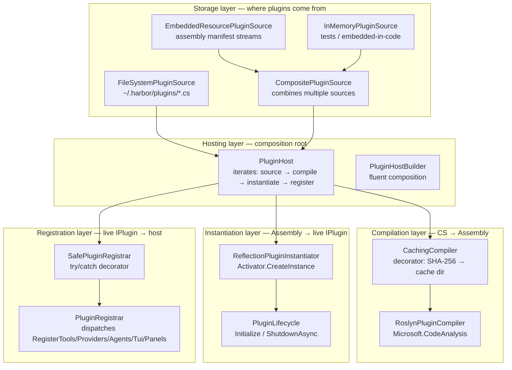

# Harbor Plugin System — Roslyn CS-source plugins

> How to write, install, and debug plugins for Harbor using **CS-source files** compiled
> at runtime via Roslyn. No DLLs, no `.csproj`, no separate build step.

## TL;DR

1. Drop a `.cs` file into `~/.harbor/plugins/` (user-global) or `<project>/.harbor/plugins/`
   (project-local).
2. The file must contain at least one public class implementing `IPlugin` (or one of its
   sub-interfaces: `IToolPlugin`, `IProviderPlugin`, `IAgentPlugin`) with a parameterless
   constructor.
3. Start Harbor — the file is compiled in-memory, instantiated, and registered.
4. Compilation errors are logged to the console and to `~/.harbor/logs/plugins.log`.
5. Compiled assemblies are cached by source SHA-256 in `~/.harbor/plugins/cache/`.

## Architecture (layered runtime)

The plugin runtime in `src/Harbor.Plugins.Runtime/` is split into five single-purpose
layers. Each layer depends only on the previous layer's **interface**, never its
implementation. This separation lets you swap storage backends (filesystem, embedded
resources, network, git), compilation engines (Roslyn, scripted, pre-built DLL), and
instantiation strategies (reflection, DI-aware, interpreter) independently.



| Layer | Interface | Default impl | What it does |
|---|---|---|---|
| Storage | `IPluginSource` | `FileSystemPluginSource` | Async-streams `PluginScript` values from disk / embedded / in-memory. |
| Compilation | `IPluginCompiler` | `CachingCompiler` over `RoslynPluginCompiler` | Compiles a `PluginScript` into a loaded `CompiledPluginAssembly`. Caches by SHA-256. |
| Instantiation | `IPluginInstantiator` | `ReflectionPluginInstantiator` | Finds `IPlugin` impls in the assembly, `Activator.CreateInstance`, returns `LoadedPlugin`. Does NOT call `Initialize`. |
| Registration | `IPluginRegistrar` | `SafePluginRegistrar` over `PluginRegistrar` | Builds `PluginContext`, calls `IPlugin.Initialize`, dispatches `RegisterTools` / `RegisterProviders` / `RegisterAgents` / `RegisterTuiPlugin` / `RegisterPanels`. |
| Hosting | (no interface — `PluginHost` is the facade) | `PluginHost` + `PluginHostBuilder` | Iterates `source → compile → instantiate → register`. Logs per-plugin failures; honors `ContinueOnError`. |

### Why the split

Before v0.4.x, a single `CsPluginLoader` class (~570 lines) did all seven
responsibilities: discovery, hashing, caching, Roslyn compilation, reflection
instantiation, initialization, and registration. This violated SRP and prevented:

- Testing compilation without the filesystem.
- Using alternative storage (embedded resources, network, git).
- Adding other engines (e.g. a SharpTS scripted evaluator) without duplicating storage logic.

Each layer is now independently testable and swappable.

### Swapping each layer

**Custom storage** — read from a network source:

```csharp
public sealed class NetworkPluginSource : IPluginSource
{
    private readonly Uri _endpoint;
    public NetworkPluginSource(Uri endpoint) { _endpoint = endpoint; }

    public async IAsyncEnumerable<PluginScript> GetScriptsAsync(
        [EnumeratorCancellation] CancellationToken ct = default)
    {
        using var http = new HttpClient();
        var listing = await http.GetFromJsonAsync<List<string>>($"{_endpoint}/plugins", ct);
        foreach (var name in listing ?? Array.Empty<string>())
        {
            var source = await http.GetStringAsync($"{_endpoint}/plugins/{name}", ct);
            yield return new PluginScript(name, source);
        }
    }
}

var host = new PluginHostBuilder()
    .WithSource(new NetworkPluginSource(new Uri("https://plugins.example.com")))
    .WithCompiler(...)
    .WithInstantiator(...)
    .WithRegistrar(...)
    .Build();
```

**Custom compilation** — pre-built DLLs (no Roslyn):

```csharp
public sealed class PreBuiltDllCompiler : IPluginCompiler
{
    public Task<CompilationResult> CompileAsync(PluginScript script, CancellationToken ct = default)
    {
        // script.Path is a .dll path; load via Assembly.LoadFrom
        var asm = Assembly.LoadFrom(script.Path);
        return Task.FromResult(CompilationResult.Fresh(
            new CompiledPluginAssembly(asm, script.Hash, script.Path)));
    }
}
```

**Custom instantiation** — DI-aware activator:

```csharp
public sealed class DiInstantiator : IPluginInstantiator
{
    private readonly IServiceProvider _sp;
    public DiInstantiator(IServiceProvider sp) { _sp = sp; }

    public Result<IReadOnlyList<LoadedPlugin>> Instantiate(CompiledPluginAssembly compiled)
    {
        // ... find IPlugin types, resolve via _sp.GetService(type) ...
    }
}
```

### Composing the runtime in the host

```csharp
var pluginHost = new PluginHostBuilder()
    .WithSource(new FileSystemPluginSource(
        new[] { globalPluginsDir, projectPluginsDir },
        loggerFactory.CreateLogger<FileSystemPluginSource>()))
    .WithCompiler(new CachingCompiler(
        new RoslynPluginCompiler(pluginReferences),
        pluginsCacheDir,
        loggerFactory.CreateLogger<CachingCompiler>()))
    .WithInstantiator(new ReflectionPluginInstantiator())
    .WithRegistrar(new SafePluginRegistrar(
        new PluginRegistrar(globalPluginsDir, loggerFactory.CreateLogger<PluginRegistrar>()),
        loggerFactory.CreateLogger<SafePluginRegistrar>()))
    .WithOptions(o => o.PluginRoot = globalPluginsDir)
    .Build(loggerFactory.CreateLogger<PluginHost>());

await pluginHost.LoadAllAsync(loadHost, ct);
```

## Where plugins live

| Location | Scope | Use case |
|---|---|---|
| `~/.harbor/plugins/*.cs` | User-global, all Harbor invocations | Personal plugins — `websearch`, `git-tools`, custom tools you use everywhere. |
| `<project>/.harbor/plugins/*.cs` | Project-local, only when running Harbor from `<project>` | Project-specific tools — e.g. a `release-notes` tool that only makes sense in one repo. |

Both directories are scanned on every Harbor startup. Files in either directory are
compiled into separate in-memory assemblies — they do NOT share types or namespaces.

## What APIs are available

The compiled plugin can reference any type already loaded in the host's AppDomain at
startup. This always includes:

| Namespace | Package | What's there |
|---|---|---|
| `Harbor.Abstractions` | `Harbor.Abstractions.dll` | All Harbor contracts: `IPlugin`, `ITool`, `ILlmClient`, `IAgent`, models, events. |
| `Harbor.Abstractions.Tools` | `Harbor.Abstractions.dll` | `ITool`, `IToolRegistryBuilder`, `ToolResult`, `ToolContext`. |
| `Harbor.Abstractions.Plugins` | `Harbor.Abstractions.dll` | `IPlugin`, `IToolPlugin`, `IProviderPlugin`, `IAgentPlugin`, `PluginContext`. |
| `Harbor.Abstractions.Models` | `Harbor.Abstractions.dll` | `ToolResult`, `AgentMessage`, `UserMessage`, `AssistantMessage`, etc. |
| `Harbor.Abstractions.Models.Identifiers` | `Harbor.Abstractions.dll` | `ToolName`, `ProviderId`, `AgentName`, `SessionId`, etc. |
| `Harbor.Abstractions.Events` | `Harbor.Abstractions.dll` | `AgentEvent` and all event sub-types, `IEventBus`. |
| `Harbor.Tui.Abstractions.Plugins` | `Harbor.Tui.Abstractions.dll` | `ITuiPlugin` for TUI extensions (views, view models). |
| `System.Text.Json` | BCL | `JsonDocument`, `JsonElement` for tool schemas and arguments. |
| `CSharpFunctionalExtensions` | NuGet | `Result`, `Result<T>` for error handling. |
| `Microsoft.Extensions.Logging` | NuGet | `LogInformation`, `LogError`, etc. extension methods. |
| `System.Net.Http` | BCL | `HttpClient` for HTTP-based tools. |
| `System.Text.RegularExpressions` | BCL | `Regex` for parsing. |

If you need a type that's NOT yet loaded in the host (e.g. a third-party NuGet you
depend on), the plugin will fail to compile with `CS0246: type or namespace not found`.
To fix this, either:
- Reference the package from a regular Harbor assembly so it's loaded at startup, OR
- Use the DLL-based plugin path (see [PLUGIN_DEVELOPMENT.md](./PLUGIN_DEVELOPMENT.md)).

## Plugin contract

```csharp
public interface IPlugin
{
    string Name { get; }                  // stable lowercase id, e.g. "web-search"
    Version Version { get; }              // semantic version
    Version RequiredHarborVersion { get; } // minimum Harbor version
    string Description { get; }           // shown in /plugins

    void Initialize(PluginContext context);            // called once on load
    Task ShutdownAsync(CancellationToken ct = default); // called once on unload
}

// Pick one or more of these sub-interfaces:
public interface IToolPlugin : IPlugin
{
    void RegisterTools(IToolRegistryBuilder builder);
}

public interface IProviderPlugin : IPlugin
{
    void RegisterProviders(IProviderRegistryBuilder builder);
}

public interface IAgentPlugin : IPlugin
{
    void RegisterAgents(IAgentRegistryBuilder builder);
}
```

For TUI extensions:

```csharp
public interface ITuiPlugin
{
    string Name { get; }
    Version Version { get; }
    string Description { get; }

    void RegisterTui(ViewRegistry views, ViewModelRegistry viewModels);
}
```

`ITuiPlugin` does NOT extend `IPlugin`. CS-source files can declare a class implementing
**both** — the loader detects each interface independently.

## Minimal example — a hello tool

Drop this into `~/.harbor/plugins/HelloWorldPlugin.cs`:

```csharp
using System.Text.Json;
using CSharpFunctionalExtensions;
using Harbor.Abstractions.Models;
using Harbor.Abstractions.Models.Identifiers;
using Harbor.Abstractions.Plugins;
using Harbor.Abstractions.Tools;
using Microsoft.Extensions.Logging;

public sealed class HelloWorldPlugin : IToolPlugin
{
    public string Name => "hello-world";
    public Version Version => new(1, 0, 0);
    public Version RequiredHarborVersion => new(0, 4, 0);
    public string Description => "Adds a `hello` tool that returns a greeting.";

    public void Initialize(PluginContext context)
    {
        context.CreateLogger<HelloWorldPlugin>().LogInformation("HelloWorld initialized");
    }

    public void RegisterTools(IToolRegistryBuilder builder) => builder.AddTool<HelloTool>();

    public Task ShutdownAsync(CancellationToken ct = default) => Task.CompletedTask;
}

public sealed class HelloTool : ITool
{
    public ToolName Name => ToolName.Create("hello");
    public string DisplayName => "Hello";
    public string Description => "Returns a friendly greeting";
    public JsonDocument ParameterSchema => JsonDocument.Parse(
        "{\"type\":\"object\",\"properties\":{\"name\":{\"type\":\"string\"}}}");
    public ExecutionMode ExecutionMode => ExecutionMode.Parallel;
    public string? PromptSnippet => "hello: returns a greeting";
    public IReadOnlyList<string> PromptGuidelines => Array.Empty<string>();

    public Task<ToolResult> ExecuteAsync(
        JsonElement args, ToolContext context, CancellationToken ct = default)
    {
        string name = args.TryGetProperty("name", out var n) && n.ValueKind == JsonValueKind.String
            ? n.GetString() ?? "world"
            : "world";
        return Task.FromResult(ToolResult.Success($"Hello, {name}!"));
    }
}
```

Run `harbor` and ask the agent: "Use the hello tool with name=Harbor". The agent will
call the freshly-compiled `hello` tool and report the result.

See `samples/plugins-cs/HelloWorldPlugin.cs` for the same example as a file.

## Lifecycle

```
1. Harbor starts
2. HostBuilder.Build() registers builtins (tools, providers, agents)
3. PluginHost.LoadAllAsync() iterates the configured IPluginSource:
     FileSystemPluginSource — ~/.harbor/plugins/*.cs + <cwd>/.harbor/plugins/*.cs
4. For each PluginScript:
   a. Compilation layer: CachingCompiler checks ~/.harbor/plugins/cache/{hash}.dll
      - Hit  → Assembly.LoadFrom(cache)
      - Miss → RoslynPluginCompiler compiles to in-memory assembly, write dll to cache
   b. Instantiation layer: ReflectionPluginInstantiator finds IPlugin impls, calls
      Activator.CreateInstance (parameterless ctor). Does NOT call Initialize.
   c. Registration layer: PluginRegistrar builds PluginContext, calls
      plugin.Initialize(context), then dispatches Register*() based on which
      sub-interface(s) the type implements:
          IToolPlugin     → RegisterTools(IToolRegistryBuilder)
          IProviderPlugin → RegisterProviders(IProviderRegistryBuilder)
          IAgentPlugin    → RegisterAgents(IAgentRegistryBuilder)
          ITuiPlugin      → host.RegisterTuiPlugin(plugin)  (deferred until TUI construct)
          ITuiPanelPlugin → RegisterPanels(IPanelRegistry)  (deferred until renderer starts)
      The SafePluginRegistrar decorator wraps each call in try/catch so one bad plugin
      doesn't abort the rest.
5. HostBuilder.Build() returns the final IHost with all plugins wired in
6. On shutdown: each plugin's ShutdownAsync() is called in reverse-load order
   (planned — see §Roadmap below; current MVP does not call ShutdownAsync on exit).
```

For plugin authors, **nothing changes** — drop a `.cs` file into `~/.harbor/plugins/`
and it Just Works. The layered architecture is purely a contributor concern: it makes
the runtime testable in isolation and lets you swap any layer for an alternative
implementation (network storage, scripted engine, DI-aware instantiation, etc.).

## Caching

Compiled assemblies are written to `~/.harbor/plugins/cache/{sha256}.dll` keyed by the
source file's SHA-256 hash. On subsequent Harbor runs:

- Same source → same hash → cache hit → `Assembly.LoadFrom(cache)` (no Roslyn).
- Different source → different hash → cache miss → recompile + overwrite.
- Deleted source → cache file is orphaned (not auto-cleaned). Run
  `harbor plugins gc` (planned) or delete `~/.harbor/plugins/cache/` manually.

Cache invalidation is **purely content-based**. Renaming a file does NOT invalidate the
cache. Editing the file does. This matches the behavior of e.g. Python's `__pycache__`.

## Debugging compilation errors

When a plugin fails to compile, the loader:

1. Logs a single-line error to the console at `LogLevel.Error`:
   ```
   [ERR] Plugin compilation failed for /home/me/.harbor/plugins/Broken.cs:
   Roslyn compilation failed for '/home/me/.harbor/plugins/Broken.cs':
     [Error] /home/me/.harbor/plugins/Broken.cs(12,9): CS1002 — ; expected
     [Error] /home/me/.harbor/plugins/Broken.cs(15,3): CS0103 — The name 'foo' does not exist
   ```
2. Writes the full Roslyn diagnostics (including warnings) to
   `~/.harbor/logs/plugins.log` (via the host's `FileLogger`).

To see verbose loader output:

```bash
HARBOR_LOGLEVEL=Debug harbor
```

To force a clean recompile (e.g. after a host dependency upgrade that may have broken
ABI compatibility):

```bash
rm -rf ~/.harbor/plugins/cache/
```

## Security warning ⚠️

**CS plugins run in-process with full trust.** A plugin `.cs` file can:

- Read and write any file on the system (via `System.IO`).
- Make arbitrary HTTP requests (via `HttpClient`).
- Execute shell commands (via `System.Diagnostics.Process`).
- Access environment variables and the host's DI service provider.

Harbor does NOT sandbox CS plugins. Only drop source files you have reviewed into
`~/.harbor/plugins/`. Treat plugin installation with the same caution as
`pip install` or `npm install -g`.

For sandboxed plugin execution, use the planned DLL-based out-of-process plugin path
(see `specs/02-plugins.md` and `specs/08-native-aot.md`). The legacy DLL-based plugin
projects in `samples/plugins/` remain as an alternative path but also run in-process.

## Migration from samples/plugins/*.csproj to .cs

The `samples/plugins/` directory contains four legacy DLL-based sample plugins:

| Project | What it does |
|---|---|
| `Harbor.Plugin.WebSearch` | DuckDuckGo web search tool |
| `Harbor.Plugin.TodoWrite` | Per-session todo list tool |
| `Harbor.Plugin.GitTools` | Safe git wrapper tool |
| `Harbor.Plugin.FileTree` | Directory tree visualization tool |

To migrate a `.csproj`-based plugin to a `.cs`-source plugin:

1. **Concatenate** all `.cs` files from the project into a single file. Order matters
   only if there are `partial` classes (keep them adjacent).
2. **Remove** the `namespace` declaration if the project uses one — top-level types in
   a CS-source plugin are placed in the global namespace by default. (You can keep the
   namespace if you prefer; just make sure all type references inside the file resolve.)
3. **Remove** `using` directives that pulled in types from NuGet packages the host does
   not already load. The plugin can only reference types already in the host's AppDomain
   (see the table above).
4. **Drop** the resulting `.cs` file into `~/.harbor/plugins/`.
5. **Test** by running `harbor` and watching the console for compilation errors.

Example migration: `samples/plugins/Harbor.Plugin.WebSearch/WebSearchPlugin.cs` is
already a single file with no external dependencies beyond `System.Text.RegularExpressions`
and `System.Net.Http` — both available in the host. To use it as a CS-source plugin:

```bash
cp samples/plugins/Harbor.Plugin.WebSearch/WebSearchPlugin.cs ~/.harbor/plugins/
harbor
# → [INF] Loaded 1 CS plugin(s)
# → [INF]   - websearch@1.0.0 (WebSearchPlugin.cs) (from cache: False)
```

The DLL-based sample projects are NOT deleted — they remain as a reference for plugin
authors who want the full .NET project experience (NuGet dependencies, unit tests,
strong naming, etc.).

## Roadmap

- [x] v0.4 — CS-source plugin loading via Roslyn (this document).
- [x] v0.4.x — Layered runtime: split `CsPluginLoader` into Storage / Compilation /
      Instantiation / Registration / Hosting. `CsPluginLoader` remains as a thin
      `[Obsolete]` facade over `PluginHostBuilder` for one release.
- [ ] v0.5 — Remove the `CsPluginLoader` facade; `PluginHostBuilder` becomes the only
      entry point.
- [ ] v0.5 — `harbor plugins` slash-command: list loaded plugins, show source paths.
- [ ] v0.5 — `harbor plugins gc`: clean orphaned cache files.
- [ ] v0.6 — `ShutdownAsync` lifecycle: call on Harbor exit in reverse-load order.
- [ ] v0.6 — Hot-reload: watch `~/.harbor/plugins/` for changes and reload on the fly.
- [ ] v0.7 — Out-of-process plugins via Unix domain sockets (NativeAOT-compatible).

## See also

- [PLUGIN_DEVELOPMENT.md](./PLUGIN_DEVELOPMENT.md) — DLL-based plugin development guide
  (legacy path, kept for projects that need full .NET project features).
- [specs/02-plugins.md](../specs/02-plugins.md) — Original plugin spec.
- [specs/08-native-aot.md](../specs/08-native-aot.md) — NativeAOT constraints and why
  in-process Roslyn compilation does not work under AOT.
- [samples/plugins-cs/HelloWorldPlugin.cs](../samples/plugins-cs/HelloWorldPlugin.cs) —
  Canonical CS-source sample plugin.
- `src/Harbor.Plugins.Runtime/` — The loader source code.
