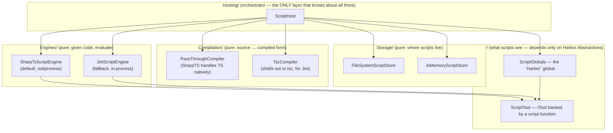

# Scripting in Harbor

> **Moved to contrib (sprint-2).** The `Harbor.Scripting.{Abstractions,Bridge,Compilation,Engines,Hosting,Storage}`
> projects now live in [`contrib/scripting/`](../contrib/scripting/) and build via
> `contrib/Contrib.slnx`. The `--script` flag is not part of the main-solution CLI — it
> reports unsupported and points to contrib.

Harbor's scripting system runs TypeScript / JavaScript plugins **in-process**
(or as a sandboxed subprocess) and exposes a curated `Harbor` bridge to them.
This document describes the layered architecture, the available engines, and
how to author scripts.

> **TL;DR** — SharpTS is the **default** engine. The system is split into
> five layers (Engines / Storage / Compilation / Hosting / Bridge) so each
> concern can be tested and swapped independently. Jint remains as a
> fallback for environments where `sharpts` is not installed.

---

## 1. Layered architecture



### Layering rules (also written as comments atop every file)

| Layer | Depends on | Knows about | DOES NOT know about |
|---|---|---|---|
| **Bridge/** | `Harbor.Abstractions` only | `IToolRegistry`, `IProviderRegistry`, `IAgentRegistry`, `ILogger` | engines, storage, compilation |
| **Engines/** | `Bridge` + `Harbor.Abstractions` | `ScriptGlobals`, `ScriptEngineOptions`, how to evaluate code | filesystem, storage, compilation |
| **Storage/** | `Harbor.Abstractions` only | how to list / read / write / delete script files | engines, compilation, the bridge |
| **Compilation/** | `Harbor.Abstractions` only | how to transform source → engine-ready source | engines, storage, the bridge |
| **Hosting/** | all four above + `Harbor.Abstractions` | how to orchestrate `store → compiler → engine` | none — this is the composition root |

A violation of these rules (e.g. an engine reading files, or a store calling an
engine) is a **bug** and is enforced by file-level comments + the directory
layout. Future linters may codify these as analyzer rules.

### Why the split

Before this refactor, `ScriptLoader` did **three** jobs in one file: (1)
discover `.js`/`.ts` files, (2) shell out to `tsc`, (3) evaluate them with
Jint. That violated the Single Responsibility Principle and made it impossible
to swap the engine without also touching storage. The new `ScriptHost` only
*orchestrates* — every concern lives behind a single-method interface
(`IScriptEngine`, `IScriptStore`, `IScriptCompiler`) and can be replaced
independently.

---

## 2. The four interfaces

### 2.1 `IScriptEngine`  (Engines/IScriptEngine.cs)

The engine's only job: given code + options + globals, evaluate it and return
a `Result` or `Result<T>`. Engines MUST NOT touch the filesystem (other than
their own temp scratch) or know about storage.

```csharp
public interface IScriptEngine
{
    Result Evaluate(string code, ScriptEngineOptions options, ScriptGlobals globals);
    Result<T> Evaluate<T>(string code, ScriptEngineOptions options, ScriptGlobals globals);
}
```

**Implementations:**
- `SharpTsScriptEngine` — **default**. Runs scripts via the `sharpts` dotnet
  tool as a subprocess. Native TypeScript interpretation. OS-level process
  isolation for free.
- `JintScriptEngine` — fallback when `sharpts` is not on PATH. Pure-.NET
  ECMAScript 2020+ interpreter, AOT-friendly.

### 2.2 `IScriptStore`  (Storage/IScriptStore.cs)

The store's only job: list / read / write / delete script entries. Stores
MUST NOT call engines or know about compilation.

```csharp
public interface IScriptStore
{
    Task<Result<IReadOnlyList<ScriptEntry>>> ListAsync(CancellationToken ct = default);
    Task<Result<ScriptEntry>> ReadAsync(string name, CancellationToken ct = default);
    Task<Result> WriteAsync(string name, string content, CancellationToken ct = default);
    Task<Result> DeleteAsync(string name, CancellationToken ct = default);
}
```

**Implementations:**
- `FileSystemScriptStore` — reads/writes `.js` / `.ts` / `.mjs` / `.mts`
  files from one or more root directories (first root wins on name
  collisions). Default root: `~/.harbor/scripts/`.
- `InMemoryScriptStore` — for tests and ephemeral REPL sessions.

### 2.3 `IScriptCompiler`  (Compilation/IScriptCompiler.cs)

The compiler's only job: transform source into an engine-ready form. Compilers
MUST NOT call engines or touch storage.

```csharp
public interface IScriptCompiler
{
    Result<string> Compile(string sourceName, string source);
}
```

**Implementations:**
- `PassThroughCompiler` — returns the source unchanged. Pair with engines
  that accept TypeScript natively (SharpTS) or plain JavaScript (Jint).
- `TscCompiler` — shells out to `tsc` to transpile TypeScript → JavaScript.
  Pair with Jint when you need `.ts` support and `sharpts` is unavailable.

### 2.4 `ScriptGlobals`  (Bridge/ScriptGlobals.cs)

The .NET-side representation of the `Harbor` global that scripts see at
runtime. Engines take this as an input and surface it as a `Harbor` object
with the methods documented below.

```csharp
public sealed class ScriptGlobals
{
    public required IToolRegistry Tools { get; init; }
    public IProviderRegistry? Providers { get; init; }
    public IAgentRegistry? Agents { get; init; }
    public required ILogger Logger { get; init; }
}
```

**Script-side surface:**

| Method | What it does |
|---|---|
| `Harbor.registerTool(def)` | Registers an `ITool` built from `def` (`{ name, execute, ... }`). |
| `Harbor.log(msg)` | Routes a string to `ScriptGlobals.Logger`. |
| `Harbor.tools.get(name)` | Returns a snapshot of a registered tool, or `undefined`. |
| `Harbor.tools.list()` | Returns an array of all registered tool snapshots. |
| `Harbor.providers.list()` | Returns an array of registered provider ids. |
| `Harbor.agents.list()` | Returns an array of registered agent names. |

---

## 3. The SharpTS engine (default)

[SharpTS](https://github.com/nickna/SharpTS) is a TypeScript interpreter and
AOT IL compiler implemented in C# / .NET 10. It is MIT-licensed, has 140+
GitHub stars, and is under active development.

### Why subprocess mode (for now)

SharpTS v1.0.8 ships on NuGet as a `dotnet tool` (NuGet package type
`DotnetTool`), not a class library. Until a library package is published, the
cleanest integration is to invoke `sharpts` as a subprocess. This has the
bonus of giving us OS-level process isolation for free.

**Install SharpTS:**
```bash
dotnet tool install -g SharpTS
# Ensure ~/.dotnet/tools is on PATH:
export PATH="$PATH:$HOME/.dotnet/tools"
```

When `sharpts` is not on PATH, every `Evaluate` call returns a clear failure
with install instructions; `ScriptHost` (or the CLI wiring) can fall back to
the Jint engine automatically.

### Bridge protocol

The engine injects a TypeScript preamble that defines a `Harbor` global.
Tool registrations and log calls are buffered in-process and emitted as a
JSON event stream on **stderr** at script exit, prefixed with
`__HARBOR_EVENTS__`. The .NET host parses the stream and replays events into
the live `IToolRegistry` / `ILogger`.

For `Evaluate<T>` (returns a value), the script must emit a single JSON-encoded
value on **stdout** prefixed with `__HARBOR_RESULT__`:

```typescript
// greet.ts — registers a tool, returns nothing (side-effect-only)
Harbor.registerTool({
  name: "greet",
  description: "Greets the caller.",
  execute: (args) => ({ output: "Hello, " + (args.name || "world") + "!" })
});
```

```typescript
// compute.ts — returns a value via the result marker
const sum = 1 + 2 + 3;
console.log("__HARBOR_RESULT__" + JSON.stringify(sum));
```

### Resource limits

| Limit | How it's enforced |
|---|---|
| `ScriptEngineOptions.Timeout` | Process kill after timeout elapses. |
| `ScriptEngineOptions.CancellationToken` | Linked to the timeout; kills the process on cancel. |
| `ScriptEngineOptions.MemoryLimitBytes` | Best-effort (process working-set hint where supported). |
| `MaxStatements` / `MaxRecursionDepth` | Not enforced by subprocess mode — timeout is the hard backstop. |

---

## 4. The Jint engine (fallback)

When `sharpts` is not installed, the host falls back to `JintScriptEngine`,
a pure-.NET ECMAScript 2020+ interpreter. Jint runs in-process (faster
cold-start, ~1-2 ms per evaluation) and enforces strict resource limits via
its `Constraints` API.

To use Jint with `.ts` files, pair it with `TscCompiler` (shells out to
`tsc`). To use Jint with `.js` files, `PassThroughCompiler` is sufficient.

### Jint sandbox defaults

- **Timeout:** 5 s (`ScriptEngineOptions.Timeout`)
- **Memory:** 10 MB allocation cap (`ScriptEngineOptions.MemoryLimitBytes`)
- **Max statements:** 1,000,000
- **Max recursion depth:** 1,000
- **AllowClr:** disabled (default — opt-in via `o.AllowClr(...)`)
- **AllowOperatorOverloading:** disabled
- **`require` / `process` / `print` / `console`:** not registered

---

## 5. Comparison with other extension mechanisms

| Engine | Language | In-process? | NativeAOT? | Type-safe? | Maturity |
|---|---|---|---|---|---|
| **SharpTS** (default) | TypeScript | subprocess (until lib pkg) | yes (SharpTS AOT path) | yes | early (Oct 2026, v1.0.8) |
| **Jint** (fallback) | JavaScript | yes (interpreter) | yes | no | mature |
| **Roslyn (CS plugins)** | C# | yes (CLR) | no | yes | mature |
| **MCP** | any (JSON-RPC) | no (subprocess / network) | n/a | runtime only | mature |

See §1 of the previous version of this doc for the full comparison table —
the trade-offs haven't changed; only the default has.

---

## 6. CLI usage

> Requires a contrib build of the CLI (`dotnet build contrib/Contrib.slnx`) —
> the main-solution CLI does not support `--script`.

```bash
# Install SharpTS once (optional — Jint is the automatic fallback):
dotnet tool install -g SharpTS
export PATH="$PATH:$HOME/.dotnet/tools"

# Run a script file at startup (after plugins load):
harbor --script ./samples/scripts/hello.ts

# Or drop the file into the auto-discovered directory:
cp ./samples/scripts/hello.ts ~/.harbor/scripts/
harbor   # script auto-loaded on startup
```

The `--script` flag wires up a `ScriptHost` with:
- SharpTS engine (or Jint fallback, auto-detected)
- `PassThroughCompiler` (SharpTS handles TS natively) or `TscCompiler` (Jint path)
- An in-memory store seeded with the one-shot script

The script's `Harbor.registerTool` calls register tools in the live
`IToolRegistry`, making them invocable by agents in the same session.

---

## 7. Authoring scripts

### 7.1 Register a tool

```typescript
// ~/.harbor/scripts/greet.ts
Harbor.registerTool({
  name: "greet",
  displayName: "Greet",
  description: "Greets the caller by name.",
  parameterSchema: {
    type: "object",
    properties: { name: { type: "string" } },
    required: ["name"]
  },
  executionMode: "Parallel",   // or "Sequential"
  execute: (args) => ({
    output: `Hello, ${args.name || "world"}!`,
    isError: false
  })
});
```

### 7.2 Return a value (for `Evaluate<T>` callers)

```typescript
// inline-script.ts
const result = doSomeComputation();
console.log("__HARBOR_RESULT__" + JSON.stringify(result));
```

### 7.3 Log

```typescript
Harbor.log("starting up...");
Harbor.log(`processed ${items.length} items`);
```

### 7.4 Introspect the registry

```typescript
const tools = Harbor.tools.list();
for (const t of tools) {
  Harbor.log(`tool: ${t.name} — ${t.description}`);
}
```

---

## 8. PoC limitations (this commit)

1. **No async/await in script `execute` (subprocess mode).** The PoC supports
   synchronous `execute` functions only. Promises are not drained across the
   subprocess boundary. (Roadmap: drain microtasks + add a Promise-aware
   result marker.)
2. **No `registerProvider` from scripts.** Providers need `ILlmClient`
   instances, which can't be constructed from JS/TS. (Roadmap: a typed
   "OpenAI-compatible" provider factory exposed to scripts.)
3. **Subprocess startup cost (SharpTS path).** Each `Evaluate` call spawns a
   fresh `sharpts` process (~50–200 ms). For high-frequency tool calls, the
   Jint path is faster (~1–2 ms cold start). (Roadmap: when SharpTS ships as
   a class library, switch to in-process evaluation.)
4. **No source-map support.** SharpTS error stack traces use TS-level line
   numbers; Jint error stack traces use JS-level line numbers (post-tsc).
   Cross-layer source maps are on the roadmap.
5. **Memory cap is allocation-based (Jint) or process-hint (SharpTS).** For
   untrusted code, use MCP (subprocess) instead.

---

## 9. Decision log

**Why SharpTS as the default, not Jint?**
The user explicitly wanted SharpTS. SharpTS gives native TypeScript execution
(no `tsc` dependency), type checking at load time, and an AOT IL emission
path for production deployments. Jint is mature and fast for in-process JS,
but it can't run TypeScript directly and requires a `tsc` pre-pass.

**Why subprocess mode for SharpTS, not in-process?**
SharpTS v1.0.8 ships as a `DotnetTool` NuGet package, not a class library.
Embedding it in-process today would require forking the repo and splitting it
into a library + CLI, which is out of scope for this iteration. The subprocess
path is a real, working integration — and gives us OS-level isolation for
free. When SharpTS publishes a library package, swap `SharpTsScriptEngine` to
call `Interpreter.Eval(...)` directly; no other layer changes.

**Why keep Jint at all?**
For environments where `sharpts` is not installed (CI runners without the
tool, minimal containers, dev machines without `dotnet tool install`), Jint
is the zero-dependency fallback. The `ScriptHost` auto-detects availability
and picks the right engine.

**Why split Storage from Engines?**
A future user may want scripts to live in a ZIP archive, a Git repo, or a
cloud bucket. With the storage layer abstracted, only `IScriptStore` changes
— engines and the compiler are untouched. Conversely, a future engine swap
(SharpTS in-process, or a WebAssembly JS runtime) doesn't affect storage.

**Why split Compilation from Engines?**
Different engines accept different input forms. SharpTS takes TypeScript
natively (`PassThroughCompiler`); Jint takes JavaScript (`TscCompiler` for
`.ts` sources, `PassThroughCompiler` for `.js`). Keeping the compiler separate
lets the `ScriptHost` pick the right pairing without the engine knowing
whether a `tsc` pre-pass happened.

**Why does `ScriptTool` live in Bridge/, not Engines/?**
`ScriptTool` is an `ITool` — a Harbor abstraction. It should not depend on a
specific engine. Instead, it accepts a `Func<JsonElement, CancellationToken,
Task<ToolResult>>` delegate that the engine supplies at registration time
(each engine knows how to invoke the script function it captured). This
keeps the Bridge layer pure (depends only on `Harbor.Abstractions`) and
breaks what would otherwise be a circular dependency (Engines → Bridge →
Engines).
